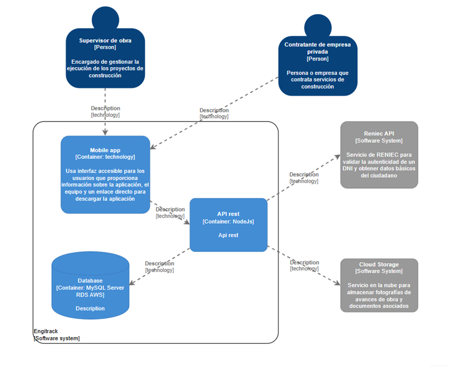

# COURSE PROJECT

    </img> 
    <strong>Universidad Peruana de Ciencias Aplicadas</strong> 
     
    <strong>Carrera de Ingeniería de Software</strong> 
    <strong>Ciclo 2025-2</strong>

  <strong>Curso: </strong>Aplicaciones para Dispositivos Móviles 
  <strong>Sección: </strong>1795

    <strong>Profesor: </strong>Jorge Luis Mayta Guillermo

    <strong>Informe de Trabajo Final</strong>

    <strong>Nombre del startup: </strong> [Startup]

    <strong>Nombre del producto:</strong> [Producto]

    <h3 align="center">Integrantes del equipo:</h3>
    

     <table align="center">
        <tr>
            <th style="text-align:center;">Código</th>
            <th style="text-align:center;">Nombre</th>
        </tr>
        <tr>
            <td>u202310931</td>
            <td>Bellido Salas, Raúl</td>
        </tr>
        <tr>
            <td>u202310680</td>
            <td>Castro Sanchez, Amir Gabriel</td>
        </tr>
        <tr>
            <td>u202314130</td>
            <td>Gonzales Valverde, Carlos Matthew</td>
        </tr>
        <tr>
            <td>u202115357</td>
            <td>Prado Vargas, Mario Benjamín</td>
        </tr> 
        <tr>
            <td>u20221b778</td>
            <td>Fernández Remón, Roy</td>
        </tr>
    </table>

    <strong>Agosto, 2025</strong>

---

# Registro de Versiones del Informe

| **Versión** | **Fecha** | **Autor** | **Descripción de modificación** |
|     ---     |     ---   |     ---   |             ---                 |
| 1.0 | 26/08/2025 | Anónimo | Se implementó el diseño/esqueleto del informe sobre todas las secciones|

---

# Project Report Collaboration Insights
**URL del repositorio para el Project Report:** [https://github.com/BrosTechnologies/report](https://github.com/BrosTechnologies/report)

Temporal => *En esta sección el equipo indica el URL del repositorio para el Project Report en la
organización de GitHub del equipo. Adicionalmente, para cada entrega explica cómo
se han desarrollado las actividades de elaboración del informe y se presenta
capturas en imagen de los analíticos de colaboración y commits en GitHub para el
repositorio del informe, realizados por los miembros del equipo. Todos los miembros
del equipo deben tener participación en la elaboración del informe. Esta sección
debe ir expandiéndose con descripciones y evidencias en cada entrega. Lo descrito y
evidenciado debe tener coherencia con el Registro de Versiones del Informe.*

---

# Contenido

- [Carátula](#course-project)
- [Registro de Versiones del Informe](#registro-de-versiones-del-informe)
- [Project Report Collaboration Insights](#project-report-collaboration-insights)
- [Contenido](#contenido)
- [Student Outcome](#student-outcome)
- [Objetivos SMART](#objetivos-smart)
- [Capítulo I: Presentación](#capítulo-i-presentación)
  - [1.1. Startup Profile](#11-startup-profile)
    - [1.1.1. Descripción de la Startup](#111-descripción-de-la-startup)
    - [1.1.2. Perfiles de integrantes del equipo](#112-perfiles-de-integrantes-del-equipo)
  - [1.2. Solution Profile](#12-solution-profile)
    - [1.2.1. Antecedentes y problemática](#121-antecedentes-y-problemática)
    - [1.2.2. Lean UX Process](#122-lean-ux-process)
      - [1.2.2.1. Lean UX Problem Statements](#1221-lean-ux-problem-statements)
      - [1.2.2.2. Lean UX Assumptions](#1222-lean-ux-assumptions)
      - [1.2.2.3. Lean UX Hypothesis Statements](#1223-lean-ux-hypothesis-statements)
      - [1.2.2.4. Lean UX Canvas](#1224-lean-ux-canvas)
  - [1.3. Segmentos objetivo](#13-segmentos-objetivo)
- [Capítulo II: Requirements Elicitation & Analysis](#capítulo-ii-requirements-elicitation--analysis)
  - [2.1. Competidores](#21-competidores)
    - [2.1.1. Análisis competitivo](#211-análisis-competitivo)
    - [2.1.2. Estrategias y tácticas frente a competidores](#212-estrategias-y-tácticas-frente-a-competidores)
  - [2.2. Entrevistas](#22-entrevistas)
    - [2.2.1. Diseño de entrevistas](#221-diseño-de-entrevistas)
    - [2.2.2. Registro de entrevistas](#222-registro-de-entrevistas)
    - [2.2.3. Análisis de entrevistas](#223-análisis-de-entrevistas)
  - [2.3. Needfinding](#23-needfinding)
    - [2.3.1. User Personas](#231-user-personas)
    - [2.3.2. User Task Matrix](#232-user-task-matrix)
    - [2.3.3. User Journey Mapping](#233-user-journey-mapping)
    - [2.3.4. Empathy Mapping](#234-empathy-mapping)
    - [2.3.5. Ubiquitous Language](#235-ubiquitous-language)
  - [2.4. Requirements specification](#24-requirements-specification)
    - [2.4.1. User Stories](#241-user-stories)
    - [2.4.2. Impact Mapping](#242-impact-mapping)
    - [2.4.3. Product Backlog](243-product-backlog)
  - [2.5. Strategic-Level Domain-Driven Design](#25-strategic-level-domain-driven-design)
    - [2.5.1. EventStorming](#251-eventstorming)
      - [2.5.1.1. Candidate Context Discovery](#2511-candidate-context-discovery)
      - [2.5.1.2. Domain Message Flows Modeling](#2512-domain-message-flows-modeling)
      - [2.5.1.3. Bounded Context Canvases](#2513-bounded-context-canvases)
    - [2.5.2. Context Mapping](#252-context-mapping)
    - [2.5.3. Software Architecture](#253-software-architecture)
      - [2.5.3.1. Software Architecture Context Level Diagrams](#2531-software-architecture-context-level-diagrams)
      - [2.5.3.2. Software Architecture Container Level Diagrams](#2532-software-architecture-container-level-diagrams)
      - [2.5.3.3. Software Architecture Deployment Diagrams](#2533-software-architecture-deployment-diagrams)
  - [2.6. Tactical-Level Domain-Driven Design](#26-tactical-level-domain-driven-design)
    - [2.6.1. Bounded Context: Gestión de Proyectos](#261-bounded-context-gestión-de-proyectos)
      - [2.6.1.1. Domain Layer](#2611-domain-layer)
      - [2.6.1.2. Interface Layer](#2612-interface-layer)
      - [2.6.1.3. Application Layer](#2613-application-layer)
      - [2.6.1.4. Infrastructure Layer](#2614-infrastructure-layer)
      - [2.6.1.5. Bounded Context Software Architecture Component Level Diagrams](#2615-bounded-context-software-architecture-component-level-diagrams)
      - [2.6.1.6. Bounded Context Software Architecture Code Level Diagrams](#2616-bounded-context-software-architecture-code-level-diagrams)
        - [2.6.1.6.1. Bounded Context Domain Layer Class Diagrams](#26161-bounded-context-domain-layer-class-diagrams)
        - [2.6.1.6.2. Bounded Context Database Design Diagram](#26162-bounded-context-database-design-diagram)
  - [2.6.2. Bounded Context: Control de Inventario](#262-bounded-context-control-de-inventario)
    - [2.6.2.1. Domain Layer](#2621-domain-layer)
    - [2.6.2.2. Interface Layer](#2622-interface-layer)
    - [2.6.2.3. Application Layer](#2623-application-layer)
    - [2.6.2.4. Infrastructure Layer](#2624-infrastructure-layer)
    - [2.6.2.5. Bounded Context Software Architecture Component Level Diagrams](#2625-bounded-context-software-architecture-component-level-diagrams)
    - [2.6.2.6. Bounded Context Software Architecture Code Level Diagrams](#2626-bounded-context-software-architecture-code-level-diagrams)
      - [2.6.2.6.1. Bounded Context Domain Layer Class Diagrams](#26261-bounded-context-domain-layer-class-diagrams)
      - [2.6.2.6.2. Bounded Context Database Design Diagram](#26262-bounded-context-database-design-diagram)
  - [2.6.3. Bounded Context: Control de Trabajadores](#263-bounded-context-control-de-trabajadores)
    - [2.6.3.1. Domain Layer](#2631-domain-layer)
    - [2.6.3.2. Interface Layer](#2632-interface-layer)
    - [2.6.3.3. Application Layer](#2633-application-layer)
    - [2.6.3.4. Infrastructure Layer](#2634-infrastructure-layer)
    - [2.6.3.5. Bounded Context Software Architecture Component Level Diagrams](#2635-bounded-context-software-architecture-component-level-diagrams)
    - [2.6.3.6. Bounded Context Software Architecture Code Level Diagrams](#2636-bounded-context-software-architecture-code-level-diagrams)
      - [2.6.3.6.1. Bounded Context Domain Layer Class Diagrams](#26361-bounded-context-domain-layer-class-diagrams)
      - [2.6.3.6.2. Bounded Context Database Design Diagram](#26362-bounded-context-database-design-diagram)
  - [2.6.4. Bounded Context: Control de Incidentes](#264-bounded-context-control-de-incidentes)
    - [2.6.4.1. Domain Layer](#2641-domain-layer)
    - [2.6.4.2. Interface Layer](#2642-interface-layer)
    - [2.6.4.3. Application Layer](#2643-application-layer)
    - [2.6.4.4. Infrastructure Layer](#2644-infrastructure-layer)
    - [2.6.4.5. Bounded Context Software Architecture Component Level Diagrams](#2645-bounded-context-software-architecture-component-level-diagrams)
    - [2.6.4.6. Bounded Context Software Architecture Code Level Diagrams](#2646-bounded-context-software-architecture-code-level-diagrams)
      - [2.6.4.6.1. Bounded Context Domain Layer Class Diagrams](#26461-bounded-context-domain-layer-class-diagrams)
      - [2.6.4.6.2. Bounded Context Database Design Diagram](#26462-bounded-context-database-design-diagram)
  - [2.6.5. Bounded Context: Control de Maquinaria](#265-bounded-context-control-de-maquinaria)
    - [2.6.5.1. Domain Layer](#2651-domain-layer)
    - [2.6.5.2. Interface Layer](#2652-interface-layer)
    - [2.6.5.3. Application Layer](#2653-application-layer)
    - [2.6.5.4. Infrastructure Layer](#2654-infrastructure-layer)
    - [2.6.5.5. Bounded Context Software Architecture Component Level Diagrams](#2655-bounded-context-software-architecture-component-level-diagrams)
    - [2.6.5.6. Bounded Context Software Architecture Code Level Diagrams](#2656-bounded-context-software-architecture-code-level-diagrams)
      - [2.6.5.6.1. Bounded Context Domain Layer Class Diagrams](#26561-bounded-context-domain-layer-class-diagrams)
      - [2.6.5.6.2. Bounded Context Database Design Diagram](#26562-bounded-context-database-design-diagram)
   
    

- [Capítulo V: Solution UI/UX Design](#capítulo-v-solution-uiux-design)
  - [5.1. Product design](#51-product-design)
    - [5.1.1. Style Guidelines](#511-style-guidelines)
      - [5.1.1.1. General Style Guidelines](#5111-general-style-guidelines)
    - [5.1.2. Information Architecture](#512-information-architecture)
      - [5.1.2.1. Organization Systems](#5121-organization-systems)
      - [5.1.2.2. Labelling Systems](#5122-labelling-systems)
      - [5.1.2.3. SEO Tags and Meta Tags](#5123-seo-tags-and-meta-tags)
      - [5.1.2.4. Searching Systems](#5124-searching-systems)
      - [5.1.2.5. Navigation Systems](#5125-navigation-systems)
    - [5.1.3. Landing Page UI Design](#513-landing-page-ui-design)
      - [5.1.3.1. Landing Page Wireframe](#5131-landing-page-wireframe)
      - [5.1.3.2. Landing Page Mock-up](#5132-landing-page-mock-up)
    - [5.1.4. Mobile Applications UX/UI Design](#514-mobile-applications-uxui-design)
      - [5.1.4.1. Mobile Applications Wireframes](#5141-mobile-applications-wireframes)
      - [5.1.4.2. Mobile Applications Wireflow Diagrams](#5142-mobile-applications-wireflow-diagrams)
      - [5.1.4.3. Mobile Applications Mock-ups](#5143-mobile-applications-mock-ups)
      - [5.1.4.4. Mobile Applications User Flow Diagrams](#5144-mobile-applications-user-flow-diagrams)
      - [5.1.4.5. Mobile Applications Prototyping](#5145-mobile-applications-prototyping)   
- [Capítulo VI: Product Implementation, Validation & Deployment](#capítulo-vi-product-implementation-validation--deployment)
- [6.1. Software Configuration Management](#61-software-configuration-management)
    - [6.1.1. Software Development Environment Configuration](#611-software-development-environment-configuration)
    - [6.1.2. Source Code Management](#612-source-code-management)
    - [6.1.3. Source Code Style Guide & Conventions](#613-source-code-style-guide--conventions)
    - [6.1.4. Software Deployment Configuration](#614-software-deployment-configuration)
  - [6.2. Landing Page & Mobile Application Implementation](#62-landing-page--mobile-application-implementation)
    - [6.2.X. Sprint n](#62x-sprint-n)
      - [6.2.X.1. Sprint Planning n](#62x1-sprint-planning-n)
      - [6.2.X.2. Sprint Backlog n](#62x2-sprint-backlog-n)
      - [6.2.X.3. Development Evidence for Sprint Review](#62x3-development-evidence-for-sprint-review)
      - [6.2.X.4. Testing Suite Evidence for Sprint Review](#62x4-testing-suite-evidence-for-sprint-review)
      - [6.2.X.5. Execution Evidence for Sprint Review](#62x5-execution-evidence-for-sprint-review)
      - [6.2.X.6. Services Documentation Evidence for Sprint Review](#62x6-services-documentation-evidence-for-sprint-review)
      - [6.2.X.7. Software Deployment Evidence for Sprint Review](#62x7-software-deployment-evidence-for-sprint-review)
      - [6.2.X.8. Team Collaboration Insights during Sprint](#62x8-team-collaboration-insights-during-sprint)
  - [6.3. Validation Interviews](#63-validation-interviews)
    - [6.3.1. Diseño de Entrevistas](#631-diseño-de-entrevistas)
    - [6.3.2. Registro de Entrevistas](#632-registro-de-entrevistas)
    - [6.3.3. Evaluaciones según heurísticas](#633-evaluaciones-según-heurísticas)
  - [6.4. Video About-the-Product](#64-video-about-the-product)
- [Conclusiones](#conclusiones)
  - [Conclusiones y recomendaciones](#conclusiones-y-recomendaciones)
  - [Video About-the-team](#video-about-the-team)
- [Bibliografía](#bibliografía)
- [Anexos](#anexos)

---

# Student Outcome

El curso contribuye al cumplimiento del Student Outcome ABET: 
**ABET – EAC - Student Outcome 3**

**Criterio:** Capacidad de comunicarse efectivamente con un rango de audiencias.
En el siguiente cuadro se describe las acciones realizadas y enunciados de
conclusiones por parte del grupo, que permiten sustentar el haber alcanzado el logro
del ABET – EAC - Student Outcome 3.

---

# Objetivos SMART

---

# Capítulo I: Presentación

## 1.1. Startup Profile
### 1.1.1. Descripción de la Startup

**Brostechnologies** es una startup fundada por jóvenes universitarios de la Universidad Peruana de Ciencias Aplicadas (UPC), enfocada en ofrecer soluciones para la gestión eficiente de proyectos de construcción dirigidos a pequeñas y medianas empresas constructoras, así como a trabajadores administrativos. A través de nuestra plataforma digital, ***Engitrack***, los usuarios pueden realizar solicitudes de servicios, además de supervisar el progreso y los gastos de cada obra.

Nuestra meta es simplificar la administración y garantizar mayor transparencia en los procesos constructivos. Entre las principales funciones que gestionamos se encuentran: la administración de personal, el control de materiales, la gestión presupuestal, el seguimiento de plazos de ejecución y el monitoreo en tiempo real del avance de los proyectos.

En **Brostechnologies** consideramos esencial optimizar los procesos de construcción para que nuestros clientes incrementen sus ganancias, reduzcan tiempos de ejecución y puedan tomar decisiones basadas en información confiable. Apostamos por la tecnología como un recurso clave para transformar el sector, facilitando que incluso las pequeñas y medianas empresas accedan a una gestión profesional, organizada y eficiente de sus obras.

**Misión:** Ofrecer soluciones digitales innovadoras que optimicen la gestión de proyectos de construcción en pequeñas y medianas empresas, permitiendo una mejor administración de recursos, seguimiento de avances, control de gastos y otros procesos, con el propósito de impulsar la eficiencia, la transparencia y la toma de decisiones estratégicas en el sector.

**Visión:** Convertirnos en la plataforma líder en Latinoamérica en la digitalización de procesos constructivos para pequeñas y medianas empresas, transformando la gestión de obras mediante tecnología accesible, eficiente y orientada a las necesidades de nuestros usuarios.

## **Fase 1: Identificación de Áreas (30 minutos)**
[Contenido]
### 1.1.2. Perfiles de integrantes del equipo
| Foto | Nombre y Apellidos | Código de Estudiante | Carrera | Resumen de Conocimientos y Habilidades |
|------|--------------------|----------------------|---------|----------------------------------------|
|  |  |  | Ingeniería de Software | EJEMPLO DE IA XDD (CAMBIARLO A TU GUSTO): Experto en desarrollo web con Vue.js, dominio de bases de datos relacionales y metodologías ágiles. Aporta habilidades en programación, documentación técnica y liderazgo de equipo. |
|  |  |  | Ingeniería de Software | EJEMPLO DE IA (CAMBIARLO A TU GUSTO): Conocimientos en ciberseguridad, análisis de sistemas y modelado UML. Aporta al equipo su capacidad de análisis crítico y estructuración de soluciones escalables. |
|  |  |  | Ingeniería de Software | EJEMPLO DE IA (CAMBIARLO A TU GUSTO): Especialista en machine learning y ciencia de datos. Aporta experiencia en análisis estadístico, programación en Python y visualización de datos. |
|  |  |  | Ingeniería de Software | EJEMPLO DE IA (CAMBIARLO A TU GUSTO): Conocimientos en gestión de proyectos y optimización de procesos. Aporta al equipo su enfoque en eficiencia, coordinación y manejo de recursos. |

## 1.2. Solution Profile
### 1.2.1. Antecedentes y problemática

En el contexto actual del sector construcción en Lima Metropolitana y otras ciudades del país, muchas pequeñas y medianas empresas (PYMEs) enfrentan una realidad compleja al gestionar sus proyectos. El sector construcción en el Perú es uno de los principales motores de la economía, aportando más del 5% al PBI nacional, pero presenta un alto nivel de informalidad y baja adopción tecnológica en los procesos operativos. A pesar de que las grandes constructoras cuentan con sistemas integrados de planificación y control, la mayoría de las PYMEs siguen dependiendo de métodos manuales o herramientas básicas como hojas de cálculo, cuadernos de obra, llamadas telefónicas o aplicaciones de mensajería instantánea. Estas prácticas generan desorganización, duplicidad de datos, errores de control y retrasos significativos en la toma de decisiones.

La situación se agrava porque los supervisores y jefes de obra deben cumplir múltiples funciones: coordinar equipos en campo, gestionar inventarios, controlar presupuestos, asegurar el cumplimiento de normas de seguridad y reportar avances a la administración o a los contratantes. Sin un sistema centralizado, estas tareas se vuelven poco eficientes, consumen tiempo valioso y exponen a las empresas a sobrecostos, incumplimientos contractuales y pérdida de competitividad. Por su parte, los clientes y contratantes demandan mayor transparencia, reportes claros y actualizados, y visibilidad en tiempo real del avance de sus proyectos, condiciones que hoy rara vez se cumplen en las PYMEs constructoras.

Frente a esta problemática, Brostechnologies identifica una brecha importante en el mercado: la ausencia de una herramienta digital accesible, intuitiva y pensada específicamente para la realidad de las pequeñas y medianas empresas del sector. Mientras soluciones internacionales como Procore o Buildertrend ofrecen funcionalidades avanzadas, sus precios resultan prohibitivos para las PYMEs locales (planes desde USD 95 hasta USD 300 mensuales), lo que deja a estas empresas sin opciones asequibles que les permitan modernizar sus procesos. Este vacío constituye una oportunidad para que nuestra startup desarrolle una plataforma móvil que centralice la información de obra, optimice la gestión de recursos y promueva la transparencia en la comunicación con contratantes y clientes, incrementando la eficiencia y reduciendo los riesgos operativos.

**What (¿Qué problema existe?)** 

- Falta de centralización: la información de obra (asistencia de obreros, entradas/salidas de materiales, avances) se guarda en múltiples formatos y lugares (Excel, cuadernos, fotos), lo que dificulta consolidar estados reales del proyecto.
- Comunicación informal: se depende de canales no estructurados (WhatsApp, llamadas) para reportar problemas o ausencias, sin trazabilidad ni estándar de reporte.
- Escasa visibilidad para contratantes: los clientes reciben información incompleta o tardía, lo que genera desconfianza y conflictos.
- Herramientas existentes no accesibles: soluciones completas en el mercado suelen ser costosas para PYMEs (planes comerciales de referencia en el mercado rondan desde ~USD 95 hasta USD 300+ mensuales), dejando un vacío para productos más económicos y enfocados en operaciones diarias.

**Why (¿Por qué es importante gestionar bien una obra?)**

- Control de costos y tiempo: una gestión adecuada evita compras innecesarias, desperdicio de materiales y penalidades por retrasos.
- Calidad y seguridad: facilita verificar el cumplimiento de normas, uso de EPP y calidad de materiales.
- Confianza entre partes: transparencia en la ejecución mejora la relación con contratantes y reduce disputas contractuales.
- Productividad: reduce el tiempo dedicado a tareas administrativas (registro manual, consolidación de datos) y permite que supervisores tomen decisiones informadas en campo.

**When (¿Cuándo ocurre?)**

- Durante la etapa de ejecución y supervisión del proyecto: planificación diaria (inicio de jornada), monitoreo de actividades (durante el día) y cierre/conciliación (fin de jornada).
- Cuando hay cambios operativos o imprevistos: retrasos en entrega de materiales, ausencias de personal clave, necesidad de valorización o ajustes presupuestarios.
- También ocurre de forma continua en proyectos con múltiples frentes y alta rotación de personal.

**Where (¿Dónde sucede?)** 

- Principalmente en obra (sitio de construcción), oficina administrativa de la empresa constructora y en el punto de interacción con contratantes (presencial o remoto).
- En el presente informe se enfatiza la realidad local de Lima Metropolitana (distritos con alta actividad de PYMEs constructoras), aunque la solución propuesta está diseñada para ser replicable a otras regiones urbanas y semiurbanas.

**Who (¿A quién afecta?)** 

- Supervisores y jefes de obra: pierden tiempo en tareas administrativas y carecen de información consolidada para decidir.
- Asistentes administrativos y almacenistas: registros inconsistentes y retrabajo por datos duplicados.
- Contratantes / clientes: reciben reportes incompletos o tardíos, lo que genera desconfianza y puede causar pérdidas económicas.
- La propia empresa constructora: costos mayores, baja rentabilidad y riesgo reputacional que afectan su capacidad para conseguir nuevos contratos.

**How (¿Cómo se manifiesta el problema?)**

- Errores en inventario: compras duplicadas o faltantes por no actualizar stock en tiempo real.
- Registros manuales y desincronizados: hojas de tareo físicas, Excel y fotos que requieren consolidación manual.
- Reportes tardíos o sin estandarización: informes en formatos inconsistentes (Word, Excel, WhatsApp) que no facilitan comparaciones ni decisiones rápidas.
- Descoordinación entre campo y oficina: demora en la transmisión de incidencias y en la gestión de reposiciones o ajustes.
- Dependencia de conectividad: muchas obras tienen baja o intermitente conectividad; sin un modo offline/sincronización robusta, la herramienta pierde utilidad en campo.

**How much (¿Qué tan grave es?)**

- Impacto económico directo: entrevistas y casos reportados muestran pérdidas concretas por mala gestión.
- Coste operativo acumulado: el tiempo de consolidación de reportes y correcciones puede consumir horas diarias del equipo, traducido en costos salariales y demoras en la toma de decisiones.
- Riesgo de contratación y reputación: falta de transparencia puede impedir la obtención de nuevos contratos y ocasionar penalidades contractuales.
- Barreras a la adopción: la percepción de complejidad y el costo de soluciones existentes limitan la digitalización de muchas PYMEs; una solución accesible y fácil de usar tiene potencial para reducir esta brecha rápidamente.

### 1.2.2. Lean UX Process

#### 1.2.2.1. Lean UX Problem Statements
En el sector construcción en Lima Metropolitana y otras ciudades del Perú, las pequeñas y medianas empresas (PYMEs) enfrentan grandes dificultades para gestionar de manera eficiente sus proyectos. El sector presenta altos niveles de informalidad y baja adopción tecnológica, lo que limita su competitividad.

Hemos observado que, a diferencia de las grandes constructoras que cuentan con sistemas integrados de planificación y control, las PYMEs continúan dependiendo de métodos manuales o herramientas básicas como hojas de cálculo, cuadernos de obra, llamadas telefónicas o aplicaciones de mensajería. Estas prácticas generan desorganización, duplicidad de datos, errores de control y retrasos significativos en la toma de decisiones.

Los supervisores y jefes de obra (que suelen asumir múltiples funciones en campo y oficina) carecen de un sistema centralizado que los apoye en la coordinación de equipos, gestión de inventarios, control presupuestal, cumplimiento de normas de seguridad y comunicación con los contratantes. Al mismo tiempo, los clientes y contratantes demandan mayor transparencia, reportes actualizados y visibilidad en tiempo real de los avances, condiciones que hoy rara vez se cumplen en las PYMEs.

Actualmente, existen soluciones internacionales como Procore o Buildertrend que ofrecen funcionalidades avanzadas, pero sus altos costos de suscripción (USD 95 a 300 mensuales) hacen que resulten inaccesibles para la mayoría de las empresas locales. Esto crea una brecha entre las necesidades de digitalización de las PYMEs y las soluciones disponibles en el mercado.

¿Cómo podemos ayudar a las PYMEs del sector construcción en Lima Metropolitana a optimizar la gestión de sus proyectos mediante una herramienta digital accesible y adaptada a su realidad, que centralice la información de obra, apoye a supervisores en sus múltiples funciones y ofrezca a los contratantes transparencia y visibilidad en tiempo real, reduciendo riesgos operativos y mejorando la competitividad?

Como segmento inicial, enfocaremos nuestra solución en los supervisores de obra de PYMEs constructoras en Lima Metropolitana, quienes desempeñan un rol crítico en la coordinación de proyectos y enfrentan directamente las limitaciones de los procesos actuales.

#### 1.2.2.2. Lean UX Assumptions
Para guiar el desarrollo de nuestra solución Engitrack y asegurarnos de que estamos abordando los problemas correctos para los usuarios adecuados, hemos formulado una serie de supuestos. Estos supuestos son hipótesis que necesitan ser validadas a lo largo del proceso Lean UX. Los hemos clasificado en tres áreas críticas: **negocio, usuario y funcionalidad.**
**Supuestos de Negocio:**
Estos supuestos se centran en la viabilidad y el valor que Brostechnologies espera generar en el mercado.
- Creemos que las PYMEs constructoras están dispuestas a pagar una suscripción mensual por una herramienta digital si esta les demuestra un retorno de inversión claro a través de la reducción de sobrecostos, el ahorro de tiempo y la prevención de penalidades por retrasos.
- Creemos que existe un mercado desatendido y suficientemente grande en Lima Metropolitana y otras ciudades de Latinoamérica que considera las soluciones internacionales existentes como demasiado costosas y complejas para sus necesidades operativas diarias.
- Creemos que al ofrecer una plataforma accesible y diseñada para la realidad del sector de construcción local, podemos lograr una rápida adopción y posicionarnos como la solución de entrada para la digitalización de las PYMEs. 
**Supuestos de Usuario:**
Estos supuestos se relacionan con nuestros usuarios objetivo, sus problemas, comportamientos y necesidades.
- Creemos que los supervisores de obra son el segmento de usuario clave para empezar, ya que son quienes más sienten el impacto negativo de la gestión manual y tienen una alta influencia en la adopción de nuevas herramientas en el proyecto.
- Creemos que los supervisores valorarán una aplicación móvil que centralice la información (personal, materiales, avances) por encima de sus métodos actuales (WhatsApp, Excel, cuadernos), porque les permitirá tomar decisiones más rápidas y fundamentadas en campo.
- Creemos que los clientes y contratantes de las PYMEs constructoras demandan mayor transparencia y que esta necesidad presiona a las constructoras para que adopten herramientas que ofrezcan reportes claros y en tiempo real.
**Supuestos de Funcionalidad**
Estos supuestos se refieren a las características específicas de la plataforma Engitrack y el valor que entregarán.
- Creemos que las funcionalidades más críticas para aportar valor inicial son el registro de asistencia, el control de inventario de materiales y la generación de reportes de avance diario con evidencia fotográfica.
- Creemos que una interfaz de usuario sencilla e intuitiva, que requiera mínima capacitación, es un factor decisivo para que los supervisores y trabajadores adopten la herramienta sin resistencia.
- Creemos que una funcionalidad de modo offline que permita registrar datos sin conexión a internet para sincronizarlos después es indispensable para el uso continuo de la aplicación en las obras, donde la conectividad suele ser inestable.

#### 1.2.2.3. Lean UX Hypothesis Statements
**Hipótesis de negocio:**
Creemos que la disposición de las PYMEs constructoras a pagar una suscripción mensual por Engitrack se logrará si los supervisores de obra logran reducir sobrecostos, ahorrar tiempo y prevenir penalidades por retrasos gracias al uso de la plataforma.
(Referencia: Assumption de negocio 1)
**Hipótesis de mercado:**
Creemos que el posicionamiento de Engitrack como la solución de entrada a la digitalización de PYMEs en Lima Metropolitana se logrará si las empresas constructoras encuentran en nuestra herramienta una alternativa accesible y adaptada a su realidad frente a las soluciones internacionales demasiado costosas y complejas.
(Referencia: Assumption de negocio 2 y 3)
**Hipótesis de usuario clave:**
Creemos que la adopción inicial de Engitrack por parte de las PYMEs se logrará si los supervisores de obra centralizan exitosamente en la aplicación móvil la información de personal, materiales y avances, superando sus métodos actuales dispersos como WhatsApp, Excel o cuadernos.
(Referencia: Assumption de usuario 1 y 2)
**Hipótesis de transparencia:**
Creemos que la confianza de los contratantes en Engitrack como alternativa correcta se logrará si los supervisores generan reportes de avance con evidencia fotográfica que brinden transparencia y visibilidad en tiempo real.
(Referencia: Assumption de usuario 3 y funcionalidad 3)
**Hipótesis de funcionalidad crítica:**
Creemos que la percepción de Engitrack como una herramienta indispensable en obra se logrará si los supervisores pueden registrar asistencia, controlar inventarios y generar reportes diarios de manera sencilla e incluso en modo offline.
(Referencia: Assumption de funcionalidad 1 y 3.)
**Hipótesis de usabilidad:**
Creemos que la adopción rápida de Engitrack por parte de supervisores y trabajadores se logrará si la interfaz de usuario es lo suficientemente sencilla e intuitiva para requerir mínima capacitación.
(Referencia: Assumption de funcionalidad 2.)

#### 1.2.2.4. Lean UX Canvas

## 1.3. Segmentos objetivo

---

# Capítulo II: Requirements Elicitation & Analysis

## 2.1. Competidores

### 2.1.1. Análisis competitivo

### 2.1.2. Estrategias y tácticas frente a competidores

## 2.2. Entrevistas

### 2.2.1. Diseño de entrevistas

#### Segmento objetivo #1: Supervisores de obra
**Introducción y contexto** 
- ¿Cuál es tu nombre?
- ¿Cuántos años tiene?
- ¿En qué distrito reside?
- ¿Puedes contarme sobre tu rol como supervisor? ¿Qué haces en un día típico?
- ¿Cuántos obreros y qué tipo de materiales gestionas en una obra promedio?

**Procesos actuales** 
- ¿Cómo confirmas la asistencia de los obreros cada día? 
- ¿Qué haces si alguien falta?
- ¿Cómo llevas el control del inventario de materiales? ¿Qué herramientas usas?
- ¿Cómo registras los avances de la obra y preparas reportes? ¿Cuánto tiempo te toma?

**Puntos de dolor**
- ¿Qué es lo más frustrante o lento en la gestión de obreros o materiales? Dame un ejemplo reciente.
- ¿Alguna vez has tenido problemas por errores en inventario o reportes? ¿Qué pasó?
- ¿Qué tan fácil o difícil es coordinar con otros roles, como asistentes administrativos?

**Necesidades y expectativas**
- Si tuvieras una herramienta que centralizará asistencia, inventario y reportes ¿te ayudaría? ¿de qué manera?
- ¿Qué tan importante es tener información en tiempo real desde la obra? ¿Por qué?
- ¿Qué te haría confiar en una nueva plataforma digital? ¿Qué te preocuparía?

**Cierre**
- ¿Hay algo que no hayamos tocado que te gustaría que una herramienta como esta resolviera?
- ¿Estarías dispuesto a probar una plataforma como ArquiTech? ¿Qué necesitarías para convencerte?

#### Segmento objetivo #2: Contratantes de empresas privadas

**Introducción y contexto**
- ¿Cuál es tu nombre?
- ¿Cuántos años tiene?
- ¿En qué distrito reside?
- ¿Qué tipo de proyectos de construcción contratas normalmente (ej. locales, edificios)?
- ¿Cómo es el proceso para elegir una constructora? ¿Qué buscas en ellas?

**Procesos actuales**
- ¿Cómo te mantienes informado sobre el avance de una obra? ¿Qué información recibes y con qué frecuencia?
- ¿Qué herramientas o métodos usa la constructora para reportarte?
- ¿Cómo verificas que se cumplan licencias, normas de seguridad o plazos?
 
**Puntos de dolor**
- ¿Qué problemas has tenido con constructoras en el pasado? Por ejemplo, retrasos o falta de claridad.
- ¿Qué tan frustrante es no tener visibilidad completa sobre el uso de materiales o el personal en obra?
- ¿Alguna vez has perdido dinero por demoras o errores en un proyecto? ¿Qué pasó?

**Necesidades y expectativas**
- Si pudieras acceder a una plataforma que te muestre en tiempo real el avance, materiales y personal de la obra, ¿cómo te ayudaría?
- ¿Qué tan importante es para ti que la constructora use tecnología moderna? ¿Por qué?
- ¿Qué características de una herramienta digital te harían confiar más en una constructora?

**Cierre**
- ¿Hay algo que las constructoras podrían mejorar para darte más tranquilidad?
- Si una constructora usará una plataforma como ArquiTech para reportarte, ¿influiría en tu decisión de contratarla? ¿Por qué?

### 2.2.2. Registro de entrevistas

#### Segmento objetivo #1: Supervisores de obra

**Entrevistado 1**

   

Link: https://upcedupe-my.sharepoint.com/:v:/g/personal/u202115357_upc_edu_pe/Ed2vKGvor7ZNiRWKimdFj6gBFSajQgR-Xu4-SCBUgQ2bgA?nav=eyJyZWZlcnJhbEluZm8iOnsicmVmZXJyYWxBcHAiOiJPbmVEcml2ZUZvckJ1c2luZXNzIiwicmVmZXJyYWxBcHBQbGF0Zm9ybSI6IldlYiIsInJlZmVycmFsTW9kZSI6InZpZXciLCJyZWZlcnJhbFZpZXciOiJNeUZpbGVzTGlua0NvcHkifX0&e=muchyP

**Resumen:**
En la entrevista realizada por Mario Prado, Marco Vargas, supervisor de obra de 26 años y residente en San Miguel, explicó que su labor diaria consiste en coordinar a un promedio de 25 obreros, verificar la asistencia, supervisar tareas y controlar materiales como cemento, fierro, ladrillos y madera, procesos que actualmente gestiona con listas manuales, cuadernos y hojas de Excel. Indicó que prepara reportes escritos y fotográficos que le toman entre una y dos horas al día, y que los principales problemas que enfrenta son retrasos en la entrega de materiales, errores en inventario y dificultades de coordinación con personal administrativo. Considera que una herramienta digital que centralice asistencia, inventario y reportes sería muy útil para ahorrar tiempo, reducir errores y acceder a información en tiempo real, siempre que sea sencilla, segura y ofrezca soporte. Además, le gustaría que facilite la coordinación con proveedores, y señaló que estaría dispuesto a probar una plataforma como ArquiTech si demuestra efectividad en su trabajo diario.

**Entrevista 2**

   

Link: https://upcedupe-my.sharepoint.com/:v:/g/personal/u202115357_upc_edu_pe/EQOnuqetOuNFsK8Cc8T7xxIBT1uKykTy4uMiwQoUxydP5A?nav=eyJyZWZlcnJhbEluZm8iOnsicmVmZXJyYWxBcHAiOiJPbmVEcml2ZUZvckJ1c2luZXNzIiwicmVmZXJyYWxBcHBQbGF0Zm9ybSI6IldlYiIsInJlZmVycmFsTW9kZSI6InZpZXciLCJyZWZlcnJhbFZpZXciOiJNeUZpbGVzTGlua0NvcHkifX0&e=eOaHkg

**Resumen:**
Jones Gonzales, supervisor y jefe de obra de 28 años en La Molina, coordina entre 15 y 20 obreros y controla materiales como cemento, fierro y ladrillos mediante listas en papel, cuadernos y Excel poco actualizados. Sus principales problemas son errores de inventario, retrasos por entregas incompletas y tiempo perdido en reportes y coordinaciones administrativas. Considera que una plataforma como EngiTrack, que centralice asistencia, inventario y reportes en tiempo real, le permitiría ahorrar tiempo y reducir errores, siempre que sea sencilla, accesible desde el celular y funcional con conectividad limitada.

**Entrevista 3**

   

Link: https://upcedupe-my.sharepoint.com/:v:/g/personal/u202115357_upc_edu_pe/EeDOX4pYQvdPrYcttkxLHK4BI0O7dCk-g2ul-31BFbwiTQ?nav=eyJyZWZlcnJhbEluZm8iOnsicmVmZXJyYWxBcHAiOiJPbmVEcml2ZUZvckJ1c2luZXNzIiwicmVmZXJyYWxBcHBQbGF0Zm9ybSI6IldlYiIsInJlZmVycmFsTW9kZSI6InZpZXciLCJyZWZlcnJhbFZpZXciOiJNeUZpbGVzTGlua0NvcHkifX0&e=DfTCaS

**Resumen:**
Ricardo Salazar, supervisor de obra de 26 años y residente en San Juan de Lurigancho, señaló que su labor diaria incluye coordinar entre 20 y 25 obreros, registrar asistencia manualmente, controlar materiales básicos con cuadernos o Excel y preparar reportes que le toman hasta dos horas extras. Los principales problemas que enfrenta son errores en inventario, retrasos por falta de materiales y dificultades para coordinar con el área administrativa. Considera que una herramienta como EngiTrack sería valiosa si centraliza asistencia, inventario y reportes, ofreciendo información en tiempo real y alertas de bajo stock. Estaría dispuesto a adoptarla siempre que sea fácil de usar, confiable en obra y accesible en costo.

#### Segmento objetivo #2: Contratantes de empresas privadas

**Entrevista 1**

   

Link: https://upcedupe-my.sharepoint.com/:v:/g/personal/u202115357_upc_edu_pe/ETtm_KHSnMNJq1WMV5yGOt4Bf6G-VT_LOLtyIh0HuaQuUw?nav=eyJyZWZlcnJhbEluZm8iOnsicmVmZXJyYWxBcHAiOiJPbmVEcml2ZUZvckJ1c2luZXNzIiwicmVmZXJyYWxBcHBQbGF0Zm9ybSI6IldlYiIsInJlZmVycmFsTW9kZSI6InZpZXciLCJyZWZlcnJhbFZpZXciOiJNeUZpbGVzTGlua0NvcHkifX0&e=Fqh3CS

**Resumen:**
En la entrevista realizada por Mario Prado, Jhon Arce, contratante de 26 años y residente en Pueblo Libre, señaló que suele contratar proyectos de locales comerciales y edificios medianos, eligiendo constructoras principalmente por su experiencia, confianza y cumplimiento de plazos. Actualmente se mantiene informado mediante reportes semanales, correos, llamadas y visitas en campo, aunque ha enfrentado problemas como retrasos, poca transparencia en costos y falta de visibilidad sobre materiales o personal, lo que genera desconfianza e incluso pérdidas económicas por demoras. Jhon considera muy importante que las constructoras adopten tecnología moderna para brindar agilidad y transparencia, y afirmó que una plataforma digital con reportes claros, alertas y acceso en tiempo real le daría mayor control y seguridad. Finalmente, destacó que la comunicación y el cumplimiento de plazos son aspectos que deben mejorar, y que el uso de una herramienta como ArquiTech influiría positivamente en su decisión de contratación al transmitir confianza.

**Entrevista 2**

   

Link: https://upcedupe-my.sharepoint.com/:v:/g/personal/u20221b778_upc_edu_pe/EY89G_ufCcJKjIbyVhkB1g8Beijsz3Ai9e00NzLbv_XeHg?e=xtHb4p&nav=eyJyZWZlcnJhbEluZm8iOnsicmVmZXJyYWxBcHAiOiJTdHJlYW1XZWJBcHAiLCJyZWZlcnJhbFZpZXciOiJTaGFyZURpYWxvZy1MaW5rIiwicmVmZXJyYWxBcHBQbGF0Zm9ybSI6IldlYiIsInJlZmVycmFsTW9kZSI6InZpZXcifX0%3D

**Resumen:**
Maryori Atanacio, una profesional de 24 años de edad, con experiencia en la construcción de centros comerciales, destacó que su elección de una constructora se basa en criterios estrictos de seguridad, calidad y transparencia. Expuso que sus principales frustraciones han sido la mala planificación de tiempos y la falta de análisis de riesgos, lo que le ha generado pérdidas económicas y una visibilidad limitada del progreso real de la obra. Por esta razón, Maryori se mostró muy a favor de la tecnología, afirmando que una plataforma digital intuitiva que le permitiera monitorear en tiempo real el avance, los materiales y el personal, no solo le daría más tranquilidad, sino que sería un factor decisivo para influir en su decisión de contratación.

**Entrevista 3**

   

Link: https://upcedupe-my.sharepoint.com/:v:/g/personal/u20221b778_upc_edu_pe/EeMrcCZWLoFHhaMqdKa8TpEBH8Z4RaADoFZh77_2uB-DUw?e=SlbAam&nav=eyJyZWZlcnJhbEluZm8iOnsicmVmZXJyYWxBcHAiOiJTdHJlYW1XZWJBcHAiLCJyZWZlcnJhbFZpZXciOiJTaGFyZURpYWxvZy1MaW5rIiwicmVmZXJyYWxBcHBQbGF0Zm9ybSI6IldlYiIsInJlZmVycmFsTW9kZSI6InZpZXcifX0%3D

**Resumen:**
Jefry Alfredo Prado Remón, un joven de 24 años residente de San Juan de Lurigancho, expresó su interés en proyectos de construcción de edificios, indicando que su criterio para elegir una constructora se basa en la calidad de sus profesionales y su legalidad, la cual verificaría a través de su RUC. Aunque no ha tenido experiencias negativas previas, considera que la tecnología es un factor importante, ya que una plataforma digital que muestre el avance en tiempo real le permitiría supervisar el proyecto a distancia y tener un mejor control del proceso, confiando más si esta ofrece visualizaciones como planos y volumetrías. Por lo tanto, afirmó que si una constructora empleara una herramienta de gestión moderna como la descrita, la consideraría seriamente para su contratación por la modernización que esto representa.

### 2.2.3. Análisis de entrevistas

En esta sección se desglosan y analizan los hallazgos obtenidos de las entrevistas realizadas a los dos segmentos objetivo. El propósito es identificar patrones, características comunes y necesidades clave, sustentando cada punto con datos cuantitativos derivados de nuestra muestra de entrevistados. Esta información será la base para la construcción de los arquetipos de usuario (user personas).

#### Análisis del Segmento #1: Supervisores de Obra

Se entrevistó a un total de 3 profesionales que cumplen el rol de supervisor o jefe de obra. El análisis revela una notable consistencia en sus procesos, desafíos y expectativas.

**Características Objetivas y Subjetivas:**

- Perfil Demográfico: Los entrevistados son jóvenes profesionales del rubro, con edades entre los 26 y 28 años, residentes de distintos distritos de Lima (San Miguel, La Molina, San Juan de Lurigancho). Todos gestionan equipos de entre 15 y 25 obreros en promedio.
- Procesos y Herramientas Actuales: Existe una dependencia total de métodos manuales y herramientas básicas. El 100% (3 de 3) de los supervisores utiliza una combinación de listas en papel, cuadernos y hojas de Excel para gestionar la asistencia, el inventario de materiales y los reportes. Se destaca que estas herramientas a menudo están desactualizadas.
- Puntos de Dolor (Frustraciones): Los problemas son recurrentes y compartidos. El 100% (3 de 3) mencionó los errores en el inventario y los retrasos ocasionados por la mala gestión de materiales como sus principales frustraciones. Además, el 100% (3 de 3) percibe la elaboración de reportes como una tarea que consume mucho tiempo (entre 1 y 2 horas diarias) y el 67% (2 de 3) señaló tener dificultades de coordinación con el personal administrativo.
- Necesidades y Actitud hacia la Tecnología: Hay una clara apertura a la digitalización. El 100% (3 de 3) de los entrevistados considera que una herramienta digital que centralice la información (asistencia, inventario y reportes) y ofrezca datos en tiempo real sería de gran utilidad para ahorrar tiempo y reducir errores. Los criterios clave para adoptar una nueva plataforma son la facilidad de uso (mencionado por todos), la accesibilidad desde el móvil y que cuente con funcionalidad offline para zonas de baja conectividad.

**Cuadro Resumen de Análisis - Supervisores de Obra**

| Característica               | Hallazgos Clave de las Entrevistas                                                                    | Sustento Estadístico (N=3) |
|------------------------------|-------------------------------------------------------------------------------------------------------|----------------------------|
| Herramientas de Gestión      | Uso combinado de cuadernos, listas manuales y hojas de Excel para todas las tareas de control.        | 100%                       |
| Principal Problema Operativo | Errores constantes en el inventario de materiales que provocan retrasos en la obra.                   | 100%                       |
| Gestión del Tiempo           | La elaboración de reportes diarios (escritos y fotográficos) consume entre 1 y 2 horas de su jornada. | 67%                        |
| Necesidad Principal          | Desean una herramienta digital que centralice la información para acceder a datos en tiempo real.     | 100%                       |
| Factor de Adopción Clave     | La plataforma debe ser sencilla, intuitiva y fácil de usar, preferiblemente desde un celular.         | 100%                       |
| Disposición al Cambio        | Todos los entrevistados manifestaron estar dispuestos a probar una nueva plataforma digital.          | 100%                       |

#### Análisis del Segmento #2: Contratantes de Empresas Privadas

Se entrevistó a un total de 3 contratantes con experiencia en proyectos de construcción privados de mediana escala. Su análisis revela que la confianza, la transparencia y el cumplimiento de plazos son los pilares de su relación con las empresas constructoras.

**Características Objetivas y Subjetivas:**

- Perfil Demográfico: Son profesionales jóvenes, con edades entre 24 y 26 años, que residen en Lima (Pueblo Libre, San Juan de Lurigancho) y contratan proyectos como locales comerciales y edificios.
- Procesos y Criterios de Selección: La elección de una constructora se basa en la confianza, experiencia y cumplimiento de plazos. El 100% (3 de 3) de los entrevistados se informa del avance mediante una combinación de reportes (semanales o por correo), llamadas y visitas a la obra.
- Puntos de Dolor (Frustraciones): La falta de visibilidad es la principal frustración. El 100% (3 de 3) ha experimentado o teme una falta de transparencia y visibilidad sobre el progreso real, el uso de materiales o la gestión del personal. El 67% (2 de 3) ha sufrido pérdidas económicas directas por retrasos y mala planificación de las constructoras.
- Necesidades y Actitud hacia la Tecnología: La tecnología es vista como un diferenciador clave. El 100% (3 de 3) afirmó que el uso de una plataforma digital por parte de la constructora influiría positivamente en su decisión de contratación, ya que lo asocian con modernización, transparencia y agilidad. Todos coinciden en que una herramienta que ofrezca monitoreo en tiempo real les daría mayor tranquilidad, control y seguridad sobre su inversión.

**Cuadro Resumen de Análisis - Contratantes**

| Característica                | Hallazgos Clave de las Entrevistas                                                                                               | Sustento Estadístico (N=3) |
|-------------------------------|----------------------------------------------------------------------------------------------------------------------------------|----------------------------|
| Principal Frustración         | Falta de transparencia y visibilidad sobre el avance real de la obra, generando desconfianza.                                    | 100%                       |
| Impacto de la Mala Gestión    | Han sufrido pérdidas económicas debido a retrasos y mala planificación de las constructoras.                                     | 67%                        |
| Necesidad Principal           | Acceder a una plataforma con información y reportes en tiempo real para tener mayor control y seguridad.                         | 100%                       |
| Valor de la Tecnología        | El uso de tecnología moderna por parte de una constructora es un factor importante que transmite confianza.                      | 100%                       |
| Influencia en la Contratación | Afirman que el uso de una herramienta de gestión digital influiría de manera positiva o decisiva en su elección de constructora. | 100%                       |

## 2.3. Needfinding

### 2.3.1. User Personas

### 2.3.2. User Task Matrix

### 2.3.3. User Journey Mapping
User Journey Mapping del segmento #1: Supervisor de Obra

User Journey Mapping del segmento #2: Contratista de empresas privadas:

### 2.3.4. Empathy Mapping

### 2.3.5. Ubiquitous Language

## 2.4. Requirements specification

### 2.4.1. User Stories
### 2.4.2. Impact Mapping

### 2.4.3. Product Backlog

## 2.5. Strategic-Level Domain-Driven Design

### 2.5.1. EventStorming
#### 2.5.1.1. Candidate Context Discovery

## **Fase 1: Identificación de Áreas (30 minutos)**

Se analizó el **EventStorming completo** y se buscaron las áreas del dominio que generan mayor valor.  
 Áreas detectadas:

* **Gestión de Inventario**: alta criticidad porque sin materiales no hay avance en obra (entradas, uso, alertas, historial).

* **Gestión de Proyectos**: define el inicio y estructura del trabajo (ingresar proyecto, asignar maquinaria, vincular trabajadores).

* **Control de Trabajadores**: garantiza que las tareas se ejecuten (registro, asignación, asistencia, roles).

* **Control de Maquinaria**: asegurar disponibilidad y uso adecuado en cada obra.

* **Reportes / Incidentes**: seguimiento del avance y visibilidad hacia stakeholders (reportes diarios/semanales, evidencias, notificaciones).

## **Fase 2: Identificación de Eventos Pivotales (45 minutos)**

Aquí se destacaron eventos que **marcan transiciones claras entre contextos**:

* **Proyecto registrado** → activa la necesidad de registrar trabajadores, asignar maquinaria, y preparar inventario (transición hacia otros contextos).

* **Trabajador registrado** → habilita asignación de roles/tareas y control de asistencia.

* **Material entry registered** → puede derivar en alerta de bajo inventario, afecta la continuidad de proyectos.

* **Daily report generated** → comunica a otros contextos el estado de avance, puede disparar notificaciones e incidentes.

* **Incident registered** (ejemplo extendido dentro de control de incidentes) → dispara procesos de seguridad, reasignación de recursos, notificaciones.

## **Fase 3: Agrupación y Refinamiento (15 minutos)**

Con los eventos pivotales, se agruparon los elementos dentro de los **bounded contexts definidos**:

### **Control de Trabajadores**

* Worker registered

* Task/role assigned to worker

* Attendance controlled

* Workers list per project consulted

### **Gestión de Proyectos**

* Project registered

* Machinery assigned to project

* Workers associated with project

* Select project to view reports

### **Control de Inventario**

* Material entry registered

* Material usage registered

* Low inventory alert received

* Inventory transactions consulted

### **Control de Incidentes**

* Incident registered (extensión futura de “reportes”)

* Incident resolved

* Notifications triggered by incidents

### **Control de Maquinaria**

* Machinery assigned to project registered

* Machinery usage logged

* Machinery availability updated  
  

## **Evolución del event storming**

  

 

  

 

  

 

  

 

  

 

  

 

  

 

  

 

  

 

  

 

## **Fase 4: Criterios de Separación de Contextos**

Se aplicaron los siguientes criterios para validar los límites de cada contexto:

* **Autonomía funcional**: cada bounded context debe tener lógica de negocio propia sin depender de otros.

* **Alta cohesión interna**: eventos, comandos y reglas de un contexto deben estar estrechamente relacionados.

* **Baja dependencia externa**: la interacción con otros contextos ocurre solo a través de eventos publicados o APIs bien definidas.

* **Diferentes usuarios/roles**: inventario es gestionado por un rol distinto al de proyectos o recursos humanos.

* **Evolución independiente**: se espera que cada contexto pueda escalar y evolucionar de manera separada.

## **Resultados y Recomendaciones**

* El dominio queda dividido en **5 bounded contexts claros** (trabajadores, proyectos, inventario, incidentes, maquinaria).

* **Eventos pivotales** como *Proyecto registrado*, *Trabajador registrado* y *Material entry registered* funcionan como conectores clave entre contextos.

* **Recomendación**: usar *event-driven integration* entre contextos (ej: cuando se registra un proyecto, se publican eventos que disparan flujos en trabajadores, inventario y maquinaria).

* **Siguiente paso**: diseñar los *ubiquitous language* de cada contexto y documentar las *context maps* (relaciones entre bounded contexts: partnership, customer-supplier, conformist, etc.).

#### 2.5.1.2. Domain Message Flows Modeling
#### 2.5.1.3. Bounded Context Canvases

### 2.5.2. Context Mapping
El equipo partió de las funcionalidades clave detectadas (User Stories y Event Storming) en el producto (EngiTrack) y definió cinco bounded contexts principales:
- Gestión de Proyectos
- Control de Maquinaria
- Control de Inventario
- Control de Trabajadores

**Control de Incidentes:**
Durante la elaboración se discutieron alternativas usando las preguntas guía:
¿Qué pasaría si movemos un capability a otro context?
 → Se evaluó mover asistencia de trabajadores a Gestión de Proyectos, pero se decidió mantenerlo en Control de Trabajadores para preservar cohesión.

¿Qué pasaría si partimos un bounded context en múltiples?
 → Se evaluó dividir Control de Incidentes en Seguridad laboral y Gestión de recursos perdidos, pero se optó por mantenerlo unificado para evitar duplicidad.

¿Qué pasaría si creamos un shared service?
 → Se detectó que Gestión de Proyectos y Control de Trabajadores comparten información de asignación de roles, por lo que se consideró un Shared Kernel.

¿Qué pasaría si usamos un Anticorruption Layer?
 → Se decidió aplicar un ACL entre Control de Incidentes y Gestión de Proyectos para simplificar la información que sube al nivel del proyecto (solo impactos relevantes).

**Diseños candidatos:**
- Diseño A: Unir Maquinaria y Trabajadores en un mismo bounded context (justificación: ambos se relacionan con asignación de recursos).
- Diseño B: Mantener cada bounded context independiente pero con Gestión de Proyectos como core domain y relaciones Customer/Supplier.
- Diseño C: Separar Incidentes en dos bounded contexts especializados (seguridad y materiales).

Al final evuluamos simplicidad vs. acoplamiento, y se eligió el Diseño B como la mejor opción.

**Relaciones finales:**
- Gestión de Proyectos ← Supplier: Inventario, Maquinaria, Trabajadores, Incidentes.
- Shared Kernel: Gestión de Proyectos ↔ Trabajadores (roles y asignaciones).
- Customer/Supplier: Trabajadores ↔ Maquinaria; Trabajadores ↔ Incidentes; Inventario ↔ Incidentes.
- Anticorruption Layer: Incidentes → Gestión de Proyectos (resumen de impactos).

El equipo llegó a la conclusión que Gestión de Proyectos debe ser el core domain, manteniendo los demás bounded contexts como satélites que se integran bajo patrones de relación claros. Se rechazaron diseños con excesiva fragmentación porque aumentaban la complejidad de sincronización y se priorizó una organización balanceada entre cohesión interna y bajo acoplamiento entre contextos.

### 2.5.3. Software Architecture
#### 2.5.3.1. Software Architecture Context Level Diagrams

#### 2.5.3.2. Software Architecture Container Level Diagrams

  

 

#### 2.5.3.3. Software Architecture Deployment Diagrams

## 2.6. Tactical-Level Domain-Driven Design

### 2.6.1. Bounded Context: Gestión de Proyectos
#### 2.6.1.1. Domain Layer
#### 2.6.1.2. Interface Layer
#### 2.6.1.3. Application Layer
#### 2.6.1.4 Infrastructure Layer
**- UserRepositoryImpl:** Implementa la interfaz UserRepository usando persistencia en base de datos relacional.

**- ProjectRepositoryImpl:** Implementa la interfaz ProjectRepository con consultas SQL para proyectos y estados.

**- AuthProviderAdapter:** Adaptador para servicios externos de autenticación (ej. JWT o OAuth2).

**- EmailNotificationService:** Envío de correos electrónicos de notificación sobre proyectos a contratantes.

#### 2.6.1.5. Bounded Context Software Architecture Component Level Diagrams

#### 2.6.1.6. Bounded Context Software Architecture Code Level Diagrams
##### 2.6.1.6.1. Bounded Context Domain Layer Class Diagrams

##### 2.6.1.6.2. Bounded Context Database Design Diagram

### 2.6.2. Bounded Context: Control de Inventario
#### 2.6.2.1. Domain Layer
#### 2.6.2.2. Interface Layer
#### 2.6.2.3. Application Layer
#### 2.6.2.4 Infrastructure Layer
**- MaterialRepositoryImpl:** Implementa la interfaz MaterialRepository para CRUD de materiales en la base de datos.

**- StockAlertPublisher:** Envía mensajes al sistema de notificaciones (ej. RabbitMQ, Firebase) cuando el stock es bajo.

**- CloudStorageAdapter:** Conector para almacenamiento de documentos de compra o fotos de materiales en un servicio en la nube (ej. AWS S3, Firebase Storage).

#### 2.6.2.5. Bounded Context Software Architecture Component Level Diagrams

#### 2.6.2.6. Bounded Context Software Architecture Code Level Diagrams
##### 2.6.2.6.1. Bounded Context Domain Layer Class Diagrams

##### 2.6.2.6.2. Bounded Context Database Design Diagram

### 2.6.3. Bounded Context: Control de Trabajadores
#### 2.6.3.1. Domain Layer
#### 2.6.3.2. Interface Layer
#### 2.6.3.3. Application Layer
#### 2.6.3.4 Infrastructure Layer
**- WorkerRepositoryImpl:** Implementa la interfaz WorkerRepository con consultas por proyecto.

**- AttendanceRepositoryImpl:** Persistencia de registros de asistencia.

**- IdentityVerificationAdapter (opcional):** Servicio externo para validar identidades (ej. integración con API RENIEC, si se considera necesario).

**- NotificationService:** Publica eventos cuando un trabajador se registra o falta (para Payroll o supervisión).

#### 2.6.3.5. Bounded Context Software Architecture Component Level Diagrams
#### 2.6.3.6. Bounded Context Software Architecture Code Level Diagrams
##### 2.6.3.6.1. Bounded Context Domain Layer Class Diagrams

##### 2.6.3.6.2. Bounded Context Database Design Diagram

### 2.6.4. Bounded Context: Control de Incidentes
#### 2.6.4.1. Domain Layer
#### 2.6.4.2. Interface Layer
#### 2.6.4.3. Application Layer
#### 2.6.4.4 Infrastructure Layer
**- IncidentRepositoryImpl:** Implementa la interfaz IncidentRepository en la base de datos.

**- IncidentReportGenerator:** Generación de reportes PDF con librería externa (ej. JasperReports, iText).

**- IncidentEventPublisher:** Publica eventos de incidentes graves hacia otros bounded contexts (ej. notificar a Gestión de Proyectos).

**- FileStorageAdapter:** Guarda evidencias fotográficas de incidentes en un servicio en la nube.

#### 2.6.4.5. Bounded Context Software Architecture Component Level Diagrams
#### 2.6.4.6. Bounded Context Software Architecture Code Level Diagrams
##### 2.6.4.6.1. Bounded Context Domain Layer Class Diagrams

  

##### 2.6.4.6.2. Bounded Context Database Design Diagram

   

### 2.6.5. Bounded Context: Control de Maquinaria
#### 2.6.5.1. Domain Layer

**Entities:**

- Machinery: Representa la maquinaria y equipos asignados a proyectos.

**Value Objects:**

- MachineryStatus: Estados operativos de la maquinaria (OPERATIONAL, UNDER_MAINTENANCE, AVAILABLE).

**Aggregates:**

- Machinery: Agregado raíz que gestiona el registro y estado de la maquinaria.

**Domain Services:**

- MachineryService: Servicio para gestión de maquinaria (creación y consultas).

**Repositories:**

- MachineryRepository: Persistencia y consultas de maquinaria con búsqueda por placa de licencia.

#### 2.6.5.2. Interface Layer

APIs REST para gestión de maquinaria (registro, consulta, cambio de estado y mantenimiento programado). Los endpoints están protegidos con JWT y autorización por roles (ADMIN, SUPERVISOR, ALMACEN).

**Controllers**

- MachineryController

CRUD de maquinaria, búsqueda por placa/serie y filtros por estado/proyecto.

- MachineryStatusController

Cambios de estado operativos (OPERATIONAL, UNDER_MAINTENANCE, AVAILABLE) y registro de mantenimiento.

- MachinerySearchController

Endpoints de búsqueda avanzada (texto libre, paginado, sorting).

#### 2.6.5.3. Application Layer

**Registrar maquinaria**
RegistrarMaquinariaCommandHandler: Maneja el registro de nueva maquinaria en el sistema, vinculada a un proyecto específico.

**Actualizar estado de maquinaria**
ActualizarEstadoMaquinariaCommandHandler: Cambia el estado operativo de la maquinaria (OPERATIONAL, UNDER_MAINTENANCE, AVAILABLE).

**Programar mantenimiento**
ProgramarMantenimientoCommandHandler: Registra mantenimientos programados y actualiza el historial de la maquinaria.

**Consultar maquinaria**
ConsultarMaquinariaQueryHandler: Devuelve la lista de maquinaria registrada, filtrada por proyecto, estado o usuario con permisos.

**Búsqueda avanzada**
BuscarMaquinariaAvanzadaQueryHandler: Gestiona consultas con criterios avanzados (placa, número de serie, filtros combinados, paginación).

**Evento de mantenimiento programado**
MantenimientoProgramadoEvent: Se emite al sistema de notificaciones para alertar a supervisores y responsables de almacén sobre mantenimientos próximos.

#### 2.6.5.4 Infrastructure Layer
**- MachineryRepositoryImpl:** Implementa la interfaz MachineryRepository.

**- MaintenanceSchedulerAdapter:** Integra con un servicio externo de mensajería o cron jobs para programar mantenimientos.

**- QRScannerAdapter (opcional):** Integración con librería externa de escaneo QR para registrar maquinaria.

#### 2.6.5.5. Bounded Context Software Architecture Component Level Diagrams

   

#### 2.6.5.6. Bounded Context Software Architecture Code Level Diagrams

##### 2.6.5.6.1. Bounded Context Domain Layer Class Diagrams

   

##### 2.6.5.6.2. Bounded Context Database Design Diagram

   

---

# Capítulo V: Solution UI/UX Design ( ESTO YA ES PARA LA TP )

## 5.1. Product design

### 5.1.1. Style Guidelines
#### 5.1.1.1. General Style Guidelines

### 5.1.2. Information Architecture
#### 5.1.2.1. Organization Systems
#### 5.1.2.2. Labelling Systems
#### 5.1.2.3. SEO Tags and Meta Tags
#### 5.1.2.4. Searching Systems
#### 5.1.2.5. Navigation Systems

### 5.1.3. Landing Page UI Design
#### 5.1.3.1. Landing Page Wireframe
#### 5.1.3.2. Landing Page Mock-up

### 5.1.4. Mobile Applications UX/UI Design
#### 5.1.4.1. Mobile Applications Wireframes
#### 5.1.4.2. Mobile Applications Wireflow Diagrams
#### 5.1.4.3. Mobile Applications Mock-ups
#### 5.1.4.4. Mobile Applications User Flow Diagrams
#### 5.1.4.5. Mobile Applications Prototyping

---

# Capítulo VI: Product Implementation, Validation & Deployment

## 6.1. Software Configuration Management
### 6.1.1. Software Development Environment Configuration
### 6.1.2. Source Code Management
### 6.1.3. Source Code Style Guide & Conventions
### 6.1.4. Software Deployment Configuration

## 6.2. Landing Page & Mobile Application Implementation
### 6.2.X. Sprint n
#### 6.2.X.1. Sprint Planning n
#### 6.2.X.2. Sprint Backlog n
#### 6.2.X.3. Development Evidence for Sprint Review
#### 6.2.X.4. Testing Suite Evidence for Sprint Review
#### 6.2.X.5. Execution Evidence for Sprint Review
#### 6.2.X.6. Services Documentation Evidence for Sprint Review
#### 6.2.X.7. Software Deployment Evidence for Sprint Review
#### 6.2.X.8. Team Collaboration Insights during Sprint

## 6.3. Validation Interviews
### 6.3.1. Diseño de Entrevistas
### 6.3.2. Registro de Entrevistas
### 6.3.3. Evaluaciones según heurísticas

## 6.4. Video About-the-Product

---

# Conclusiones
## Conclusiones y recomendaciones
## Video About-the-team

---

# Bibliografía

# Anexos

