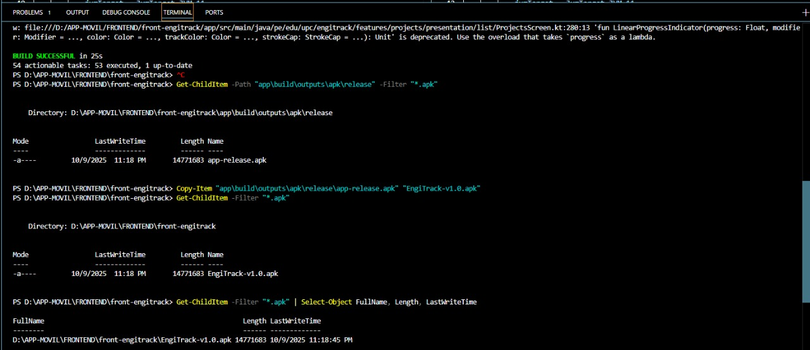

# COURSE PROJECT

    </img> 
    <strong>Universidad Peruana de Ciencias Aplicadas</strong> 
     
    <strong>Carrera de Ingeniería de Software</strong> 
    <strong>Ciclo 2025-2</strong>

  <strong>Curso: </strong>Aplicaciones para Dispositivos Móviles 
  <strong>Sección: </strong>1795

    <strong>Profesor: </strong>Jorge Luis Mayta Guillermo

    <strong>Informe de Trabajo Final</strong>

    <strong>Nombre del startup: </strong> BrosTechnologies

    <strong>Nombre del producto:</strong> Engitrack

    <h3 align="center">Integrantes del equipo:</h3>
    

     <table align="center">
        <tr>
            <th style="text-align:center;">Código</th>
            <th style="text-align:center;">Nombre</th>
        </tr>
        <tr>
            <td>u202310931</td>
            <td>Bellido Salas, Raúl</td>
        </tr>
        <tr>
            <td>u202310680</td>
            <td>Castro Sanchez, Amir Gabriel</td>
        </tr>
        <tr>
            <td>u202314130</td>
            <td>Gonzales Valverde, Carlos Matthew</td>
        </tr>
        <tr>
            <td>u202115357</td>
            <td>Prado Vargas, Mario Benjamín</td>
        </tr> 
        <tr>
            <td>u20221b778</td>
            <td>Fernández Remón, Roy</td>
        </tr>
    </table>

    <strong>Setiembre, 2025</strong>

---

# Registro de Versiones del Informe

Aqui podemos observar las diferentes versiones registradas del informe, conteniendo el numero de versión, la fecha en la que se desarrolló la versión, y la descripcion de la modificación

| **Versión** | **Fecha**  | **Autor** | **Descripción de modificación**                                         |
| ----------- | ---------- | --------- | ----------------------------------------------------------------------- |
| 1.0         | 26/08/2025 | Anónimo   | Se implementó el diseño/esqueleto del informe sobre todas las secciones |

---

# Project Report Collaboration Insights

Aqui podemos observar La cantidad de commits realizados por cada persona por entregable en el reporte. La cantidad de comits y los cambios totales al documento

**URL del repositorio para el Project Report:** [https://github.com/BrosTechnologies/report](https://github.com/BrosTechnologies/report)

---

# Contenido

- [Carátula](#course-project)
- [Registro de Versiones del Informe](#registro-de-versiones-del-informe)
- [Project Report Collaboration Insights](#project-report-collaboration-insights)
- [Contenido](#contenido)
- [Student Outcome](#student-outcome)
- [Objetivos SMART](#objetivos-smart)
- [Capítulo I: Presentación](#capítulo-i-presentación)
  - [1.1. Startup Profile](#11-startup-profile)
    - [1.1.1. Descripción de la Startup](#111-descripción-de-la-startup)
    - [1.1.2. Perfiles de integrantes del equipo](#112-perfiles-de-integrantes-del-equipo)
  - [1.2. Solution Profile](#12-solution-profile)
    - [1.2.1. Antecedentes y problemática](#121-antecedentes-y-problemática)
    - [1.2.2. Lean UX Process](#122-lean-ux-process)
      - [1.2.2.1. Lean UX Problem Statements](#1221-lean-ux-problem-statements)
      - [1.2.2.2. Lean UX Assumptions](#1222-lean-ux-assumptions)
      - [1.2.2.3. Lean UX Hypothesis Statements](#1223-lean-ux-hypothesis-statements)
      - [1.2.2.4. Lean UX Canvas](#1224-lean-ux-canvas)
  - [1.3. Segmentos objetivo](#13-segmentos-objetivo)
- [Capítulo II: Requirements Elicitation & Analysis](#capítulo-ii-requirements-elicitation--analysis)
  - [2.1. Competidores](#21-competidores)
    - [2.1.1. Análisis competitivo](#211-análisis-competitivo)
    - [2.1.2. Estrategias y tácticas frente a competidores](#212-estrategias-y-tácticas-frente-a-competidores)
  - [2.2. Entrevistas](#22-entrevistas)
    - [2.2.1. Diseño de entrevistas](#221-diseño-de-entrevistas)
    - [2.2.2. Registro de entrevistas](#222-registro-de-entrevistas)
    - [2.2.3. Análisis de entrevistas](#223-análisis-de-entrevistas)
  - [2.3. Needfinding](#23-needfinding)
    - [2.3.1. User Personas](#231-user-personas)
    - [2.3.2. User Task Matrix](#232-user-task-matrix)
    - [2.3.3. User Journey Mapping](#233-user-journey-mapping)
    - [2.3.4. Empathy Mapping](#234-empathy-mapping)
    - [2.3.5. Ubiquitous Language](#235-ubiquitous-language)
  - [2.4. Requirements specification](#24-requirements-specification)
    - [2.4.1. User Stories](#241-user-stories)
    - [2.4.2. Impact Mapping](#242-impact-mapping)
    - [2.4.3. Product Backlog](243-product-backlog)
  - [2.5. Strategic-Level Domain-Driven Design](#25-strategic-level-domain-driven-design)
    - [2.5.1. EventStorming](#251-eventstorming)
      - [2.5.1.1. Candidate Context Discovery](#2511-candidate-context-discovery)
      - [2.5.1.2. Domain Message Flows Modeling](#2512-domain-message-flows-modeling)
      - [2.5.1.3. Bounded Context Canvases](#2513-bounded-context-canvases)
    - [2.5.2. Context Mapping](#252-context-mapping)
    - [2.5.3. Software Architecture](#253-software-architecture)
      - [2.5.3.1. Software Architecture Context Level Diagrams](#2531-software-architecture-context-level-diagrams)
      - [2.5.3.2. Software Architecture Container Level Diagrams](#2532-software-architecture-container-level-diagrams)
      - [2.5.3.3. Software Architecture Deployment Diagrams](#2533-software-architecture-deployment-diagrams)
  - [2.6. Tactical-Level Domain-Driven Design](#26-tactical-level-domain-driven-design)
    - [2.6.1. Bounded Context: Gestión de Proyectos](#261-bounded-context-gestión-de-proyectos)
      - [2.6.1.1. Domain Layer](#2611-domain-layer)
      - [2.6.1.2. Interface Layer](#2612-interface-layer)
      - [2.6.1.3. Application Layer](#2613-application-layer)
      - [2.6.1.4. Infrastructure Layer](#2614-infrastructure-layer)
      - [2.6.1.5. Bounded Context Software Architecture Component Level Diagrams](#2615-bounded-context-software-architecture-component-level-diagrams)
      - [2.6.1.6. Bounded Context Software Architecture Code Level Diagrams](#2616-bounded-context-software-architecture-code-level-diagrams)
        - [2.6.1.6.1. Bounded Context Domain Layer Class Diagrams](#26161-bounded-context-domain-layer-class-diagrams)
        - [2.6.1.6.2. Bounded Context Database Design Diagram](#26162-bounded-context-database-design-diagram)
  - [2.6.2. Bounded Context: Control de Inventario](#262-bounded-context-control-de-inventario)
    - [2.6.2.1. Domain Layer](#2621-domain-layer)
    - [2.6.2.2. Interface Layer](#2622-interface-layer)
    - [2.6.2.3. Application Layer](#2623-application-layer)
    - [2.6.2.4. Infrastructure Layer](#2624-infrastructure-layer)
    - [2.6.2.5. Bounded Context Software Architecture Component Level Diagrams](#2625-bounded-context-software-architecture-component-level-diagrams)
    - [2.6.2.6. Bounded Context Software Architecture Code Level Diagrams](#2626-bounded-context-software-architecture-code-level-diagrams)
      - [2.6.2.6.1. Bounded Context Domain Layer Class Diagrams](#26261-bounded-context-domain-layer-class-diagrams)
      - [2.6.2.6.2. Bounded Context Database Design Diagram](#26262-bounded-context-database-design-diagram)
  - [2.6.3. Bounded Context: Control de Trabajadores](#263-bounded-context-control-de-trabajadores)
    - [2.6.3.1. Domain Layer](#2631-domain-layer)
    - [2.6.3.2. Interface Layer](#2632-interface-layer)
    - [2.6.3.3. Application Layer](#2633-application-layer)
    - [2.6.3.4. Infrastructure Layer](#2634-infrastructure-layer)
    - [2.6.3.5. Bounded Context Software Architecture Component Level Diagrams](#2635-bounded-context-software-architecture-component-level-diagrams)
    - [2.6.3.6. Bounded Context Software Architecture Code Level Diagrams](#2636-bounded-context-software-architecture-code-level-diagrams)
      - [2.6.3.6.1. Bounded Context Domain Layer Class Diagrams](#26361-bounded-context-domain-layer-class-diagrams)
      - [2.6.3.6.2. Bounded Context Database Design Diagram](#26362-bounded-context-database-design-diagram)
  - [2.6.4. Bounded Context: Control de Incidentes](#264-bounded-context-control-de-incidentes)
    - [2.6.4.1. Domain Layer](#2641-domain-layer)
    - [2.6.4.2. Interface Layer](#2642-interface-layer)
    - [2.6.4.3. Application Layer](#2643-application-layer)
    - [2.6.4.4. Infrastructure Layer](#2644-infrastructure-layer)
    - [2.6.4.5. Bounded Context Software Architecture Component Level Diagrams](#2645-bounded-context-software-architecture-component-level-diagrams)
    - [2.6.4.6. Bounded Context Software Architecture Code Level Diagrams](#2646-bounded-context-software-architecture-code-level-diagrams)
      - [2.6.4.6.1. Bounded Context Domain Layer Class Diagrams](#26461-bounded-context-domain-layer-class-diagrams)
      - [2.6.4.6.2. Bounded Context Database Design Diagram](#26462-bounded-context-database-design-diagram)
  - [2.6.5. Bounded Context: Control de Maquinaria](#265-bounded-context-control-de-maquinaria)
    - [2.6.5.1. Domain Layer](#2651-domain-layer)
    - [2.6.5.2. Interface Layer](#2652-interface-layer)
    - [2.6.5.3. Application Layer](#2653-application-layer)
    - [2.6.5.4. Infrastructure Layer](#2654-infrastructure-layer)
    - [2.6.5.5. Bounded Context Software Architecture Component Level Diagrams](#2655-bounded-context-software-architecture-component-level-diagrams)
    - [2.6.5.6. Bounded Context Software Architecture Code Level Diagrams](#2656-bounded-context-software-architecture-code-level-diagrams)
      - [2.6.5.6.1. Bounded Context Domain Layer Class Diagrams](#26561-bounded-context-domain-layer-class-diagrams)
      - [2.6.5.6.2. Bounded Context Database Design Diagram](#26562-bounded-context-database-design-diagram)
- [Capítulo III: Solution UI/UX Design](#capítulo-iii-solution-uiux-design)
  - [3.1. Product design](#31-product-design)
    - [3.1.1. Style Guidelines](#311-style-guidelines)
      - [3.1.1.1. General Style Guidelines](#3111-general-style-guidelines)
    - [3.1.2. Information Architecture](#312-information-architecture)
      - [3.1.2.1. Organization Systems](#3121-organization-systems)
      - [3.1.2.2. Labelling Systems](#3122-labelling-systems)
      - [3.1.2.3. SEO Tags and Meta Tags](#3123-seo-tags-and-meta-tags)
      - [3.1.2.4. Searching Systems](#3124-searching-systems)
      - [3.1.2.5. Navigation Systems](#3125-navigation-systems)
    - [3.1.3. Landing Page UI Design](#313-landing-page-ui-design)
      - [3.1.3.1. Landing Page Wireframe](#3131-landing-page-wireframe)
      - [3.1.3.2. Landing Page Mock-up](#3132-landing-page-mock-up)
    - [3.1.4. Mobile Applications UX/UI Design](#314-mobile-applications-uxui-design)
      - [3.1.4.1. Mobile Applications Wireframes](#3141-mobile-applications-wireframes)
      - [3.1.4.2. Mobile Applications Wireflow Diagrams](#3142-mobile-applications-wireflow-diagrams)
      - [3.1.4.3. Mobile Applications Mock-ups](#3143-mobile-applications-mock-ups)
      - [3.1.4.4. Mobile Applications User Flow Diagrams](#3144-mobile-applications-user-flow-diagrams)
      - [3.1.4.5. Mobile Applications Prototyping](#3145-mobile-applications-prototyping)
- [Capítulo IV: Product Implementation & Validation](#capítulo-iv-product-implementation--validation)
- [4.1. Software Configuration Management](#41-software-configuration-management)
  - [4.1.1. Software Development Environment Configuration](#411-software-development-environment-configuration)
  - [4.1.2. Source Code Management](#412-source-code-management)
  - [4.1.3. Source Code Style Guide & Conventions](#413-source-code-style-guide--conventions)
  - [4.1.4. Software Deployment Configuration](#414-software-deployment-configuration)
  - [4.2. Landing Page & Mobile Application Implementation](#42-landing-page--mobile-application-implementation)
    - [4.2.1. Sprint 1](#421-sprint-1)
      - [4.2.1.1. Sprint Planning 1](#4211-sprint-planning-1)
      - [4.2.1.2. Sprint Backlog 1](#4212-sprint-backlog-1)
      - [4.2.1.3. Development Evidence for Sprint Review](#4213-development-evidence-for-sprint-review)
      - [4.2.1.4. Testing Suite Evidence for Sprint Review](#4214-testing-suite-evidence-for-sprint-review)
      - [4.2.1.5. Execution Evidence for Sprint Review](#4215-execution-evidence-for-sprint-review)
      - [4.2.1.6. Services Documentation Evidence for Sprint Review](#4216-services-documentation-evidence-for-sprint-review)
      - [4.2.1.7. Software Deployment Evidence for Sprint Review](#4217-software-deployment-evidence-for-sprint-review)
      - [4.2.1.8. Team Collaboration Insights during Sprint](#4218-team-collaboration-insights-during-sprint)
  - [4.3. Validation Interviews](#43-validation-interviews)
    - [4.3.1. Diseño de Entrevistas](#431-diseño-de-entrevistas)
    - [4.3.2. Registro de Entrevistas](#432-registro-de-entrevistas)
    - [4.3.3. Evaluaciones según heurísticas](#433-evaluaciones-según-heurísticas)
- [Conclusiones](#conclusiones)
  - [Conclusiones y recomendaciones](#conclusiones-y-recomendaciones)
  - [Video App Validation](#video-app-validation)
  - [Video About-the-product](#video-about-the-product)
  - [Video About-the-team](#video-about-the-team)
- [Glosario](#glosario)
- [Bibliografía](#bibliografía)
- [Anexos](#anexos)

---

# Student Outcome

El curso contribuye al cumplimiento del Student Outcome ABET: 
**ABET - EAC - Student Outcome 7**

**Criterio:** La capacidad de adquirir y aplicar nuevos conocimientos según sea
necesario, utilizando estrategias de aprendizaje apropiadas.

En el siguiente cuadro se describe las acciones realizadas y enunciados de
conclusiones por parte del grupo, que permiten sustentar el haber alcanzado el logro
del ABET – EAC - Student Outcome 7.

| Criterio específico | Acciones realizadas | Conclusiones |
| :------------------ | :------------------ | :------------ |
| **Actualiza conceptos y conocimientos necesarios para su desarrollo profesional y en especial para su proyecto en soluciones de software.** | **TB1: Roy Fernández Remón** Reforzamos los conocimientos sobre metodologías ágiles y el enfoque Lean UX para aplicarlos en la definición del problema y la validación de la propuesta de valor.  **TP1: Roy Fernández Remón** Diseñé las pantallas de presentación de la aplicación EngiTrack en Android Studio, aplicando principios de diseño visual y flujo de navegación entre vistas. Profundicé en el enrutamiento dentro del entorno móvil, fortaleciendo mis conocimientos en estructuración de interfaces y coherencia de experiencia de usuario.  **TB1: Prado Vargas, Mario Benjamín** Aplicamos herramientas de análisis y técnicas de entrevista para comprender las necesidades reales de los usuarios y el contexto del problema.  **TP1: Prado Vargas, Mario Benjamín** Desarrollé la landing page de EngiTrack y gestioné su despliegue final, aplicando conceptos de diseño responsive y jerarquía visual. Aprendí a integrar secciones interactivas como *features* y *pricing*, fortaleciendo mi dominio en la presentación de productos digitales.  **TB1: Bellido Salas, Raúl** Ejecutamos actividades de Event Storming y modelado de dominio para representar los procesos del sistema y entender su estructura funcional.  **TP1: Bellido Salas, Raúl** Asumí el rol de líder del equipo, organizando tareas, guiando la redacción del informe y verificando la consistencia entre artefactos. Fortalecí mis habilidades de gestión y coordinación, además de apoyar en la identificación y resolución de errores técnicos durante el desarrollo.  **TB1: Castro Sanchez, Amir Gabriel** Participamos en el análisis competitivo del mercado, identificando oportunidades de mejora frente a soluciones móviles existentes.  **TP1: Castro Sanchez, Amir Gabriel** Diseñé las pantallas de *login*, *register* y *perfil* en Android Studio, implementando el enrutamiento entre vistas y la edición del perfil. Profundicé en la arquitectura de navegación de Android y en la estructuración modular del código para facilitar futuras integraciones.  **TB1: Gonzales Valverde, Carlos Matthew** Reforzamos conceptos de diseño centrado en el usuario, preparando las bases para el desarrollo de wireframes y prototipos en las siguientes etapas.  **TP1: Gonzales Valverde, Carlos Matthew** Desarrollé el backend de EngiTrack utilizando *Minimal API*, implementando la conexión con la aplicación móvil para una funcionalidad principal. Apliqué buenas prácticas de arquitectura ligera y documenté los endpoints creados. Además, apoyé en la maquetación de pantallas del frontend, fortaleciendo mis competencias técnicas en integración móvil-backend. | **TB1:** El equipo consolidó su capacidad para aplicar conocimientos previos en metodologías de análisis y diseño, adaptándolos a un contexto real de proyecto. Este proceso fortaleció la comprensión del problema, el trabajo colaborativo y la planificación de la futura implementación.  **TP1:** El grupo amplió sus competencias técnicas al implementar los componentes principales del sistema: backend con Minimal API, frontend móvil en Android Studio y landing page web. Se evidenció la aplicación práctica de nuevos conocimientos adquiridos de manera autónoma, mejorando la capacidad técnica y la coordinación grupal. |
| **Reconoce la necesidad del aprendizaje permanente para el desempeño profesional y el desarrollo de proyectos en soluciones de software.** | **TB1: Roy Fernández Remón** Promovimos la actualización constante de conocimientos técnicos y metodológicos para adaptarnos a los requerimientos del proyecto.  **TP1: Roy Fernández Remón** Me capacité en nuevas técnicas de navegación en Android y optimización de interfaces, aplicando documentación oficial y recursos en línea para mejorar el flujo de la aplicación. Este proceso reforzó la importancia del aprendizaje autónomo para superar los retos del desarrollo móvil.  **TB1: Prado Vargas, Mario Benjamín** Fomentamos el aprendizaje colaborativo mediante la revisión de recursos y ejemplos de proyectos similares en el ámbito móvil.  **TP1: Prado Vargas, Mario Benjamín** Aprendí sobre despliegue de páginas web estáticas y la estructura de componentes modernos en frameworks frontend. Este aprendizaje me permitió optimizar la presentación del producto y comprender el flujo de interacción con usuarios reales.  **TB1: Bellido Salas, Raúl** Participamos en la documentación de los procesos de análisis para fortalecer la comprensión compartida y facilitar futuras iteraciones.  **TP1: Bellido Salas, Raúl** Fortalecí mis habilidades de liderazgo técnico, aplicando estrategias de seguimiento ágil y comunicación efectiva. Este proceso me permitió reconocer la importancia del aprendizaje organizacional y la gestión del conocimiento dentro del equipo.  **TB1: Castro Sanchez, Amir Gabriel** Colaboramos activamente en la consolidación de los entregables, aplicando estrategias de mejora continua en base a retroalimentación interna.  **TP1: Castro Sanchez, Amir Gabriel** Aprendí sobre la arquitectura de *Activities* y *Fragments* en Android Studio, investigando en foros y documentación oficial. Esta experiencia fortaleció mi autonomía para resolver problemas y mi habilidad de adaptación ante tecnologías nuevas.  **TB1: Gonzales Valverde, Carlos Matthew** Reconocimos la importancia de seguir adquiriendo conocimientos en experiencia de usuario y arquitectura de software para etapas posteriores del desarrollo.  **TP1: Gonzales Valverde, Carlos Matthew** Profundicé de forma autodidacta en la creación de servicios con Minimal API, entendiendo su diferencia con RESTful y sus ventajas en proyectos ligeros. Esta experiencia consolidó mi capacidad de aprendizaje técnico continuo y de aplicación práctica inmediata. | **TB1:** El grupo comprendió que el aprendizaje continuo es una herramienta clave para afrontar los desafíos del desarrollo de software. Mantener una actitud de mejora y actualización constante permitirá fortalecer el desempeño profesional y la calidad del producto final.  **TP1:** Durante esta etapa, el equipo demostró un aprendizaje activo y colaborativo al enfrentarse a nuevas tecnologías como Android Studio y Minimal API. El trabajo autónomo, la investigación técnica y la documentación constante reflejan un compromiso con el crecimiento profesional y la mejora continua. |

---

# Objetivos SMART

Aqui podemos observar como cada participante desarrolló los objetivos smart de manera unica para cada uno

# Cuadro de Objetivos SMART - Equipo de Ingeniería de Software

| Integrante                            | Objetivo SMART 1                                                                                                                                                                                                         | Objetivo SMART 2                                                                                                                                                                                       |
| ------------------------------------- | ------------------------------------------------------------------------------------------------------------------------------------------------------------------------------------------------------------------------ | ------------------------------------------------------------------------------------------------------------------------------------------------------------------------------------------------------ |
| **Roy Fernández Remón**               | Desarrollar dos aplicaciones completas implementando arquitectura hexagonal y principios de clean code, entregando el primer proyecto en 3 meses y el segundo antes de 6 meses.                                          | Obtener la certificación AWS Solutions Architect Associate dedicando 10 horas semanales de estudio durante 12 semanas, aprobando el examen en el tercer trimestre del año.                             |
| **Prado Vargas, Mario Benjamín**      | Reducir la deuda técnica en el código base actual en un cuarenta por ciento mediante técnicas de refactorización y mejora de procesos, midiendo el progreso mensualmente durante los próximos 4 meses.                   | Completar la especialización en DevOps mediante un programa estructurado de 40 horas que incluya la implementación práctica de una canalización de CI/CD para un proyecto real en un plazo de 3 meses. |
| **Bellido Salas, Raúl**               | Dominar e implementar tres patrones de diseño arquitectónico en proyectos del portafolio personal, documentando cada caso de uso y sus beneficios dentro del próximo cuatrimestre.                                       | Realizar una práctica profesional especializada en el área de ciberseguridad aplicada al desarrollo de software, con una duración de 320 horas durante el segundo semestre del año.                    |
| **Castro Sanchez, Amir Gabriel**      | Implementar un sistema integral de testing automatizado que alcance una cobertura de código del noventa por ciento para el proyecto principal, estableciendo métricas y reportes semanales durante los próximos 2 meses. | Completar un bootcamp intensivo de desarrollo móvil con Flutter con una duración de 8 semanas, que culmine con el desarrollo y publicación de una aplicación en stores oficiales.                      |
| **Gonzales Valverde, Carlos Matthew** | Aumentar la velocidad y eficiencia de desarrollo en un veinticinco por ciento mediante la adopción de nuevas herramientas y metodologías, midiendo el progreso con métricas específicas durante un período de 5 meses.   | Especializarse en inteligencia artificial aplicada al software mediante un curso avanzado de 100 horas, implementando un proyecto de machine learning con un dataset real antes de finalizar el año.   |

---

# Capítulo I: Presentación

## 1.1. Startup Profile

Startup profile: En esta sección se presenta el startup junto a sus integrantes, describiendo a cada uno de ellos

### 1.1.1. Descripción de la Startup

**Brostechnologies** es una startup fundada por jóvenes universitarios de la Universidad Peruana de Ciencias Aplicadas (UPC), enfocada en ofrecer soluciones para la gestión eficiente de proyectos de construcción dirigidos a pequeñas y medianas empresas constructoras, así como a trabajadores administrativos. A través de nuestra plataforma digital, **_Engitrack_**, los usuarios pueden realizar solicitudes de servicios, además de supervisar el progreso y los gastos de cada obra.

Nuestra meta es simplificar la administración y garantizar mayor transparencia en los procesos constructivos. Entre las principales funciones que gestionamos se encuentran: la administración de personal, el control de materiales, la gestión presupuestal, el seguimiento de plazos de ejecución y el monitoreo en tiempo real del avance de los proyectos.

En **Brostechnologies** consideramos esencial optimizar los procesos de construcción para que nuestros clientes incrementen sus ganancias, reduzcan tiempos de ejecución y puedan tomar decisiones basadas en información confiable. Apostamos por la tecnología como un recurso clave para transformar el sector, facilitando que incluso las pequeñas y medianas empresas accedan a una gestión profesional, organizada y eficiente de sus obras.

**Misión:** Ofrecer soluciones digitales innovadoras que optimicen la gestión de proyectos de construcción en pequeñas y medianas empresas, permitiendo una mejor administración de recursos, seguimiento de avances, control de gastos y otros procesos, con el propósito de impulsar la eficiencia, la transparencia y la toma de decisiones estratégicas en el sector.

**Visión:** Convertirnos en la plataforma líder en Latinoamérica en la digitalización de procesos constructivos para pequeñas y medianas empresas, transformando la gestión de obras mediante tecnología accesible, eficiente y orientada a las necesidades de nuestros usuarios.

### 1.1.2. Perfiles de integrantes del equipo

| Foto                                                                                                                                                   | Nombre y Apellidos                | Código de Estudiante | Carrera                | Resumen de Conocimientos y Habilidades                                                                                                                                                                                                                                                                                                                         |
|--------------------------------------------------------------------------------------------------------------------------------------------------------|-----------------------------------|----------------------|------------------------|----------------------------------------------------------------------------------------------------------------------------------------------------------------------------------------------------------------------------------------------------------------------------------------------------------------------------------------------------------------|
|                                                                                                 | Fernandez Remon, Roy Linsh        | u20221b778           | Ingeniería de Software | Experto en desarrollo web con Vue.js, dominio de bases de datos relacionales y metodologías ágiles. Aporta habilidades en programación, documentación técnica y liderazgo de equipo.                                                                                                                                                                           |
|  | Castro Sanchez, Amir Gabriel      | u202310680           | Ingeniería de Software | Conocimientos en VUE.JS, ANGULAR, .net 9 con RestfulApi para el backend, análisis de sistemas y modelado UML. Aporta al equipo su capacidad de análisis crítico y estructuración de soluciones escalables.                                                                                                                                                     |
|               | Gonzales Valverde, Carlos Matthew | u202314130           | Ingeniería de Software | Me gusta mucho el desarrollo web mayormente con Angular, Typescript todo lo que viene siendo tambien en el tema de backend .NET he probado realizar aplicaciones en flutter pero quiero manejarlo aun mas, Aporto mucho al equipo ya sea mediante comunicando o incluso sabiendo trabajar bajo presion                                                         |
|               | Prado Vargas, Mario Benjamín      | U202115357           | Ingeniería de Software | Frontend: Angular, Tailwind . Backend: Desarrollo de APIs REST con Spring Boot y .NET. Conocimientos adicionales: C++, gestión de bases de datos, java, python, javascript. También cuento con base en HTML, CSS y el framework Tailwind v4.0. Actualmente estoy aprendiendo desarrollo de redes neuronales y machine learning.                                |
|                                                                                                   | Bellido Salas, Raúl               | u202310931           | Ingeniería de Software | Actualmente mi primera experiencia en el desarrollo de aplicaciones móviles, estoy dispuesto a mostrar una gran disposición para aprender nuevas tecnologías y adaptarme a los retos del proyecto. Aportaré al equipo una actitud colaborativa, pensamiento crítico y compromiso con la mejora continua durante las fases de análisis y diseño de la solución. |

## 1.2. Solution Profile

En esta sección se identifica la problemática a resolver, investigando sobre sus origenes usando la metodología 5w 2h

### 1.2.1. Antecedentes y problemática

En el contexto actual del sector construcción en Lima Metropolitana y otras ciudades del país, muchas pequeñas y medianas empresas (PYMEs) enfrentan una realidad compleja al gestionar sus proyectos. El sector construcción en el Perú es uno de los principales motores de la economía, aportando más del 5% al PBI nacional (Constructivo, 2024\) , pero presenta un alto nivel de informalidad y baja adopción tecnológica en los procesos operativos. A pesar de que las grandes constructoras cuentan con sistemas integrados de planificación y control, la mayoría de las PYMEs siguen dependiendo de métodos manuales o herramientas básicas como hojas de cálculo, cuadernos de obra, llamadas telefónicas o aplicaciones de mensajería instantánea. Estas prácticas generan desorganización, duplicidad de datos, errores de control y retrasos significativos en la toma de decisiones.  
La situación se agrava porque los supervisores y jefes de obra deben cumplir múltiples funciones: coordinar equipos en campo, gestionar inventarios, controlar presupuestos, asegurar el cumplimiento de normas de seguridad y reportar avances a la administración o a los contratantes. Sin un sistema centralizado, estas tareas se vuelven poco eficientes, consumen tiempo valioso y exponen a las empresas a sobrecostos, incumplimientos contractuales y pérdida de competitividad. Este problema de eficiencia se enmarca en un sector que, según las proyecciones para 2025, espera un crecimiento moderado de entre 3.5% y 3.8% , impulsado principalmente por la inversión privada y las Asociaciones Público-Privadas (APP), un entorno donde la eficiencia operativa es crucial. Por su parte, los clientes y contratantes demandan mayor transparencia, reportes claros y actualizados, y visibilidad en tiempo real del avance de sus proyectos, condiciones que hoy rara vez se cumplen en las PYMEs constructoras.

Frente a esta problemática, Brostechnologies identifica una brecha importante en el mercado: la ausencia de una herramienta digital accesible, intuitiva y pensada específicamente para la realidad de las pequeñas y medianas empresas del sector. Mientras soluciones internacionales como Procore o Buildertrend ofrecen funcionalidades avanzadas, sus precios resultan prohibitivos para las PYMEs locales (planes desde USD 95 hasta USD 300 mensuales), lo que deja a estas empresas sin opciones asequibles que les permitan modernizar sus procesos. Este vacío constituye una oportunidad para que nuestra startup desarrolle una plataforma móvil que centralice la información de obra, optimice la gestión de recursos y promueva la transparencia en la comunicación con contratantes y clientes, incrementando la eficiencia y reduciendo los riesgos operativos.

**What (¿Qué problema existe?)**

- Falta de centralización: la información de obra (asistencia de obreros, entradas/salidas de materiales, avances) se guarda en múltiples formatos y lugares (Excel, cuadernos, fotos), lo que dificulta consolidar estados reales del proyecto.
- Comunicación informal: se depende de canales no estructurados (WhatsApp, llamadas) para reportar problemas o ausencias, sin trazabilidad ni estándar de reporte.
- Escasa visibilidad para contratantes: los clientes reciben información incompleta o tardía, lo que genera desconfianza y conflictos.
- Herramientas existentes no accesibles: soluciones completas en el mercado suelen ser costosas para PYMEs (planes comerciales de referencia en el mercado rondan desde \~USD 95 hasta USD 300+ mensuales), dejando un vacío para productos más económicos y enfocados en operaciones diarias. (Numia, s.f)

**Why (¿Por qué es importante gestionar bien una obra?)**

- Control de costos y tiempo: una gestión adecuada evita compras innecesarias, desperdicio de materiales y penalidades por retrasos.
- Calidad y seguridad: facilita verificar el cumplimiento de normas, uso de EPP y calidad de materiales.
- Confianza entre partes: transparencia en la ejecución mejora la relación con contratantes y reduce disputas contractuales.
- Productividad: reduce el tiempo dedicado a tareas administrativas (registro manual, consolidación de datos) y permite que supervisores tomen decisiones informadas en campo.

**When (¿Cuándo ocurre?)**

- Durante la etapa de ejecución y supervisión del proyecto: planificación diaria (inicio de jornada), monitoreo de actividades (durante el día) y cierre/conciliación (fin de jornada).
- Cuando hay cambios operativos o imprevistos: retrasos en entrega de materiales, ausencias de personal clave, necesidad de valorización o ajustes presupuestarios.
- También ocurre de forma continua en proyectos con múltiples frentes y alta rotación de personal.

**Where (¿Dónde sucede?)**

- Principalmente en obra (sitio de construcción), oficina administrativa de la empresa constructora y en el punto de interacción con contratantes (presencial o remoto).
- En el presente informe se enfatiza la realidad local de Lima Metropolitana (distritos con alta actividad de PYMEs constructoras), aunque la solución propuesta está diseñada para ser replicable a otras regiones urbanas y semiurbanas.

**Who (¿A quién afecta?)**

- Supervisores y jefes de obra: pierden tiempo en tareas administrativas y carecen de información consolidada para decidir.
- Asistentes administrativos y almacenistas: registros inconsistentes y retrabajo por datos duplicados.
- Contratantes / clientes: reciben reportes incompletos o tardíos, lo que genera desconfianza y puede causar pérdidas económicas.
- La propia empresa constructora: costos mayores, baja rentabilidad y riesgo reputacional que afectan su capacidad para conseguir nuevos contratos.

**How (¿Cómo se manifiesta el problema?)**

- Errores en inventario: compras duplicadas o faltantes por no actualizar stock en tiempo real.
- Registros manuales y desincronizados: hojas de tareo físicas, Excel y fotos que requieren consolidación manual.
- Reportes tardíos o sin estandarización: informes en formatos inconsistentes (Word, Excel, WhatsApp) que no facilitan comparaciones ni decisiones rápidas.
- Descoordinación entre campo y oficina: demora en la transmisión de incidencias y en la gestión de reposiciones o ajustes.
- Dependencia de conectividad: muchas obras tienen baja o intermitente conectividad; sin un modo offline/sincronización robusta, la herramienta pierde utilidad en campo. (Lopez, 2019)

**How much (¿Qué tan grave es?)**

- Impacto económico directo: entrevistas y casos reportados muestran pérdidas concretas por mala gestión.
- Coste operativo acumulado: el tiempo de consolidación de reportes y correcciones puede consumir horas diarias del equipo, traducido en costos salariales y demoras en la toma de decisiones.
- Riesgo de contratación y reputación: falta de transparencia puede impedir la obtención de nuevos contratos y ocasionar penalidades contractuales.
- Barreras a la adopción: la percepción de complejidad y el costo de soluciones existentes limitan la digitalización de muchas PYMEs; una solución accesible y fácil de usar tiene potencial para reducir esta brecha rápidamente. (Hinostroza, 2019)

### 1.2.2. Lean UX Process

En esta sección se presenta el marco fundamental que sustenta la propuesta de valor de Engitrack, comenzando con una definición clara del problema a resolver, seguida de los supuestos iniciales de negocio, usuario y funcionalidad, para finalmente articular un conjunto de hipótesis estratégicas que serán validadas con los usuarios objetivo.

#### 1.2.2.1. Lean UX Problem Statements

En el sector construcción en Lima Metropolitana y otras ciudades del Perú, las pequeñas y medianas empresas (PYMEs) enfrentan grandes dificultades para gestionar de manera eficiente sus proyectos. El sector presenta altos niveles de informalidad y baja adopción tecnológica, lo que limita su competitividad.

Hemos observado que, a diferencia de las grandes constructoras que cuentan con sistemas integrados de planificación y control, las PYMEs continúan dependiendo de métodos manuales o herramientas básicas como hojas de cálculo, cuadernos de obra, llamadas telefónicas o aplicaciones de mensajería. Estas prácticas generan desorganización, duplicidad de datos, errores de control y retrasos significativos en la toma de decisiones.

Los supervisores y jefes de obra (que suelen asumir múltiples funciones en campo y oficina) carecen de un sistema centralizado que los apoye en la coordinación de equipos, gestión de inventarios, control presupuestal, cumplimiento de normas de seguridad y comunicación con los contratantes. Al mismo tiempo, los clientes y contratantes demandan mayor transparencia, reportes actualizados y visibilidad en tiempo real de los avances, condiciones que hoy rara vez se cumplen en las PYMEs.

Actualmente, existen soluciones internacionales como Procore o Buildertrend que ofrecen funcionalidades avanzadas, pero sus altos costos de suscripción (USD 95 a 300 mensuales) hacen que resulten inaccesibles para la mayoría de las empresas locales. Esto crea una brecha entre las necesidades de digitalización de las PYMEs y las soluciones disponibles en el mercado.

¿Cómo podemos ayudar a las PYMEs del sector construcción en Lima Metropolitana a optimizar la gestión de sus proyectos mediante una herramienta digital accesible y adaptada a su realidad, que centralice la información de obra, apoye a supervisores en sus múltiples funciones y ofrezca a los contratantes transparencia y visibilidad en tiempo real, reduciendo riesgos operativos y mejorando la competitividad?

Como segmento inicial, enfocaremos nuestra solución en los supervisores de obra de PYMEs constructoras en Lima Metropolitana, quienes desempeñan un rol crítico en la coordinación de proyectos y enfrentan directamente las limitaciones de los procesos actuales.

#### 1.2.2.2. Lean UX Assumptions

Para guiar el desarrollo de nuestra solución Engitrack y asegurarnos de que estamos abordando los problemas correctos para los usuarios adecuados, hemos formulado una serie de supuestos. Estos supuestos son hipótesis que necesitan ser validadas a lo largo del proceso Lean UX. Los hemos clasificado en tres áreas críticas: **negocio, usuario y funcionalidad.**

**Supuestos de Negocio:**

Estos supuestos se centran en la viabilidad y el valor que Brostechnologies espera generar en el mercado.

- Creemos que las PYMEs constructoras están dispuestas a pagar una suscripción mensual por una herramienta digital si esta les demuestra un retorno de inversión claro a través de la reducción de sobrecostos, el ahorro de tiempo y la prevención de penalidades por retrasos.
- Creemos que existe un mercado desatendido y suficientemente grande en Lima Metropolitana y otras ciudades de Latinoamérica que considera las soluciones internacionales existentes como demasiado costosas y complejas para sus necesidades operativas diarias.
- Creemos que al ofrecer una plataforma accesible y diseñada para la realidad del sector de construcción local, podemos lograr una rápida adopción y posicionarnos como la solución de entrada para la digitalización de las PYMEs.

**Supuestos de Usuario:**

Estos supuestos se relacionan con nuestros usuarios objetivo, sus problemas, comportamientos y necesidades.

- Creemos que los supervisores de obra son el segmento de usuario clave para empezar, ya que son quienes más sienten el impacto negativo de la gestión manual y tienen una alta influencia en la adopción de nuevas herramientas en el proyecto.
- Creemos que los supervisores valorarán una aplicación móvil que centralice la información (personal, materiales, avances) por encima de sus métodos actuales (WhatsApp, Excel, cuadernos), porque les permitirá tomar decisiones más rápidas y fundamentadas en campo.
- Creemos que los clientes y contratantes de las PYMEs constructoras demandan mayor transparencia y que esta necesidad presiona a las constructoras para que adopten herramientas que ofrezcan reportes claros y en tiempo real.

**Supuestos de Funcionalidad**

Estos supuestos se refieren a las características específicas de la plataforma Engitrack y el valor que entregarán.

- Creemos que las funcionalidades más críticas para aportar valor inicial son el registro de asistencia, el control de inventario de materiales y la generación de reportes de avance diario con evidencia fotográfica.
- Creemos que una interfaz de usuario sencilla e intuitiva, que requiera mínima capacitación, es un factor decisivo para que los supervisores y trabajadores adopten la herramienta sin resistencia.
- Creemos que una funcionalidad de modo offline que permita registrar datos sin conexión a internet para sincronizarlos después es indispensable para el uso continuo de la aplicación en las obras, donde la conectividad suele ser inestable.

#### 1.2.2.3. Lean UX Hypothesis Statements

**Hipótesis de negocio:**

Creemos que la disposición de las PYMEs constructoras a pagar una suscripción mensual por Engitrack se logrará si los supervisores de obra logran reducir sobrecostos, ahorrar tiempo y prevenir penalidades por retrasos gracias al uso de la plataforma.
(Referencia: Assumption de negocio 1)

**Hipótesis de mercado:**

Creemos que el posicionamiento de Engitrack como la solución de entrada a la digitalización de PYMEs en Lima Metropolitana se logrará si las empresas constructoras encuentran en nuestra herramienta una alternativa accesible y adaptada a su realidad frente a las soluciones internacionales demasiado costosas y complejas.
(Referencia: Assumption de negocio 2 y 3)

**Hipótesis de usuario clave:**

Creemos que la adopción inicial de Engitrack por parte de las PYMEs se logrará si los supervisores de obra centralizan exitosamente en la aplicación móvil la información de personal, materiales y avances, superando sus métodos actuales dispersos como WhatsApp, Excel o cuadernos.
(Referencia: Assumption de usuario 1 y 2)

**Hipótesis de transparencia:**

Creemos que la confianza de los contratantes en Engitrack como alternativa correcta se logrará si los supervisores generan reportes de avance con evidencia fotográfica que brinden transparencia y visibilidad en tiempo real.
(Referencia: Assumption de usuario 3 y funcionalidad 3)

**Hipótesis de funcionalidad crítica:**

Creemos que la percepción de Engitrack como una herramienta indispensable en obra se logrará si los supervisores pueden registrar asistencia, controlar inventarios y generar reportes diarios de manera sencilla e incluso en modo offline.
(Referencia: Assumption de funcionalidad 1 y 3.)

**Hipótesis de usabilidad:**

Creemos que la adopción rápida de Engitrack por parte de supervisores y trabajadores se logrará si la interfaz de usuario es lo suficientemente sencilla e intuitiva para requerir mínima capacitación.
(Referencia: Assumption de funcionalidad 2.)

#### 1.2.2.4. Lean UX Canvas

Link: https://miro.com/app/board/uXjVJ8XZQgE=/?share_link_id=150143934663

## 1.3. Segmentos objetivo

La identificación de los segmentos objetivo es fundamental para orientar el desarrollo y la comercialización de Engitrack. Nuestra solución está diseñada para crear valor en ambos extremos de la relación contractual en el sector construcción: quienes ejecutan los proyectos y quienes los contratan. A continuación, se definen los dos segmentos principales que constituyen nuestro mercado meta inicial, detallando sus características demográficas, roles, desafíos específicos y las necesidades centrales que Engitrack busca resolver para cada uno de ellos.

**Segmento objetivo \#1: Supervisores de obra**  
Este segmento está compuesto por profesionales encargados de supervisar y gestionar la ejecución de los proyectos de construcción. En muchas pequeñas y medianas empresas, el rol de supervisor suele ser asumido también por el jefe de obra, quien cumple múltiples funciones que van desde la supervisión directa en campo hasta la toma de decisiones administrativas y técnicas.  
**Características demográficas**  
Ubicación: Principalmente en zonas urbanas y semiurbanas de Lima Metropolitana, como San Juan de Lurigancho, Villa El Salvador, Ate y San Martín de Porres, donde se concentran pequeñas y medianas empresas constructoras.

- Edad: Entre 28 y 50 años, con una media de 38 años.
- Nivel socioeconómico: Clase media.

Desafíos: Los supervisores de obra enfrentan el reto de mantener los proyectos dentro del presupuesto estimado, asegurar la disponibilidad de materiales para la ejecución de la obra, comunicar de manera clara los avances a los contratantes y garantizar la coordinación del personal en campo.

**Segmento objetivo \#2: Contratantes de empresas privadas**  
Este segmento está compuesto por personas o empresas que contratan servicios de construcción, ya sea para edificaciones comerciales, remodelaciones o proyectos privados de mediana escala. Su interés principal es que la obra cumpla con los plazos, la calidad y las normativas establecidas, además de recibir información transparente y confiable del progreso.  
**Características demográficas**  
Ubicación: Principalmente en zonas urbanas y semiurbanas de Lima Metropolitana, como San Juan de Lurigancho, Villa El Salvador, Ate y San Martín de Porres, donde se concentran pequeñas y medianas empresas constructoras.

- Edad: Entre 34 y 45 años, con una media de 39 años.
- Nivel socioeconómico: Clase media-alta.

Desafíos: Necesitan que las obras sean entregadas a tiempo para evitar interrupciones en sus operaciones o pérdidas económicas. Además, esperan que todo el proceso esté en regla (licencias, seguros, normas de construcción y seguridad laboral) y que exista transparencia en el uso de materiales y recursos.

---

# Capítulo II: Requirements Elicitation & Analysis

## 2.1. Competidores

En un mercado en proceso de digitalización como el de la construcción en Perú, comprender el panorama competitivo es crucial para posicionar estratégicamente nuestra solución. Este análisis nos permite identificar no solo las alternativas disponibles, sino también las brechas en la oferta actual que EngiTrack puede aprovechar. A través de una evaluación detallada de competidores directos e indirectos, se busca definir nuestro diferencial clave, refinar la propuesta de valor y diseñar estrategias efectivas para capturar el segmento de mercado desatendido por las soluciones existentes: las PYMEs constructoras. El siguiente análisis compara perfiles, estrategias y posicionamiento, sentando las bases para nuestra ventaja competitiva.

### 2.1.1. Análisis competitivo

**¿Por qué realizar este análisis?**  
Es fundamental realizarlo debido a que te brinda una visión más detallada de los competidores del rubro donde se está desarrollando nuestra startup. Esto nos permite identificar los FODA de nuestra startup, así como de los competidores. Además, nos ayuda a detectar aspectos clave para saber en donde marcamos la diferencia contra los otros competidores, y así poder sobresalir en el mercado. Incluso podemos reconocer nuestras fortalezas y debilidades, lo que servirá de apoyo para la toma de decisiones estratégicas más acertadas.

|        **Nombre**        |                                                           | EngiTrack                                                                                                       |                                              Procore                                               |                                BuilderTrend                                 |                                            BuildWise                                             |
|:------------------------:|-----------------------------------------------------------|-----------------------------------------------------------------------------------------------------------------|:--------------------------------------------------------------------------------------------------:|:---------------------------------------------------------------------------:|:------------------------------------------------------------------------------------------------:|
|         **Logo**         |                                                           |                                                         |                                              |                  |                                          |
|        **Perfil**        | **Overview**                                              | Plataforma digital integral para PYMEs constructoras y equipos administrativos. Optimiza procesos y decisiones. | Plataforma robusta para grandes constructoras; impulsa la gestión basada en datos y escalabilidad. |           Software para construcción residencial y remodelación.            |             Plataforma ágil y accesible para PYMEs; también brinda asesoría técnica.             |
|                          | **Ventaja competitiva ¿Qué valor ofrece a los clientes?** | Solución completa, accesible y fácil de usar, con soporte personalizado e informes automatizados.               |                   Funcionalidad avanzada y escalabilidad para proyectos grandes.                   | Mejora comunicación, planificación y presupuesto en proyectos de vivienda.  |        Solución sencilla y accesible para obras pequeñas y medianas, con soporte directo.        |
|  **Plan de marketing**   | **Mercado objetivo**                                      | Supervisores de obras y contratantes de PYMEs constructoras.                                                    |           Grandes empresas constructoras, gerentes de proyectos, contratistas generales.           |   Constructores de viviendas, remodeladores, contratistas especializados.   |           Pequeñas constructoras, remodeladores independientes y contratistas locales.           |
|                          | **Estrategias de marketing**                              | Precio competitivo, pruebas gratuitas, capacitación gratuita, atención personalizada, marketing de contenidos.  |               Marketing de contenido, ferias de construcción, alianzas estratégicas.               | Publicidad en redes sociales, videos tutoriales, marketing segmentado, SEO. |                 SEO, precios simples y asociaciones con gremios de construcción.                 |
|   **Precios y costos**   | **Productos y servicios**                                 | Gestión de proyectos, control de inventario, gestión de personal en obra, reportes visuales de avances.         |             Gestión de proyectos, finanzas, calidad, seguridad, recursos y documentos.             | Planificación, presupuestos, CRM, pagos, facturación, informes financieros. | Control de presupuestos, programación, seguimiento de proyectos, control de costos y materiales. |
|                          | **Precios y costos**                                      | Prueba gratuita 30 días; luego suscripción desde **USD 45/mes**.                                                |                     Planes personalizados desde **USD 375/mes** según módulos.                     |               Planes desde **USD 99/mes**, según necesidades.               |                 Tarifa mensual/anual fija que incluye todas las funcionalidades.                 |
|                          | **Canales de distribución**                               | Landing page, redes sociales, talleres gratuitos, atención personalizada vía chat/teléfono.                     |                 Plataforma web, app móvil, ventas B2B, integraciones con terceros.                 |      Plataforma web, app móvil, ventas online, soporte y capacitación.      |                Plataforma web, app móvil, venta directa online, soporte en línea.                |
| **Análisis FODA (SWOT)** | **Fortalezas**                                            | Precio accesible, soporte personalizado, prueba gratuita.                                                       |                               Plataforma consolidada, soporte 24/7.                                |                Interfaz amigable, recursos de capacitación.                 |                           Precio competitivo, atención personalizada.                            |
|                          | **Oportunidades**                                         | Digitalización creciente, poca oferta local.                                                                    |                                        Expansión en LATAM.                                         |                        Expansión en remodelaciones.                         |                                Digitalización creciente en LATAM.                                |
|                          | **Debilidades**                                           | Producto en fase de crecimiento, baja visibilidad.                                                              |                                 Alto costo, curva de aprendizaje.                                  |                   Costos elevados para planes avanzados.                    |                                       Marca poco conocida.                                       |
|                          | **Amenazas**                                              | Ingreso de competidores internacionales, resistencia al cambio.                                                 |                             Competencia con soluciones más accesibles.                             |         Entrada de nuevos competidores con soluciones más baratas.          |                         Competidores consolidados con mayores recursos.                          |

### 2.1.2. Estrategias y tácticas frente a competidores

Brostechnologies aplicará una estrategia de diferenciación enfocada en la accesibilidad, simplicidad de uso y adaptación al contexto local de las PYMEs constructoras en el Perú. A diferencia de competidores como Procore o BuilderTrend, que ofrecen soluciones robustas pero con precios elevados y orientadas a grandes constructoras, nuestra propuesta prioriza la usabilidad, costos asequibles y soporte personalizado, respondiendo directamente a las limitaciones y necesidades del mercado local.

El valor central de nuestra solución es ofrecer una plataforma ligera e intuitiva que centralice la información de obra, brinde reportes visuales en tiempo real y permita a los supervisores y contratantes mantener un control transparente sin necesidad de inversiones costosas ni capacitaciones complejas. Este enfoque nos permitirá posicionarnos como la herramienta ideal para pequeñas y medianas empresas que buscan modernizarse sin comprometer su presupuesto.

**Estrategias preliminares frente a competidores:**

- Diferenciación por accesibilidad: ofrecer planes desde $30 con prueba gratuita de 30 días, en contraste con las tarifas elevadas de Procore (USD 375/mes).
- Enfoque local: adaptar funcionalidades a la realidad de las PYMEs en Lima Metropolitana, considerando normativas y dinámicas de obra locales.
- Soporte personalizado: acompañamiento directo vía chat, talleres virtuales y capacitaciones gratuitas, frente a los servicios impersonales de los grandes competidores.
- Marketing educativo: generación de contenidos prácticos (webinars, tutoriales, guías) que muestren los beneficios inmediatos de digitalizar procesos.

**Tácticas para aprovechar debilidades y enfrentar amenazas:**

- Aprovechar la complejidad y curva de aprendizaje de competidores internacionales ofreciendo una interfaz simple y mobile-first.
- Enfrentar la resistencia al cambio tecnológico mediante capacitaciones prácticas y demostraciones gratuitas que reduzcan la percepción de riesgo.
- Diferenciarse de competidores con baja visibilidad de marca (como BuildWise) mediante campañas digitales segmentadas y presencia en gremios de construcción locales.
- Mitigar la amenaza de nuevos competidores de bajo costo reforzando la propuesta de valor con reportes automatizados y transparencia en tiempo real, aspectos aún limitados en el mercado.

En definitiva, Brostechnologies busca posicionarse como la alternativa ágil, accesible y confiable para las PYMEs constructoras, cubriendo la brecha existente entre soluciones internacionales de alto costo y las herramientas informales actuales, y consolidando una ventaja competitiva basada en cercanía, simplicidad y valor local.

## 2.2. Entrevistas

Para comprender a profundidad las necesidades, puntos de dolor y expectativas de nuestros segmentos objetivo, se realizó un proceso de elicitación de requisitos a través de entrevistas semiestructuradas. Esta metodología permitió obtener insights cualitativos valiosos directamente de la fuente, validando o refutando los supuestos iniciales planteados en la fase Lean UX. A continuación, se presenta el diseño metodológico de las entrevistas, un registro sistematizado de los hallazgos y un análisis detallado que sintetiza la información recopilada, sentando las bases para la definición de nuestros user personas y los requisitos del sistema.

### 2.2.1. Diseño de entrevistas

#### Segmento objetivo #1: Supervisores de obra

**Introducción y contexto**

- ¿Cuál es tu nombre?
- ¿Cuántos años tiene?
- ¿En qué distrito reside?
- ¿Puedes contarme sobre tu rol como supervisor? ¿Qué haces en un día típico?
- ¿Cuántos obreros y qué tipo de materiales gestionas en una obra promedio?

**Procesos actuales**

- ¿Cómo confirmas la asistencia de los obreros cada día?
- ¿Qué haces si alguien falta?
- ¿Cómo llevas el control del inventario de materiales? ¿Qué herramientas usas?
- ¿Cómo registras los avances de la obra y preparas reportes? ¿Cuánto tiempo te toma?

**Puntos de dolor**

- ¿Qué es lo más frustrante o lento en la gestión de obreros o materiales? Dame un ejemplo reciente.
- ¿Alguna vez has tenido problemas por errores en inventario o reportes? ¿Qué pasó?
- ¿Qué tan fácil o difícil es coordinar con otros roles, como asistentes administrativos?

**Necesidades y expectativas**

- Si tuvieras una herramienta que centralizará asistencia, inventario y reportes ¿te ayudaría? ¿de qué manera?
- ¿Qué tan importante es tener información en tiempo real desde la obra? ¿Por qué?
- ¿Qué te haría confiar en una nueva plataforma digital? ¿Qué te preocuparía?

**Cierre**

- ¿Hay algo que no hayamos tocado que te gustaría que una herramienta como esta resolviera?
- ¿Estarías dispuesto a probar una plataforma como ArquiTech? ¿Qué necesitarías para convencerte?

#### Segmento objetivo #2: Contratantes de empresas privadas

**Introducción y contexto**

- ¿Cuál es tu nombre?
- ¿Cuántos años tiene?
- ¿En qué distrito reside?
- ¿Qué tipo de proyectos de construcción contratas normalmente (ej. locales, edificios)?
- ¿Cómo es el proceso para elegir una constructora? ¿Qué buscas en ellas?

**Procesos actuales**

- ¿Cómo te mantienes informado sobre el avance de una obra? ¿Qué información recibes y con qué frecuencia?
- ¿Qué herramientas o métodos usa la constructora para reportarte?
- ¿Cómo verificas que se cumplan licencias, normas de seguridad o plazos?

**Puntos de dolor**

- ¿Qué problemas has tenido con constructoras en el pasado? Por ejemplo, retrasos o falta de claridad.
- ¿Qué tan frustrante es no tener visibilidad completa sobre el uso de materiales o el personal en obra?
- ¿Alguna vez has perdido dinero por demoras o errores en un proyecto? ¿Qué pasó?

**Necesidades y expectativas**

- Si pudieras acceder a una plataforma que te muestre en tiempo real el avance, materiales y personal de la obra, ¿cómo te ayudaría?
- ¿Qué tan importante es para ti que la constructora use tecnología moderna? ¿Por qué?
- ¿Qué características de una herramienta digital te harían confiar más en una constructora?

**Cierre**

- ¿Hay algo que las constructoras podrían mejorar para darte más tranquilidad?
- Si una constructora usará una plataforma como ArquiTech para reportarte, ¿influiría en tu decisión de contratarla? ¿Por qué?

### 2.2.2. Registro de entrevistas

#### Segmento objetivo #1: Supervisores de obra

**Entrevistado 1**

  

Link: https://upcedupe-my.sharepoint.com/:v:/g/personal/u202115357_upc_edu_pe/Ed2vKGvor7ZNiRWKimdFj6gBFSajQgR-Xu4-SCBUgQ2bgA?nav=eyJyZWZlcnJhbEluZm8iOnsicmVmZXJyYWxBcHAiOiJPbmVEcml2ZUZvckJ1c2luZXNzIiwicmVmZXJyYWxBcHBQbGF0Zm9ybSI6IldlYiIsInJlZmVycmFsTW9kZSI6InZpZXciLCJyZWZlcnJhbFZpZXciOiJNeUZpbGVzTGlua0NvcHkifX0&e=muchyP

**Resumen:**
En la entrevista realizada por Mario Prado, Marco Vargas, supervisor de obra de 26 años y residente en San Miguel, explicó que su labor diaria consiste en coordinar a un promedio de 25 obreros, verificar la asistencia, supervisar tareas y controlar materiales como cemento, fierro, ladrillos y madera, procesos que actualmente gestiona con listas manuales, cuadernos y hojas de Excel. Indicó que prepara reportes escritos y fotográficos que le toman entre una y dos horas al día, y que los principales problemas que enfrenta son retrasos en la entrega de materiales, errores en inventario y dificultades de coordinación con personal administrativo. Considera que una herramienta digital que centralice asistencia, inventario y reportes sería muy útil para ahorrar tiempo, reducir errores y acceder a información en tiempo real, siempre que sea sencilla, segura y ofrezca soporte. Además, le gustaría que facilite la coordinación con proveedores, y señaló que estaría dispuesto a probar una plataforma como ArquiTech si demuestra efectividad en su trabajo diario.

**Entrevista 2**

  

Link: https://upcedupe-my.sharepoint.com/:v:/g/personal/u202115357_upc_edu_pe/EQOnuqetOuNFsK8Cc8T7xxIBT1uKykTy4uMiwQoUxydP5A?nav=eyJyZWZlcnJhbEluZm8iOnsicmVmZXJyYWxBcHAiOiJPbmVEcml2ZUZvckJ1c2luZXNzIiwicmVmZXJyYWxBcHBQbGF0Zm9ybSI6IldlYiIsInJlZmVycmFsTW9kZSI6InZpZXciLCJyZWZlcnJhbFZpZXciOiJNeUZpbGVzTGlua0NvcHkifX0&e=eOaHkg

**Resumen:**
Jones Gonzales, supervisor y jefe de obra de 28 años en La Molina, coordina entre 15 y 20 obreros y controla materiales como cemento, fierro y ladrillos mediante listas en papel, cuadernos y Excel poco actualizados. Sus principales problemas son errores de inventario, retrasos por entregas incompletas y tiempo perdido en reportes y coordinaciones administrativas. Considera que una plataforma como EngiTrack, que centralice asistencia, inventario y reportes en tiempo real, le permitiría ahorrar tiempo y reducir errores, siempre que sea sencilla, accesible desde el celular y funcional con conectividad limitada.

**Entrevista 3**

  

Link: https://upcedupe-my.sharepoint.com/:v:/g/personal/u202115357_upc_edu_pe/EeDOX4pYQvdPrYcttkxLHK4BI0O7dCk-g2ul-31BFbwiTQ?nav=eyJyZWZlcnJhbEluZm8iOnsicmVmZXJyYWxBcHAiOiJPbmVEcml2ZUZvckJ1c2luZXNzIiwicmVmZXJyYWxBcHBQbGF0Zm9ybSI6IldlYiIsInJlZmVycmFsTW9kZSI6InZpZXciLCJyZWZlcnJhbFZpZXciOiJNeUZpbGVzTGlua0NvcHkifX0&e=DfTCaS

**Resumen:**
Ricardo Salazar, supervisor de obra de 26 años y residente en San Juan de Lurigancho, señaló que su labor diaria incluye coordinar entre 20 y 25 obreros, registrar asistencia manualmente, controlar materiales básicos con cuadernos o Excel y preparar reportes que le toman hasta dos horas extras. Los principales problemas que enfrenta son errores en inventario, retrasos por falta de materiales y dificultades para coordinar con el área administrativa. Considera que una herramienta como EngiTrack sería valiosa si centraliza asistencia, inventario y reportes, ofreciendo información en tiempo real y alertas de bajo stock. Estaría dispuesto a adoptarla siempre que sea fácil de usar, confiable en obra y accesible en costo.

#### Segmento objetivo #2: Contratantes de empresas privadas

**Entrevista 1**

  

Link: https://upcedupe-my.sharepoint.com/:v:/g/personal/u202115357_upc_edu_pe/ETtm_KHSnMNJq1WMV5yGOt4Bf6G-VT_LOLtyIh0HuaQuUw?nav=eyJyZWZlcnJhbEluZm8iOnsicmVmZXJyYWxBcHAiOiJPbmVEcml2ZUZvckJ1c2luZXNzIiwicmVmZXJyYWxBcHBQbGF0Zm9ybSI6IldlYiIsInJlZmVycmFsTW9kZSI6InZpZXciLCJyZWZlcnJhbFZpZXciOiJNeUZpbGVzTGlua0NvcHkifX0&e=Fqh3CS

**Resumen:**
En la entrevista realizada por Mario Prado, Jhon Arce, contratante de 26 años y residente en Pueblo Libre, señaló que suele contratar proyectos de locales comerciales y edificios medianos, eligiendo constructoras principalmente por su experiencia, confianza y cumplimiento de plazos. Actualmente se mantiene informado mediante reportes semanales, correos, llamadas y visitas en campo, aunque ha enfrentado problemas como retrasos, poca transparencia en costos y falta de visibilidad sobre materiales o personal, lo que genera desconfianza e incluso pérdidas económicas por demoras. Jhon considera muy importante que las constructoras adopten tecnología moderna para brindar agilidad y transparencia, y afirmó que una plataforma digital con reportes claros, alertas y acceso en tiempo real le daría mayor control y seguridad. Finalmente, destacó que la comunicación y el cumplimiento de plazos son aspectos que deben mejorar, y que el uso de una herramienta como ArquiTech influiría positivamente en su decisión de contratación al transmitir confianza.

**Entrevista 2**

  

Link: https://upcedupe-my.sharepoint.com/:v:/g/personal/u20221b778_upc_edu_pe/EY89G_ufCcJKjIbyVhkB1g8Beijsz3Ai9e00NzLbv_XeHg?e=xtHb4p&nav=eyJyZWZlcnJhbEluZm8iOnsicmVmZXJyYWxBcHAiOiJTdHJlYW1XZWJBcHAiLCJyZWZlcnJhbFZpZXciOiJTaGFyZURpYWxvZy1MaW5rIiwicmVmZXJyYWxBcHBQbGF0Zm9ybSI6IldlYiIsInJlZmVycmFsTW9kZSI6InZpZXcifX0%3D

**Resumen:**
Maryori Atanacio, una profesional de 24 años de edad, con experiencia en la construcción de centros comerciales, destacó que su elección de una constructora se basa en criterios estrictos de seguridad, calidad y transparencia. Expuso que sus principales frustraciones han sido la mala planificación de tiempos y la falta de análisis de riesgos, lo que le ha generado pérdidas económicas y una visibilidad limitada del progreso real de la obra. Por esta razón, Maryori se mostró muy a favor de la tecnología, afirmando que una plataforma digital intuitiva que le permitiera monitorear en tiempo real el avance, los materiales y el personal, no solo le daría más tranquilidad, sino que sería un factor decisivo para influir en su decisión de contratación.

**Entrevista 3**

  

Link: https://upcedupe-my.sharepoint.com/:v:/g/personal/u20221b778_upc_edu_pe/EeMrcCZWLoFHhaMqdKa8TpEBH8Z4RaADoFZh77_2uB-DUw?e=SlbAam&nav=eyJyZWZlcnJhbEluZm8iOnsicmVmZXJyYWxBcHAiOiJTdHJlYW1XZWJBcHAiLCJyZWZlcnJhbFZpZXciOiJTaGFyZURpYWxvZy1MaW5rIiwicmVmZXJyYWxBcHBQbGF0Zm9ybSI6IldlYiIsInJlZmVycmFsTW9kZSI6InZpZXcifX0%3D

**Resumen:**
Jefry Alfredo Prado Remón, un joven de 24 años residente de San Juan de Lurigancho, expresó su interés en proyectos de construcción de edificios, indicando que su criterio para elegir una constructora se basa en la calidad de sus profesionales y su legalidad, la cual verificaría a través de su RUC. Aunque no ha tenido experiencias negativas previas, considera que la tecnología es un factor importante, ya que una plataforma digital que muestre el avance en tiempo real le permitiría supervisar el proyecto a distancia y tener un mejor control del proceso, confiando más si esta ofrece visualizaciones como planos y volumetrías. Por lo tanto, afirmó que si una constructora empleara una herramienta de gestión moderna como la descrita, la consideraría seriamente para su contratación por la modernización que esto representa.

### 2.2.3. Análisis de entrevistas

En esta sección se desglosan y analizan los hallazgos obtenidos de las entrevistas realizadas a los dos segmentos objetivo. El propósito es identificar patrones, características comunes y necesidades clave, sustentando cada punto con datos cuantitativos derivados de nuestra muestra de entrevistados. Esta información será la base para la construcción de los arquetipos de usuario (user personas).

#### Análisis del Segmento #1: Supervisores de Obra

Se entrevistó a un total de 3 profesionales que cumplen el rol de supervisor o jefe de obra. El análisis revela una notable consistencia en sus procesos, desafíos y expectativas.

**Características Objetivas y Subjetivas:**

- Perfil Demográfico: Los entrevistados son jóvenes profesionales del rubro, con edades entre los 26 y 28 años, residentes de distintos distritos de Lima (San Miguel, La Molina, San Juan de Lurigancho). Todos gestionan equipos de entre 15 y 25 obreros en promedio.
- Procesos y Herramientas Actuales: Existe una dependencia total de métodos manuales y herramientas básicas. El 100% (3 de 3) de los supervisores utiliza una combinación de listas en papel, cuadernos y hojas de Excel para gestionar la asistencia, el inventario de materiales y los reportes. Se destaca que estas herramientas a menudo están desactualizadas.
- Puntos de Dolor (Frustraciones): Los problemas son recurrentes y compartidos. El 100% (3 de 3) mencionó los errores en el inventario y los retrasos ocasionados por la mala gestión de materiales como sus principales frustraciones. Además, el 100% (3 de 3) percibe la elaboración de reportes como una tarea que consume mucho tiempo (entre 1 y 2 horas diarias) y el 67% (2 de 3) señaló tener dificultades de coordinación con el personal administrativo.
- Necesidades y Actitud hacia la Tecnología: Hay una clara apertura a la digitalización. El 100% (3 de 3) de los entrevistados considera que una herramienta digital que centralice la información (asistencia, inventario y reportes) y ofrezca datos en tiempo real sería de gran utilidad para ahorrar tiempo y reducir errores. Los criterios clave para adoptar una nueva plataforma son la facilidad de uso (mencionado por todos), la accesibilidad desde el móvil y que cuente con funcionalidad offline para zonas de baja conectividad.

**Cuadro Resumen de Análisis - Supervisores de Obra**

| Característica               | Hallazgos Clave de las Entrevistas                                                                    | Sustento Estadístico (N=3) |
| ---------------------------- | ----------------------------------------------------------------------------------------------------- | -------------------------- |
| Herramientas de Gestión      | Uso combinado de cuadernos, listas manuales y hojas de Excel para todas las tareas de control.        | 100%                       |
| Principal Problema Operativo | Errores constantes en el inventario de materiales que provocan retrasos en la obra.                   | 100%                       |
| Gestión del Tiempo           | La elaboración de reportes diarios (escritos y fotográficos) consume entre 1 y 2 horas de su jornada. | 67%                        |
| Necesidad Principal          | Desean una herramienta digital que centralice la información para acceder a datos en tiempo real.     | 100%                       |
| Factor de Adopción Clave     | La plataforma debe ser sencilla, intuitiva y fácil de usar, preferiblemente desde un celular.         | 100%                       |
| Disposición al Cambio        | Todos los entrevistados manifestaron estar dispuestos a probar una nueva plataforma digital.          | 100%                       |

#### Análisis del Segmento #2: Contratantes de Empresas Privadas

Se entrevistó a un total de 3 contratantes con experiencia en proyectos de construcción privados de mediana escala. Su análisis revela que la confianza, la transparencia y el cumplimiento de plazos son los pilares de su relación con las empresas constructoras.

**Características Objetivas y Subjetivas:**

- Perfil Demográfico: Son profesionales jóvenes, con edades entre 24 y 26 años, que residen en Lima (Pueblo Libre, San Juan de Lurigancho) y contratan proyectos como locales comerciales y edificios.
- Procesos y Criterios de Selección: La elección de una constructora se basa en la confianza, experiencia y cumplimiento de plazos. El 100% (3 de 3) de los entrevistados se informa del avance mediante una combinación de reportes (semanales o por correo), llamadas y visitas a la obra.
- Puntos de Dolor (Frustraciones): La falta de visibilidad es la principal frustración. El 100% (3 de 3) ha experimentado o teme una falta de transparencia y visibilidad sobre el progreso real, el uso de materiales o la gestión del personal. El 67% (2 de 3) ha sufrido pérdidas económicas directas por retrasos y mala planificación de las constructoras.
- Necesidades y Actitud hacia la Tecnología: La tecnología es vista como un diferenciador clave. El 100% (3 de 3) afirmó que el uso de una plataforma digital por parte de la constructora influiría positivamente en su decisión de contratación, ya que lo asocian con modernización, transparencia y agilidad. Todos coinciden en que una herramienta que ofrezca monitoreo en tiempo real les daría mayor tranquilidad, control y seguridad sobre su inversión.

**Cuadro Resumen de Análisis - Contratantes**

| Característica                | Hallazgos Clave de las Entrevistas                                                                                               | Sustento Estadístico (N=3) |
| ----------------------------- | -------------------------------------------------------------------------------------------------------------------------------- | -------------------------- |
| Principal Frustración         | Falta de transparencia y visibilidad sobre el avance real de la obra, generando desconfianza.                                    | 100%                       |
| Impacto de la Mala Gestión    | Han sufrido pérdidas económicas debido a retrasos y mala planificación de las constructoras.                                     | 67%                        |
| Necesidad Principal           | Acceder a una plataforma con información y reportes en tiempo real para tener mayor control y seguridad.                         | 100%                       |
| Valor de la Tecnología        | El uso de tecnología moderna por parte de una constructora es un factor importante que transmite confianza.                      | 100%                       |
| Influencia en la Contratación | Afirman que el uso de una herramienta de gestión digital influiría de manera positiva o decisiva en su elección de constructora. | 100%                       |

## 2.3. Needfinding

En los siguientes cuadros podemos observar los usuarios ideales de nuestra solución a través de la tecnica de User persona, detallando historia previa y caracteristicas que esperamos en nuestros segmentos objetivos

### 2.3.1. User Personas

### 2.3.2. User Task Matrix

Para priorizar las funcionalidades de EngiTrack, se analizaron las tareas clave que nuestros usuarios arquetipo, Carlos Huamán y Mariana Torres, realizan en su flujo de trabajo. La siguiente matriz cruza la frecuencia con la que ejecutan cada tarea y la importancia que estas tienen para el éxito de sus roles. Esta evaluación nos permite identificar las necesidades críticas que la plataforma debe resolver de manera prioritaria, asegurando que el desarrollo se centre en las funcionalidades de mayor impacto y valor para ambos segmentos.

| USER TASK                                                | Carlos Huaman |                | Mariana Torres |                |
| -------------------------------------------------------- | :-----------: | :------------: | :------------: | :------------: |
|                                                          | **Frequency** | **Importance** | **Frequency**  | **Importance** |
| Control de inventario de materiales                      |    Always     |      High      |     Often      |      High      |
| Supervisión del personal en obra                         |    Always     |      High      |    Unlikely    |     Medium     |
| Reporte de avances de obra                               |     Often     |      High      |     Always     |      High      |
| Comunicación con proveedores                             |     Often     |      High      |     Often      |     Medium     |
| Gestión de presupuestos y gastos                         |    Always     |      High      |     Often      |      High      |
| Verificación de cumplimiento normativo y seguridad       |     Often     |      High      |     Always     |      High      |
| Resolución de problemas imprevistos (“apagar incendios”) |    Always     |      High      |    Unlikely    |     Medium     |
| Revisión de informes digitales o físicos                 |     Often     |      High      |     Always     |      High      |
| Coordinación con clientes/contratantes                   |    Always     |      High      |     Always     |      High      |
| Toma de decisiones de continuidad del proyecto           |     Often     |      High      |     Always     |      High      |

### 2.3.3. User Journey Mapping

Con los arquetipos de usuario definidos y sus tareas críticas identificadas a través de la matriz, el siguiente paso es profundizar en su experiencia subjetiva. El User Journey Mapping nos permite visualizar de manera integral la interacción de Carlos y Mariana con el proceso de gestión de obras, identificando puntos de fricción, momentos de verdad y oportunidades clave para la intervención de EngiTrack a lo largo de su jornada.

User Journey Mapping del segmento #1: Supervisor de Obra

User Journey Mapping del segmento #2: Contratista de empresas privadas:

### 2.3.4. Empathy Mapping

Complementariamente, el Empathy Mapping se enfoca en comprender el universo interno de nuestros usuarios, sintetizando lo que ellos dicen, piensan, sienten y hacen en su contexto laboral. En conjunto, estas herramientas transforman los datos y tareas en una comprensión humana y profunda, esencial para diseñar una solución que no solo sea funcional, sino también intuitiva y emocionalmente resonante para quienes la utilizarán.

### 2.3.5. Ubiquitous Language

**Project (Proyecto):** Conjunto de actividades de construcción o remodelación con objetivos, plazos y presupuesto definidos.  
**Site (Obra):** Lugar físico donde se ejecuta el proyecto de construcción.  
**Supervisor (Supervisor/Jefe de Obra):** Profesional responsable de coordinar al personal en campo, controlar materiales y reportar avances.  
**Contractor (Contratista/Contratante):** Persona o empresa que contrata servicios de construcción para un proyecto.  
**Supplier (Proveedor):** Empresa o persona encargada de abastecer materiales o servicios necesarios para la obra.  
**Budget (Presupuesto):** Estimación económica del costo total del proyecto, que incluye materiales, mano de obra y servicios.  
**Inventory (Inventario):** Registro actualizado de materiales disponibles para el desarrollo del proyecto.  
**Task (Tarea):** Actividad específica que debe realizarse dentro del proyecto para cumplir los objetivos establecidos.  
**Report (Informe):** Documento o registro digital que comunica el estado de avances, gastos, problemas o resultados del proyecto.  
**Progress (Avance):** Nivel de ejecución alcanzado en la obra en relación con lo planificado.  
**Compliance (Cumplimiento):** Grado en que la obra respeta las normativas legales, de seguridad y de calidad.  
**Delay (Retraso):** Diferencia negativa entre lo planificado y lo ejecutado en tiempos o entregables del proyecto.  
**Incident (Incidente):** Evento imprevisto que afecta la seguridad, calidad o continuidad de la obra.  
**Milestone (Hito):** Punto clave o etapa importante dentro del cronograma del proyecto, usado para medir el progreso.  
**Communication Channel (Canal de Comunicación):** Medio formal o informal utilizado para intercambiar información entre los actores del proyecto (ej. WhatsApp, email, reuniones).  
**Stakeholder (Interesado):** Persona o grupo que tiene interés en el desarrollo del proyecto, ya sea por inversión, operación o responsabilidad.

## 2.4. Requirements specification

### 2.4.1. User Stories

A partir del análisis profundo de usuarios, competencia y tareas críticas identificadas en las secciones anteriores, se procede a formalizar los requisitos funcionales del sistema mediante el framework de User Stories. Esta sección organiza las capacidades de EngiTrack en seis épicas principales (EP01-EP06) que abarcan desde la gestión operativa en obra hasta la interacción con la plataforma digital.

| EPIC ID |       Descripción de la épica        |
| :-----: | :----------------------------------: |
|  EP01   | Gestión de inventario y maquinarias  |
|  EP02   |       Gestión de trabajadores        |
|  EP03   | Generación y observación de reportes |
|  EP04   |       Configuración de perfil        |
|  EP05   |    Navegación por la landing page    |
|  EP06   |     Administración de proyectos      |

| Epic / Story ID | Título                                             | Descripción                                                                                                                                                                               | Criterios de Aceptación                                                                                                                                                                                                                                                                                                                                                                                                                                                                                                                                                                                                                                                                                                                                                                                                                                                                                                                                                                                                                                                                                                                                                          | Relacionado con (Epic ID) |
| :-------------- | :------------------------------------------------- | :---------------------------------------------------------------------------------------------------------------------------------------------------------------------------------------- | :------------------------------------------------------------------------------------------------------------------------------------------------------------------------------------------------------------------------------------------------------------------------------------------------------------------------------------------------------------------------------------------------------------------------------------------------------------------------------------------------------------------------------------------------------------------------------------------------------------------------------------------------------------------------------------------------------------------------------------------------------------------------------------------------------------------------------------------------------------------------------------------------------------------------------------------------------------------------------------------------------------------------------------------------------------------------------------------------------------------------------------------------------------------------------- | :------------------------ |
| **EP01/HU01**   | Registrar Entrada de Materiales                    | Como Supervisor de Obra, quiero registrar la entrada de materiales, para mantener un inventario actualizado y evitar retrasos.                                                            | **Escenario 1: Registrar entrada de material con éxito.** **Dado que:** Estoy autenticado como Gerente de Obra y tengo un proyecto activo con un inventario. **Cuando:** Registro una entrada de 500 kg de cemento del proveedor "ConstruMax". **Entonces:** El sistema actualiza el inventario, aumentando la cantidad de cemento a 500 kg, y registra la transacción con el proveedor y la fecha actual. **Escenario 2: Intentar registrar entrada con datos incompletos.** **Dado que:** Estoy autenticado como Gerente de Obra y tengo un proyecto activo. **Cuando:** Intento registrar una entrada de cemento sin especificar la cantidad. **Entonces:** El sistema muestra un error indicando que la cantidad es obligatoria y no actualiza el inventario.                                                                                                                                                                                                                                                                                                                                                                                                                | EP01                      |
| **EP01/HU02**   | Registrar Uso de Materiales en Obra                | Como Supervisor de Obra, quiero registrar el uso de materiales, para controlar el consumo y evitar desperdicios.                                                                          | **Escenario 1: Registrar uso de material con éxito.** **Dado que:** Estoy autenticado como Supervisor de Obra y tengo un inventario con 500 kg de cemento. **Cuando:** Registro el uso de 200 kg de cemento para el día actual. **Entonces:** El sistema reduce el inventario a 300 kg y registra la transacción de uso con la fecha actual. **Escenario 2: Intentar registrar uso mayor al stock disponible** **Dado que:** Estoy autenticado como Supervisor de Obra y tengo un inventario con 100 kg de cemento. **Cuando:** Intento registrar el uso de 150 kg de cemento. **Entonces:** El sistema muestra un error indicando que no hay suficiente stock y no actualiza el inventario.                                                                                                                                                                                                                                                                                                                                                                                                                                                                                     | EP01                      |
| **EP01/HU03**   | Recibir Alertas de Bajo Nivel de Inventario        | Como Supervisor de Obra, quiero recibir alertas cuando el inventario esté bajo, para abastecer a tiempo y evitar retrasos.                                                                | **Escenario 1: Recibir alerta de bajo nivel de material** **Dado que:** Estoy autenticado como Gerente de Obra, y el inventario tiene 150 kg de cemento con un nivel mínimo de 100 kg. **Cuando:** Registro el uso de 60 kg de cemento, reduciendo el stock a 90 kg. **Entonces:** El sistema me envía una notificación indicando que el cemento está por debajo del nivel mínimo (90 kg \< 100 kg). **Escenario 2: No recibir alerta si el nivel es suficiente** **Dado que:** Estoy autenticado como Gerente de Obra, y el inventario tiene 150 kg de cemento con un nivel mínimo de 100 kg. **Cuando:** Registro el uso de 20 kg de cemento, reduciendo el stock a 130 kg. **Entonces:** El sistema no envía ninguna notificación, ya que el stock (130 kg) está por encima del nivel mínimo.                                                                                                                                                                                                                                                                                                                                                                                 | EP01                      |
| **EP01/HU04**   | Consultar Historial de Transacciones de Inventario | Como Supervisor de Obra, quiero consultar el historial de transacciones de inventario, para auditar el uso de materiales y detectar irregularidades.                                      | **Escenario 1: Consultar historial con transacciones existentes** **Dado que:** Estoy autenticado como Gerente de Obra, y el inventario de cemento tiene 2 transacciones: una entrada de 500 kg y un uso de 200 kg. **Cuando:** Consulto el historial de transacciones del cemento. **Entonces:** El sistema muestra una lista con las 2 transacciones, incluyendo tipo (entrada/uso), cantidades, proveedor (para entradas), y fechas. **Escenario 2: Consultar historial sin transacciones** **Dado que:** Estoy autenticado como Gerente de Obra, y el inventario de acero no tiene transacciones registradas. **Cuando:** Consulto el historial de transacciones del acero. **Entonces:** El sistema muestra un mensaje indicando que no hay transacciones registradas.                                                                                                                                                                                                                                                                                                                                                                                                      | EP01                      |
| **EP01/HU05**   | Registrar Maquinaria Asignada al Proyecto          | Como Supervisor de Obra, quiero registrar maquinaria asignada al proyecto, para gestionar su disponibilidad y evitar retrasos.                                                            | **Escenario 1: Registrar maquinaria con éxito** **Dado que:** Estoy autenticado como Supervisor de Obra y tengo un proyecto activo. **Cuando:** Registro una mezcladora con número de serie "MX123" y estado "Operativa". **Entonces:** El sistema agrega la mezcladora al inventario del proyecto con los datos proporcionados y actualiza su estado. **Escenario 2: Intentar registrar maquinaria con datos duplicados** **Dado que:** Estoy autenticado como Supervisor de Obra, y ya existe una mezcladora con número de serie "MX123". **Cuando:** Intento registrar otra mezcladora con el mismo número de serie "MX123". **Entonces:** El sistema muestra un error indicando que el número de serie ya está registrado y no agrega la maquinaria.                                                                                                                                                                                                                                                                                                                                                                                                                         | EP01                      |
| **EP02/HU06**   | Registro de trabajadores                           | Como supervisor de obra, quiero registrar a los trabajadores con sus datos personales, cargo y especialidad, para tener un control ordenado y centralizado del personal en cada proyecto. | **Escenario 1: Registro exitoso de un nuevo trabajador** **Dado que:** El supervisor accede al registro de trabajadores **Cuando:** Ingresa los datos personales, cargo y especialidad de un nuevo trabajador. **Entonces:** El sistema guarda correctamente la información y muestra al nuevo trabajador en la lista de trabajadores. **Escenario 2: Modificación de datos de un trabajador existente** **Dado que:** El supervisor quiere editar los datos de un trabajador registrado anteriormente. **Cuando:** Selecciona el trabajador y modifica la información. **Entonces:** El sistema actualiza los datos y muestra los cambios reflejados en la lista de trabajadores.                                                                                                                                                                                                                                                                                                                                                                                                                                                                                               | EP02                      |
| **EP02/HU07**   | Asignación de tareas y roles                       | Como supervisor de obra, quiero asignar tareas específicas y roles a cada trabajador dentro de una obra, para saber sus responsabilidades diarias.                                        | **Escenario 1: Asignación inicial de tarea y rol a un trabajador.** **Dado que:** El supervisor está en la sección de lista de trabajadores **Cuando:** Selecciona un trabajador y le asigna una tarea y un rol. **Entonces:** El sistema guarda la asignación y la muestra en el recuadro de tarea asignada y rol. **Escenario 2: Modificación de la tarea asignada a un trabajador** **Dado que:** El supervisor de obra necesita cambiar la tarea asignada a un trabajador. **Cuando:** Acceder a la lista de trabajadores y editar la tarea de asignada. **Entonces:** El sistema actualiza la tarea y actualiza el cambio en la pantalla.                                                                                                                                                                                                                                                                                                                                                                                                                                                                                                                                   | EP02                      |
| **EP02/HU08**   | Control de Asistencia                              | Como supervisor de obra, quiero llevar el control de asistencia diaria de los trabajadores en obra, para contar con un registro confiable que respalde pagos y evaluaciones.              | **Escenario 1: Registro diario de asistencia de trabajadores.** **Dado que:** El supervisor de obra accede a la sección control de asistencia. **Cuando:** Completa los datos de la asistencia de los trabajadores al inicio del trabajo. **Entonces:** El sistema guarda el registro con fecha y hora de llegada. **Escenario 2: Justificación de ausencia de un trabajador** **Dado que:** Un trabajador no asistió y se debe justificar la ausencia. **Cuando:** El supervisor de obra selecciona al trabajador que faltó y añade una observación. **Entonces:** El sistema registra la ausencia como justificada y almacena la observación.                                                                                                                                                                                                                                                                                                                                                                                                                                                                                                                                  | EP02                      |
| **EP06/HU09**   | Ingresar un Nuevo Proyecto                         | Como Supervisor de Obra, quiero ingresar un nuevo proyecto, para planificar y gestionar todas las actividades relacionadas con la obra.                                                   | **Escenario 1: Ingresar un proyecto con éxito.** **Dado que:** Estoy autenticado como Gerente de Obra y tengo permisos para crear proyectos. **Cuando:** Ingreso un proyecto con nombre "Construcción Edificio A", fecha de inicio "2025-05-01", presupuesto "100,000" y estado "Activo". **Entonces:** El sistema crea el proyecto y lo muestra en mi lista de proyectos con los datos ingresados. **Escenario 2: Intentar ingresar un proyecto con datos incompletos.** **Dado que:** Estoy autenticado como Gerente de Obra. **Cuando:** Intento ingresar un proyecto sin especificar el nombre ni la fecha de inicio. **Entonces:** El sistema muestra un error indicando que el nombre y la fecha de inicio son obligatorios y no crea el proyecto.                                                                                                                                                                                                                                                                                                                                                                                                                         | EP06                      |
| **EP02/HU10**   | Lista de trabajadores por obra                     | Como supervisor de obra, quiero ver una lista de todos los trabajadores asignados a cada obra, para saber rápidamente quién está trabajando en cada proyecto y qué roles cumplen.         | **Escenario 1: Visualización general de trabajadores en una obra.** **Dado que:** El gerente de la obra entra la sección obras activas. **Cuando:** Selecciona una obra en específico. **Entonces:** El sistema muestra la lista de todos los trabajadores asignados a esa obra. **Escenario 2: Búsqueda de trabajadores por nombre o cargo en una obra.** **Dado que:** El gerente de obra quiere buscar un trabajador específico en una obra. **Cuando:** Usa el buscador por nombre o cargo. **Entonces:** El sistema filtra y muestra solo a los trabajadores que cumplen con ese criterio.                                                                                                                                                                                                                                                                                                                                                                                                                                                                                                                                                                                  | EP02                      |
| **EP05/HU11**   | Ver descripción de ArquiTech                       | Como contratante de empresa privada, quiero leer una descripción clara de ArquiTech para entender sus beneficios.                                                                         | **Escenario 1: Mostrar descripción en landing page.** **Dado que:** Que soy un contratante de empresa privada y me encuentro en del sitio web de BuildTruck. **Cuando:** Navego hacia abajo en la sección de inicio. **Entonces:** Se presenta una descripción clara de BuildTruck. **Escenario 2: Mensaje de error si la sección no carga.** **Dado que:** Que el contenido se actualiza. **Cuando:** Accedo al sitio web. **Entonces:** Se muestra la versión más reciente.                                                                                                                                                                                                                                                                                                                                                                                                                                                                                                                                                                                                                                                                                                    | EP05                      |
| **EP05/HU12**   | Contactar al equipo de ArquiTech                   | Como supervisor de obra, quiero contactarme con el equipo de ArquiTech para poder tener más información y contratar el servicio.                                                          | **Escenario 1: Enviar mensaje desde landing page con éxito.** **Dado que:** estoy en la página web de BuildTruck, **Cuando:** le doy clic al botón que dice "Contacto" en la barra superior al lado derecho, **Entonces:** la página se desplazará automáticamente hasta esa sección. **Escenario 2: Error si el formulario está incompleto.** **Dado que:** estoy en el sitio web de BuildTruck y estoy en la sección "Contacto" de la landing page, **Cuando:** completo el formulario que aparece con todos mis datos solicitados obligatorios (nombres, apellidos, email, número telefónico), y presiono el botón "Enviar", **Entonces:** recibo un mensaje de confirmación en la pantalla que dice "Solicitud enviada. Te contactaremos pronto." **Escenario 3: Solicitud Fallida por Campo de Email Inválido** **Dado que:** estoy en el sitio web de BuildTruck y estoy en la sección "Contacto" de la landing page, **Cuando:** relleno el formulario, pero dejo un campo obligatorio vacío o con el tipo de dato equivocado y presiono el botón "Enviar", **Entonces:** el formulario mostrará un mensaje de error que indique que falta completar un campo solicitado. | EP05                      |
| **EP05/HU13**   | Explorar beneficios                                | Como supervisor de obra, quiero explorar los beneficios de ArquiTech en la landing page, para entender cómo puede ayudarme a gestionar mejor mis proyectos y ahorrar tiempo.              | **Escenario 1: Mostrar lista de beneficios.** **Dado que:** estoy en la página principal de BuildTruck **Cuando:** desplazo hacia abajo hasta encontrar la sección "Beneficios" y hago clic en el botón "Ver Más Beneficios". **Entonces:** se despliega una sección detallada donde leo cómo BuildTruck automatiza la gestión de inventario y asistencia, con ejemplos de reportes en tiempo real.                                                                                                                                                                                                                                                                                                                                                                                                                                                                                                                                                                                                                                                                                                                                                                              | EP05                      |
| **EP05/HU14**   | Observar medios oficiales de comunicación          | Como supervisor de obra, quiero contactarme con el equipo directamente para consultas sobre beneficios u otras dudas.                                                                     | **Escenario 1: Ubicar el lugar donde se encuentran los medios de contacto** **Dado que:** que me encuentro en la página web de BuildTruck, **Cuando:** me desplazo hacia la parte final de la página, **Entonces:** veré el número telefónico y el correo electrónico en el lado derecho del pie de página debajo de "Contáctanos".                                                                                                                                                                                                                                                                                                                                                                                                                                                                                                                                                                                                                                                                                                                                                                                                                                              | EP05                      |
| **EP05/HU15**   | Visitar las redes sociales de ArquiTech            | Como supervisor de obra, quiero visitar las redes sociales de ArquiTech para observar opiniones de otros usuarios y más información de la empresa.                                        | **Escenario 1: Visualizar las redes en las que la empresa tiene una cuenta** **Dado que:** que me encuentro en la página de BuildTruck. **Cuando:** me desplazo hacia el final de la página **Entonces:** observaré los íconos de las redes sociales en las que BuildTruck tiene una cuenta. **Escenario 2: Entrar a las redes desde las páginas** **Dado que:** que me encuentro observando los íconos de las redes sociales en el pie de la página, **Cuando:** le doy clic a uno de los íconos, **Entonces:** se abrirá otra pestaña con la cuenta de la red social del ícono que seleccioné.                                                                                                                                                                                                                                                                                                                                                                                                                                                                                                                                                                                 | EP05                      |
| **EP04/HU16**   | Registrar Perfil                                   | Como supervisor de obra, quiero registrar mi perfil en la plataforma, para personalizar mi experiencia de uso.                                                                            | **Escenario 1: Edición exitosa del perfil.** **Dado que:** estoy autenticado y accedo a la sección de configuración de perfil. **Cuando:** modifico mi nombre y cargo, y presiono "Guardar cambios". **Entonces:** el sistema actualiza mis datos correctamente y muestra un mensaje de confirmación. **Escenario 2: Edición con campos vacíos** **Dado que:** estoy autenticado y accedo a la sección de perfil. **Cuando:** elimino el campo de correo y trato de guardar. **Entonces:** el sistema muestra un error indicando que el correo es obligatorio y no guarda los cambios.                                                                                                                                                                                                                                                                                                                                                                                                                                                                                                                                                                                           | EP04                      |
| **EP04/HU17**   | Editar Perfil                                      | Como supervisor de obra, quiero editar mi perfil registrado, para mantener actualizada mi información.                                                                                    | **Escenario 1: Editar perfil con éxito.** **Dado que:** estoy en la configuración del perfil y elijo una imagen válida (.jpg, .png). **Cuando:** presiono el botón "Subir foto". **Entonces:** el sistema actualiza mi imagen y se refleja inmediatamente en la interfaz. **Escenario 2: Error si no se guardan cambios.** **Dado que:** intento subir un archivo PDF como imagen de perfil. **Cuando:** selecciono el archivo y hago clic en "Subir". **Entonces:** el sistema muestra un mensaje de error que indica que el formato no es válido.                                                                                                                                                                                                                                                                                                                                                                                                                                                                                                                                                                                                                              | EP04                      |
| **EP04/HU18**   | Configuración de Preferencias                      | Como supervisor de obra, quiero configurar mis preferencias de notificaciones y vista, para adaptar la plataforma a mis necesidades.                                                      | **Escenario 1: Cambio exitoso** **Dado que:** estoy en la sección de "Cambiar" del perfil. **Cuando:** ingreso mi contraseña actual, la nueva y su confirmación, y luego presiono "Guardar". **Entonces:** el sistema actualiza mi contraseña y muestra un mensaje de éxito. **Escenario 2: Contraseñas no coinciden** **Dado que:** ingreso una nueva contraseña y su confirmación con diferencias. **Cuando:** presiono "Guardar". **Entonces:** el sistema muestra un mensaje de error indicando que las contraseñas no coinciden.                                                                                                                                                                                                                                                                                                                                                                                                                                                                                                                                                                                                                                            | EP04                      |
| **EP03/HU19**   | Generar Reporte Diario                             | Como supervisor de obra, quiero generar reportes diarios del avance, para mantener un registro organizado y transparente.                                                                 | **Escenario 1: Activar notificaciones por correo** **Dado que:** estoy en la sección de notificaciones del perfil. **Cuando:** activo la opción "Notificarme por correo" y guardo cambios. **Entonces:** el sistema guarda mi preferencia y empiezo a recibir avisos por email. **Escenario 2: Desactivar todas las notificaciones** **Dado que:** desactivo todas las opciones de notificación. **Cuando:** guardo los cambios **Entonces:** el sistema me muestra una advertencia indicando que desactivé todas las notificaciones.                                                                                                                                                                                                                                                                                                                                                                                                                                                                                                                                                                                                                                            | EP03                      |
| **EP03/HU20**   | Generar Reporte de Incidentes                      | Como supervisor de obra, quiero generar reportes de incidentes, para dejar constancia de problemas ocurridos y facilitar su resolución.                                                   | **Escenario 1: Generación de reporte diario de obra 1\.** **Dado que:** que el Supervisor ha iniciado sesión en el sistema y se encuentra en el módulo de reportes, **Cuando:** completa la información del día (actividades realizadas, materiales usados, observaciones y personal presente) y pulsa el botón "Generar reporte", **Entonces:** el sistema debe guardar el reporte correctamente, mostrar una confirmación visual y permitir visualizarlo en el historial de reportes. **Escenario 2: Validación de campos obligatorios** **Dado que:** Que el supervisor está en el formulario de reporte diario, **Cuando:** intenta generar el reporte sin completar todos los campos requeridos (como fecha o avance físico), **Entonces:** el sistema debe mostrar mensajes de error que indiquen qué campos faltan y evitar la generación hasta que estén completos.                                                                                                                                                                                                                                                                                                      | EP03                      |
| **EP03/HU21**   | Visualizar Reportes Semanales                      | Como supervisor de obra, quiero visualizar reportes semanales consolidados, para tener una visión clara del progreso acumulado.                                                           | **Escenario 1: Acceso a reportes semanales consolidados** **Dado que:** que el gerente ha iniciado sesión y se encuentra en el módulo de reportes, **Cuando:** selecciona la opción "reporte semanal" desde el menú, **Entonces:** el sistema debe mostrarle un reporte con gráficos y datos consolidados de los últimos 7 días. **Escenario 2: Datos faltantes en la semana** **Dado que:** que uno o más días de la semana no tienen reporte cargado, **Cuando:** el gerente accede al reporte semanal, **Entonces:** el sistema debe indicarle qué días no cuentan con información y mostrar los demás datos correctamente.                                                                                                                                                                                                                                                                                                                                                                                                                                                                                                                                                   | EP03                      |
| **EP03/HU22**   | Adjuntar Fotos a Reportes                          | Como supervisor de obra, quiero adjuntar fotos a los reportes, para respaldar la información con evidencia visual.                                                                        | **Escenario 1: Notificación por correo electrónico** **Dado que:** que el contratante está registrado y tiene su correo validado, **Cuando:** se genera un nuevo reporte diario o semanal, **Entonces:** el sistema debe enviarle un correo con un resumen del contenido y un enlace para visualizarlo. **Escenario 2: Notificación push desde la app** **Dado que:** que el contratante tiene la app instalada y ha activado las notificaciones, **Cuando:** se publica un nuevo reporte, **Entonces:** el sistema debe enviarle una notificación push con un mensaje corto y opción para abrir el reporte directamente.                                                                                                                                                                                                                                                                                                                                                                                                                                                                                                                                                        | EP03                      |
| **EP03/HU23**   | Compartir Reportes con Contratantes                | Como supervisor de obra, quiero compartir los reportes con los contratantes, para mantenerlos informados en tiempo real.                                                                  | **Escenario 1: Adjuntar imágenes desde el dispositivo** **Dado que:** que el supervisor está generando un nuevo reporte, **Cuando:** selecciona la opción "Agregar imágenes" y carga una o varias fotos desde su dispositivo, **Entonces:** el sistema debe adjuntar correctamente las imágenes al reporte y mostrar una vista previa. **Escenario 2: Visualización en el reporte generado** **Dado que:** que el reporte ya fue generado con imágenes adjuntas, **Cuando:** otro usuario (gerente, asistente, contratante) lo abre, **Entonces:** el sistema debe mostrar las imágenes junto con los datos del reporte, organizadas por fecha o sección.                                                                                                                                                                                                                                                                                                                                                                                                                                                                                                                        | EP03                      |
| **EP06/HU24**   | Seleccionar Obra Específica                        | Como gerente o supervisor, quiero seleccionar una obra específica desde un listado, para ver únicamente los reportes relacionados con ella.                                               | **Escenario 1: Filtrar reportes por obra** **Dado que:** que el usuario tiene acceso a más de una obra, **Cuando:** selecciona una obra desde un menú desplegable o buscador, **Entonces:** el sistema debe mostrar únicamente los reportes correspondientes a esa obra. **Escenario 2: Persistencia de selección** **Dado que:** que el usuario ya ha seleccionado una obra, **Cuando:** navega entre diferentes secciones del módulo de reportes, **Entonces:** el sistema debe mantener esa obra seleccionada hasta que el usuario decida cambiarla manualmente.                                                                                                                                                                                                                                                                                                                                                                                                                                                                                                                                                                                                              | EP06                      |
| **EP06/HU25**   | Visualizar Lista de Proyectos                      | Como Supervisor de Obra, quiero visualizar una lista de mis proyectos, para tener un panorama claro de todas mis obras activas.                                                           | **Escenario 1: Visualizar lista con proyectos existentes.** **Dado que:** Estoy autenticado como Supervisor de Obra y tengo 3 proyectos activos: "Edificio A", "Tienda B" y "Casa C". **Cuando:** Accede a la sección de proyectos. **Entonces:** El sistema muestra una lista con los 3 proyectos, incluyendo nombre, fecha de inicio, presupuesto y estado. **Escenario 2: Visualizar lista sin proyectos** **Dado que:** Estoy autenticado como Supervisor de Obra y no tengo proyectos registrados. **Cuando:** Accede a la sección de proyectos. **Entonces:** El sistema muestra un mensaje indicando que no hay proyectos registrados.                                                                                                                                                                                                                                                                                                                                                                                                                                                                                                                                    | EP06                      |

Technical Stories

| ID   | Título Técnico                                              | Descripción                                                                                                         | Relacionado con |
| ---- | ----------------------------------------------------------- | ------------------------------------------------------------------------------------------------------------------- | --------------- |
| TS01 | Endpoint GET de obras para gerente                          | Como developer, quiero implementar un endpoint que devuelva las obras asignadas al gerente autenticado.             | US01            |
| TS02 | Endpoint POST para registrar nueva obra                     | Como developer, quiero implementar un endpoint para obtener los lotes enviados por un distribuidor.                 | US02            |
| TS03 | Endpoint GET por ID de obra                                 | Como developer, quiero obtener los detalles completos de una obra según su ID.                                      | US03            |
| TS04 | Endpoint PUT para editar una obra                           | Como developer, quiero permitir editar una obra desde backend solo si el usuario tiene rol de gerente.              | US04            |
| TS05 | Endpoint GET de materiales por obra                         | Como developer, quiero retornar todos los materiales registrados en una obra específica.                            | US05            |
| TS06 | Endpoint GET de detalle de material                         | Como developer, quiero permitir obtener el detalle completo de un material por ID.                                  | US06            |
| TS07 | Endpoint POST para registrar material                       | Como developer, quiero permitir crear nuevos materiales y asociarlos a una obra específica.                         | US07            |
| TS08 | Endpoint PUT para editar un material                        | Como developer, quiero permitir editar datos de materiales registrados en el sistema.                               | US08            |
| TS09 | Endpoint POST para registrar salida de material             | Como developer, quiero permitir registrar salidas o consumos de materiales que impacten el stock actual.            | US09            |
| TS10 | Lógica de alerta por stock mínimo                           | Como developer, quiero evaluar si el stock está por debajo del mínimo para disparar una alerta.                     | US10            |
| TS11 | Campo de configuración de stock mínimo por material         | Como developer, quiero agregar y guardar un campo adicional que indique el stock mínimo para cada material.         | US11            |
| TS12 | Generar formulario de reposición desde alerta               | Como developer, quiero implementar un flujo que permita generar una solicitud de reposición al detectar bajo stock. | US12            |
| TS13 | Endpoint GET para listar incidentes por obra                | Como developer, quiero obtener todos los incidentes asociados a una obra específica.                                | US13            |
| TS14 | Endpoint POST para registrar nuevo incidente                | Como developer, quiero implementar un endpoint para crear incidentes con validación de campos obligatorios.         | US14            |
| TS15 | Endpoint GET de detalle de incidente                        | Como developer, quiero permitir consultar todos los datos de un incidente registrado por su ID.                     | US15            |
| TS16 | Exportar ficha de incidente a PDF                           | Como developer, quiero generar un documento PDF descargable con los datos de un incidente registrado.               | US15            |
| TS17 | Endpoint PUT para editar incidente registrado               | Como developer, quiero permitir actualizar la información de un incidente por ID.                                   | US16            |
| TS18 | Endpoint GET de lista de personal por obra                  | Como developer, quiero retornar la lista del personal registrado en una obra específica.                            | US17            |
| TS19 | Endpoint POST para registrar nuevo personal                 | Como developer, quiero crear un nuevo registro de personal y asociarlo a una obra                                   | US18            |
| TS20 | Endpoint GET para obtener detalle de trabajador             | Como developer, quiero retornar los datos completos de un trabajador, incluyendo imagen, según su ID.               | US19            |
| TS21 | Endpoint GET para listar maquinaria por obra                | Como developer, quiero retornar la lista de maquinaria registrada en una obra específica.                           | US21            |
| TS22 | Endpoint POST para registrar nueva maquinaria               | Como developer, quiero permitir crear un nuevo registro de maquinaria con validación de campos.                     | US22            |
| TS23 | Endpoint GET para obtener detalle de maquinaria             | Como developer, quiero devolver los datos completos de una maquinaria por su ID.                                    | US23            |
| TS24 | Generar ficha técnica de maquinaria en PDF                  | Como developer, quiero generar un documento descargable con todos los datos técnicos de una maquinaria.             | US23            |
| TS25 | Endpoint PUT para editar datos de maquinaria                | Como developer, quiero permitir actualizar los datos de una máquina registrada por su ID.                           | US24            |
| TS26 | Endpoint GET para estadísticas generales por obra           | Como developer, quiero retornar un resumen con datos agregados de asistencia, ausencias y personal por obra.        | US25            |
| TS27 | Lógica para calcular porcentaje de asistencia por obra      | Como developer, quiero implementar una lógica para calcular y retornar asistencia por obra en formato de gráfico.   | US26            |
| TS28 | Lógica para calcular ranking de obras con más personal      | Como developer, quiero procesar los datos de personal y construir un ranking para mostrarlo en gráfico circular.    | US27            |
| TS29 | Lógica para calcular porcentaje de ausencias                | Como developer, quiero calcular ausencias laborales por obra para graficarlas en un donut chart.                    | US28            |
| TS30 | Endpoint GET para galería de imágenes documentadas          | Como developer, quiero obtener las imágenes documentadas de una obra con su título, descripción y fecha.            | US29            |
| TS31 | Endpoint DELETE para eliminar imagen documentada            | Como developer, quiero permitir eliminar una imagen de la galería mediante su ID, con validación previa.            | US31            |
| TS32 | Endpoint GET de configuración de obra                       | Como developer, quiero retornar los datos actuales de configuración de una obra en formato editable.                | US32            |
| TS33 | Endpoint PUT para actualizar datos de configuración de obra | Como developer, quiero permitir actualizar la configuración general de una obra desde el frontend.                  | US33            |
| TS34 | Lógica para descartar cambios en configuración              | Como developer, quiero restaurar los valores originales si el usuario cancela la edición de la configuración.       | US33            |
| TS35 | Endpoint GET para perfil de usuario                         | Como developer, quiero retornar los datos del usuario autenticado (nombre, correo, foto) desde backend.             | US34            |
| TS36 | Endpoint PUT para actualizar perfil personal                | Como developer, quiero permitir editar nombre, correo y foto del usuario autenticado.                               | US35            |
| TS37 | Endpoint GET para configuración de cuenta                   | Como developer, quiero devolver las preferencias del usuario: idioma, tema visual y tipo de plan.                   | US36            |
| TS38 | Endpoint PUT para guardar configuración personalizada       | Como developer, quiero guardar los cambios de idioma, tema y plan seleccionados por el usuario.                     | US36            |

Spike stories

| Spike ID | Título                                                       | Descripción                                                                                                              | Criterios de Aceptación                                                                                                                                                                                                                          | Tiempo |
| :------- | :----------------------------------------------------------- | :----------------------------------------------------------------------------------------------------------------------- | :----------------------------------------------------------------------------------------------------------------------------------------------------------------------------------------------------------------------------------------------- | :----- |
| **SP01** | Investigación de integración con APIs de proveedores         | Analizar disponibilidad y documentación de APIs de proveedores como "ConstruMax" para automatizar registro de materiales | **Dado que:** Necesitamos integrar con sistemas de proveedores **Cuando:** Investigo las APIs disponibles y su documentación **Entonces:** Entrego un reporte comparativo con endpoints, autenticación requerida y complejidad de implementación | 3 días |
| **SP02** | Evaluación de tecnologías para notificaciones en tiempo real | Comparar soluciones para alertas (Push, SMS, Email, WebSocket) y determinar la más adecuada                              | **Dado que:** Requerimos notificaciones inmediatas para alertas de inventario **Cuando:** Evalúo diferentes tecnologías de notificación **Entonces:** Presento recomendación con costos, escalabilidad y complejidad de cada opción              | 2 días |
| **SP03** | Análisis de algoritmos para predicción de consumo            | Investigar métodos de ML para predecir consumo de materiales y optimizar niveles mínimos                                 | **Dado que:** Queremos optimizar los niveles de inventario **Cuando:** Analizo algoritmos de predicción y series de tiempo **Entonces:** Documento los algoritmos más viables con precisión estimada y datos requeridos                          | 5 días |
| **SP04** | Estudio de librerías para generación de PDFs                 | Evaluar librerías para generar reportes e incidentes en PDF de forma eficiente                                           | **Dado que:** Necesitamos generar PDFs para reportes e incidentes **Cuando:** Comparo librerías de generación de PDF **Entonces:** Recomiendo la mejor opción con ejemplos de implementación y performance                                       | 2 días |
| **SP05** | Investigación de integración con sistemas de nómina          | Analizar posibilidad de integrar control de asistencia con sistemas de pago existentes                                   | **Dado que:** El control de asistencia debe integrarse con nómina **Cuando:** Investigo APIs de sistemas de nómina populares **Entonces:** Entrego documentación de integración y requisitos de datos                                            | 3 días |
| **SP06** | Evaluación de almacenamiento en la nube para imágenes        | Comparar opciones de almacenamiento para fotos de reportes (AWS S3, Google Cloud, etc.)                                  | **Dado que:** Requerimos almacenar imágenes de reportes eficientemente **Cuando:** Evalúo soluciones de cloud storage **Entonces:** Presento análisis de costos, performance y seguridad de cada opción                                          | 2 días |
| **SP07** | Análisis de frameworks para gráficos y dashboards            | Investigar librerías para visualización de reportes semanales y estadísticas                                             | **Dado que:** Necesitamos mostrar gráficos en reportes semanales **Cuando:** Comparo librerías de visualización de datos **Entonces:** Recomiendo framework con mejores características para nuestros tipos de gráficos                          | 2 días |
| **SP08** | Estudio de sistemas de autenticación y autorización          | Evaluar tecnologías para gestión de usuarios, roles y permisos                                                           | **Dado que:** Requerimos sistema robusto de autenticación **Cuando:** Analizo opciones de autenticación y gestión de roles **Entonces:** Documento arquitectura recomendada con flujos de autorización                                           | 3 días |
| **SP09** | Investigación de APIs de redes sociales                      | Analizar integración con APIs de redes sociales para landing page                                                        | **Dado que:** Queremos integrar redes sociales en la landing page **Cuando:** Investigo APIs de Facebook, LinkedIn, etc. **Entonces:** Presento guía de implementación y limitaciones de cada API                                                | 2 días |
| **SP10** | Evaluación de motores de búsqueda                            | Analizar tecnologías para búsqueda avanzada en listas grandes de datos                                                   | **Dado que:** Necesitamos búsqueda eficiente en listas grandes **Cuando:** Comparo motores de búsqueda como Elasticsearch y Algolia **Entonces:** Recomiendo solución con mejor performance para nuestros volúmenes de datos                     | 3 días |
| **SP11** | Análisis de procesamiento de imágenes                        | Investigar librerías para validación y procesamiento de imágenes                                                         | **Dado que:** Requerimos validar y procesar imágenes de perfil y reportes **Cuando:** Evalúo librerías de procesamiento de imágenes **Entonces:** Documento capacidades de validación, compresión y formatos soportados                          | 1 día  |
| **SP12** | Estudio de notificaciones push móviles                       | Analizar implementación de notificaciones push para aplicación móvil                                                     | **Dado que:** Necesitamos notificaciones push en dispositivos móviles **Cuando:** Investigo servicios de notificaciones push **Entonces:** Presento comparativa de servicios y guía de implementación                                            | 2 días |
| **SP13** | Investigación de detección de duplicados                     | Analizar algoritmos para detectar registros duplicados en maquinaria y materiales                                        | **Dado que:** Queremos prevenir registros duplicados **Cuando:** Estudio algoritmos de matching y deduplicación **Entonces:** Documento algoritmos más efectivos con tasa de precisión                                                           | 2 días |
| **SP14** | Evaluación de sincronización offline                         | Analizar estrategias para funcionamiento offline en dispositivos móviles                                                 | **Dado que:** La app debe funcionar offline en obras sin conexión **Cuando:** Investigo estrategias de sincronización offline **Entonces:** Presento arquitectura para sync offline/online y resolución de conflictos                            | 4 días |
| **SP15** | Análisis de métricas para dashboard                          | Investigar KPIs relevantes para reportes de gerencia                                                                     | **Dado que:** Necesitamos definir métricas para dashboards **Cuando:** Analizo KPIs de gestión de proyectos construcción **Entonces:** Documento set de métricas recomendadas con fórmulas de cálculo                                            | 2 días |

### 2.4.2. Impact Mapping

Para traducir las user stories en una estrategia de desarrollo focalizada y medible, se emplea la técnica de Impact Mapping. Este enfoque asegura que cada feature desarrollado contribuya directamente a los objetivos de negocio, priorizando las iniciativas de mayor impacto y evitando el desarrollo de funcionalidades superfluas.

### 2.4.3. Product Backlog

Una vez definidas y priorizadas las user stories a través del Impact Mapping, se procede a estructurar el Product Backlog de EngiTrack. Este artefacto ágil representa la fuente única de requisitos para el producto, organizando las funcionalidades en un listado priorizado que guiará el desarrollo iterativo e incremental.
La siguiente tabla presenta el backlog priorizado que servirá como plan de trabajo para los sprints de desarrollo, asegurando que el equipo se enfoque en entregar el máximo valor en el menor tiempo posible.

| Orden | User Story ID | Título                                             | Descripción                                                                                                                                                                               | Story Points |
| :---: | :-----------: | -------------------------------------------------- | ----------------------------------------------------------------------------------------------------------------------------------------------------------------------------------------- | :----------: |
|   1   |     HU01      | Registrar Entrada de Materiales                    | Como Supervisor de Obra, quiero registrar la entrada de materiales, para mantener un inventario actualizado y evitar retrasos.                                                            |      2       |
|   2   |     HU02      | Registrar Uso de Materiales en Obra                | Como Supervisor de Obra, quiero registrar el uso de materiales, para controlar el consumo y evitar desperdicios.                                                                          |      2       |
|   3   |     HU03      | Recibir Alertas de Bajo Nivel de Inventario        | Como Supervisor de Obra, quiero recibir alertas cuando el inventario esté bajo, para abastecer a tiempo y evitar retrasos.                                                                |      3       |
|   4   |     HU04      | Consultar Historial de Transacciones de Inventario | Como Supervisor de Obra, quiero consultar el historial de transacciones de inventario, para auditar el uso de materiales y detectar irregularidades.                                      |      5       |
|   5   |     HU05      | Registrar Maquinaria Asignada al Proyecto          | Como Supervisor de Obra, quiero registrar maquinaria asignada al proyecto, para gestionar su disponibilidad y evitar retrasos.                                                            |      2       |
|   6   |     HU06      | Registro de trabajadores                           | Como supervisor de obra, quiero registrar a los trabajadores con sus datos personales, cargo y especialidad, para tener un control ordenado y centralizado del personal en cada proyecto. |      3       |
|   7   |     HU07      | Asignación de tareas y roles                       | Como supervisor de obra, quiero asignar tareas específicas y roles a cada trabajador dentro de una obra, para saber sus responsabilidades diarias en una lista de trabajadores.           |      3       |
|   8   |     HU08      | Control de Asistencia                              | Como supervisor de obra, quiero llevar el control de asistencia diaria de los trabajadores en obra, para contar con un registro confiable que respalde pagos y evaluaciones.              |      5       |
|   9   |     HU09      | Ingresar un Nuevo Proyecto                         | Como Supervisor de Obra, quiero ingresar un nuevo proyecto, para planificar y gestionar todas las actividades relacionadas con la obra.                                                   |      3       |
|  10   |     HU10      | Lista de trabajadores por obra                     | Como supervisor de obra, quiero ver una lista de todos los trabajadores asignados a cada obra, para saber rápidamente quién está trabajando en cada proyecto y qué roles cumplen.         |      3       |
|  11   |     HU11      | Ver descripción de ArquiTech                       | Como contratante de empresa privada, quiero leer una descripción clara de la plataforma para entender sus beneficios.                                                                     |      1       |
|  12   |     HU12      | Contactar al equipo de ArquiTech                   | Como supervisor de obra, quiero contactarme con el equipo de soporte para obtener más información y contratar el servicio.                                                                |      3       |
|  13   |     HU13      | Explorar beneficios                                | Como supervisor de obra, quiero explorar los beneficios de la plataforma en la landing page, para entender cómo puede ayudarme a gestionar mejor mis proyectos y ahorrar tiempo.          |      1       |
|  14   |     HU14      | Observar medios oficiales de comunicación          | Como supervisor de obra, quiero contactarme con el equipo directamente a través de medios oficiales para realizar consultas.                                                              |      1       |
|  15   |     HU15      | Visitar redes sociales de ArquiTech                | Como supervisor de obra, quiero visitar las redes sociales de la plataforma para conocer opiniones de otros usuarios.                                                                     |      1       |
|  16   |     HU16      | Editar información de perfil                       | Como usuario de la plataforma, quiero poder editar mi información personal (nombre, correo, cargo), para mantener mis datos actualizados.                                                 |      2       |
|  17   |     HU17      | Cambiar foto de perfil                             | Como usuario registrado, quiero subir o cambiar mi foto de perfil, para personalizar mi cuenta y facilitar la identificación.                                                             |      1       |
|  18   |     HU18      | Cambiar contraseña                                 | Como usuario autenticado, quiero cambiar mi contraseña, para mantener segura mi cuenta.                                                                                                   |      2       |
|  19   |     HU19      | Configurar notificaciones                          | Como usuario administrador, quiero configurar mis preferencias de notificación (correo, SMS, alertas in-app), para recibir los avisos más importantes por los medios que prefiera.        |      2       |
|  20   |     HU20      | Generar reporte diario de avance                   | Permite al Supervisor de Obra registrar el avance diario (actividades, asistencia del personal y materiales usados).                                                                      |      3       |
|  21   |     HU21      | Visualizar reportes semanales                      | Permite al Gerente de Obra acceder a un resumen semanal consolidado con gráficos y métricas del proyecto.                                                                                 |      3       |
|  22   |     HU22      | Recibir notificación de nuevo reporte              | Envía una notificación (push o correo) automáticamente al contratante o gerente cada vez que se genera un nuevo reporte.                                                                  |      2       |
|  23   |     HU23      | Agregar evidencias fotográficas                    | Permite al Supervisor adjuntar imágenes al reporte diario como respaldo visual del avance, incidentes o condiciones de la obra.                                                           |      5       |
|  24   |     HU24      | Seleccionar obra específica para ver reportes      | Permite a usuarios que gestionan múltiples obras filtrar los reportes por proyecto.                                                                                                       |      2       |
|  25   |     HU25      | Visualizar lista de proyectos                      | Como Supervisor de Obra, quiero visualizar una lista de mis proyectos activos, para tener un panorama claro de todas mis obras.                                                           |      3       |

## 2.5. Strategic-Level Domain-Driven Design

### 2.5.1. EventStorming

Glosario:

  

Paso 1

Se inicia con una lluvia de ideas para identificar los eventos del dominio, es decir, aquellos sucesos que ya ocurrieron en el negocio y son relevantes para el proceso que se desea modelar.

  

Paso 2

Una vez listados los eventos, se ordenan cronológicamente según su secuencia natural. Primero se representa el flujo principal o exitoso (happy path) y luego se incorporan los escenarios alternativos o excepcionales.

  

Paso 3

Con la línea de tiempo establecida, se procede a detectar los puntos problemáticos del proceso: cuellos de botella, tareas manuales innecesarias, falta de automatización o vacíos de información que afecten la eficiencia.

  

Paso 4

Se identifican los eventos clave que marcan transiciones o cambios importantes dentro del dominio. Estos eventos sirven para dividir la línea temporal en etapas diferenciadas, representando un “antes” y un “después”.

  

Paso 5

Se analizan los comandos que provocan la aparición de los eventos. A diferencia de los eventos (que describen hechos pasados), los comandos son órdenes o acciones expresadas en modo imperativo que buscan generar un resultado.

  

Paso 6

Se reconocen las políticas automáticas, es decir, reglas del sistema que hacen que un evento dispare automáticamente un comando, sin necesidad de intervención humana.

  

Paso 7

Se modelan las vistas de lectura que los usuarios o actores del dominio utilizan para tomar decisiones, como reportes, pantallas o notificaciones que presentan información relevante del proceso.

  

Paso 8

Se incorporan los sistemas externos que interactúan con el dominio, ya sea enviando comandos (como fuentes de entrada) o recibiendo notificaciones generadas por eventos (como salidas del sistema).

  

Paso 9

Se agrupan los eventos y comandos relacionados dentro de agregados, los cuales representan unidades lógicas de consistencia del dominio. Cada agregado recibe comandos y produce eventos asociados a su comportamiento.

  

Paso 10

Finalmente, se organizan los agregados afines para definir los bounded contexts o contextos delimitados, que representan áreas funcionales cohesionadas y autónomas dentro del dominio general.

  

#### 2.5.1.1. Candidate Context Discovery

## **Fase 1: Identificación de Áreas (30 minutos)**

Se analizó el **EventStorming completo** y se buscaron las áreas del dominio que generan mayor valor.  
 Áreas detectadas:

- **Gestión de Inventario**: alta criticidad porque sin materiales no hay avance en obra (entradas, uso, alertas, historial).

- **Gestión de Proyectos**: define el inicio y estructura del trabajo (ingresar proyecto, asignar maquinaria, vincular trabajadores).

- **Control de Trabajadores**: garantiza que las tareas se ejecuten (registro, asignación, asistencia, roles).

- **Control de Maquinaria**: asegurar disponibilidad y uso adecuado en cada obra.

- **Reportes / Incidentes**: seguimiento del avance y visibilidad hacia stakeholders (reportes diarios/semanales, evidencias, notificaciones).

## **Fase 2: Identificación de Eventos Pivotales (45 minutos)**

Aquí se destacaron eventos que **marcan transiciones claras entre contextos**:

- **Proyecto registrado** → activa la necesidad de registrar trabajadores, asignar maquinaria, y preparar inventario (transición hacia otros contextos).

- **Trabajador registrado** → habilita asignación de roles/tareas y control de asistencia.

- **Material entry registered** → puede derivar en alerta de bajo inventario, afecta la continuidad de proyectos.

- **Daily report generated** → comunica a otros contextos el estado de avance, puede disparar notificaciones e incidentes.

- **Incident registered** (ejemplo extendido dentro de control de incidentes) → dispara procesos de seguridad, reasignación de recursos, notificaciones.

## **Fase 3: Agrupación y Refinamiento (15 minutos)**

Con los eventos pivotales, se agruparon los elementos dentro de los **bounded contexts definidos**:

### **Control de Trabajadores**

- Worker registered

- Task/role assigned to worker

- Attendance controlled

- Workers list per project consulted

### **Gestión de Proyectos**

- Project registered

- Machinery assigned to project

- Workers associated with project

- Select project to view reports

### **Control de Inventario**

- Material entry registered

- Material usage registered

- Low inventory alert received

- Inventory transactions consulted

### **Control de Incidentes**

- Incident registered (extensión futura de “reportes”)

- Incident resolved

- Notifications triggered by incidents

### **Control de Maquinaria**

- Machinery assigned to project registered

- Machinery usage logged

- Machinery availability updated

## **Evolución del event storming**

Steps 1–3:
Fase inicial enfocada en la identificación de eventos del dominio y la construcción de una línea de tiempo básica que refleje el flujo principal de los procesos y sus variaciones.

Step 4:
Reconocimiento de los puntos clave o eventos pivote que marcan transiciones importantes dentro del flujo del dominio.

Step 5:
Determinación de los comandos que originan los eventos, definiendo las acciones que impulsan los cambios en el sistema.

Step 6:
Incorporación de políticas automáticas que permiten que ciertos eventos desencadenen comandos de forma autónoma, sin intervención manual.

Step 7:
Integración de modelos de lectura o vistas que proporcionan la información necesaria a los actores del sistema para la toma de decisiones.

Step 8:
Identificación de sistemas externos que interactúan con el dominio, ya sea enviando comandos o recibiendo notificaciones de eventos.

Step 9:
Refinamiento de los agregados, agrupando los eventos y comandos relacionados en unidades lógicas coherentes del dominio.

Step 10:
Descubrimiento de contextos delimitados (bounded contexts), agrupando los agregados interrelacionados para definir áreas funcionales autónomas dentro del modelo general.

## **Criterios de Separación de Contextos**

Se aplicaron los siguientes criterios para validar los límites de cada contexto:

- **Autonomía funcional**: cada bounded context debe tener lógica de negocio propia sin depender de otros.

- **Alta cohesión interna**: eventos, comandos y reglas de un contexto deben estar estrechamente relacionados.

- **Baja dependencia externa**: la interacción con otros contextos ocurre solo a través de eventos publicados o APIs bien definidas.

- **Diferentes usuarios/roles**: inventario es gestionado por un rol distinto al de proyectos o recursos humanos.

- **Evolución independiente**: se espera que cada contexto pueda escalar y evolucionar de manera separada.

## **Resultados y Recomendaciones**

- El dominio queda dividido en **5 bounded contexts claros** (trabajadores, proyectos, inventario, incidentes, maquinaria).

- **Eventos pivotales** como _Proyecto registrado_, _Trabajador registrado_ y _Material entry registered_ funcionan como conectores clave entre contextos.

- **Recomendación**: usar _event-driven integration_ entre contextos (ej: cuando se registra un proyecto, se publican eventos que disparan flujos en trabajadores, inventario y maquinaria).

- **Siguiente paso**: diseñar los _ubiquitous language_ de cada contexto y documentar las _context maps_ (relaciones entre bounded contexts: partnership, customer-supplier, conformist, etc.).

#### 2.5.1.2. Domain Message Flows Modeling

En Engitrack, el _Domain Message Flows Modeling_ se centra en mostrar cómo los distintos _bounded contexts_ (Proyectos, Inventario, Trabajadores, Incidentes y Maquinaria) interactúan entre sí mediante mensajes de negocio (comandos, eventos o notificaciones).  
Estos flujos permiten visualizar de forma clara las reacciones que se producen cuando un contexto emite un mensaje y otro lo procesa, reflejando la coreografía completa del sistema.

---

## Escenario 1 – Registro de Usuario y Proyecto

Flujo inicial del sistema. El supervisor se registra en la plataforma → el sistema valida las credenciales en _Auth_ → se crea el perfil correspondiente en _Profile_ → se inicia la creación del primer proyecto en _Projects_ → _Notifications_ emite un aviso → _Email Service_ envía un correo de bienvenida.  
Este flujo establece la base para comenzar a operar dentro de Engitrack.

---

## Escenario 2 – Consumo de Material y Alerta de Stock Bajo

Flujo de control de inventario. El supervisor registra en la aplicación el consumo de un insumo → _Inventory_ procesa la disminución de stock → si se detecta un nivel bajo se genera el evento _StockLow_ → _Notifications_ emite la alerta correspondiente → el _Email/Push Service_ notifica al supervisor.  
Este flujo asegura la continuidad operativa evitando quiebres de stock en obra.

---

## Escenario 3 – Reporte Diario con Evidencia Fotográfica

Flujo de comunicación con el cliente. El supervisor genera un reporte diario desde la aplicación → _Reports_ inicia el registro de información → el sistema permite adjuntar evidencias fotográficas en _Object Storage_ → las imágenes se asocian al reporte → _Notifications_ confirma el envío del reporte → _Email Service_ remite al contratante un enlace con el informe completo.  
Este flujo garantiza trazabilidad y transparencia en la gestión de avance.

---

## Escenario 4 – Registro de Incidente de Seguridad

Flujo de gestión de seguridad. El supervisor reporta un incidente en campo → la aplicación envía el evento a _Incidents_ → el contexto actualiza la información en _Projects_ y dispara un evento a _Notifications_ → este genera un aviso al _Email/Push Service_ → el administrador recibe la alerta.  
Este flujo es clave para la atención temprana de riesgos y la gestión de la seguridad en obra.

#### 2.5.1.3. Bounded Context Canvases

  

**Link del MIRO:** https://miro.com/welcomeonboard/VFVJaE96M1NLaC82QjlnVmZTWlF2emkxcHRPa1pJUWRmQlFqVXdaQi9SWmcvaGtVOVh1QjFyaUtiaHhWYjdGOXlUMFBSMjhqd1lNdDlTUnV1SE1FSUtjY0J5Zm1RaUQ3YTBuMmxES3VDV3hJQmp3NkFqOXR5by9QZEdoYnI4aVVnbHpza3F6REdEcmNpNEFOMmJXWXBBPT0hdjE=?share_link_id=56340824162

### 2.5.2. Context Mapping

El equipo partió de las funcionalidades clave detectadas (User Stories y Event Storming) en el producto (EngiTrack) y definió cinco bounded contexts principales:

- Gestión de Proyectos
- Control de Maquinaria
- Control de Inventario
- Control de Trabajadores

**Control de Incidentes:**
Durante la elaboración se discutieron alternativas usando las preguntas guía:
¿Qué pasaría si movemos un capability a otro context?
→ Se evaluó mover asistencia de trabajadores a Gestión de Proyectos, pero se decidió mantenerlo en Control de Trabajadores para preservar cohesión.

¿Qué pasaría si partimos un bounded context en múltiples?
→ Se evaluó dividir Control de Incidentes en Seguridad laboral y Gestión de recursos perdidos, pero se optó por mantenerlo unificado para evitar duplicidad.

¿Qué pasaría si creamos un shared service?
→ Se detectó que Gestión de Proyectos y Control de Trabajadores comparten información de asignación de roles, por lo que se consideró un Shared Kernel.

¿Qué pasaría si usamos un Anticorruption Layer?
→ Se decidió aplicar un ACL entre Control de Incidentes y Gestión de Proyectos para simplificar la información que sube al nivel del proyecto (solo impactos relevantes).

**Diseños candidatos:**

- Diseño A: Unir Maquinaria y Trabajadores en un mismo bounded context (justificación: ambos se relacionan con asignación de recursos).
- Diseño B: Mantener cada bounded context independiente pero con Gestión de Proyectos como core domain y relaciones Customer/Supplier.
- Diseño C: Separar Incidentes en dos bounded contexts especializados (seguridad y materiales).

Al final evuluamos simplicidad vs. acoplamiento, y se eligió el Diseño B como la mejor opción.

**Relaciones finales:**

- Gestión de Proyectos ← Supplier: Inventario, Maquinaria, Trabajadores, Incidentes.
- Shared Kernel: Gestión de Proyectos ↔ Trabajadores (roles y asignaciones).
- Customer/Supplier: Trabajadores ↔ Maquinaria; Trabajadores ↔ Incidentes; Inventario ↔ Incidentes.
- Anticorruption Layer: Incidentes → Gestión de Proyectos (resumen de impactos).

El equipo llegó a la conclusión que Gestión de Proyectos debe ser el core domain, manteniendo los demás bounded contexts como satélites que se integran bajo patrones de relación claros. Se rechazaron diseños con excesiva fragmentación porque aumentaban la complejidad de sincronización y se priorizó una organización balanceada entre cohesión interna y bajo acoplamiento entre contextos.

### 2.5.3. Software Architecture

#### 2.5.3.1. Software Architecture Context Level Diagrams

#### 2.5.3.2. Software Architecture Container Level Diagrams

  

#### 2.5.3.3. Software Architecture Deployment Diagrams

## 2.6. Tactical-Level Domain-Driven Design

En esta sección el equipo explica y presenta su propuesta para la perspectiva táctica del diseño de la solución de software. Aquí se incluye una sección interna por cada bounded context.

### 2.6.1. Bounded Context: Gestión de Proyectos

#### 2.6.1.1. Domain Layer

Entities:

**User:** Representa a los usuarios del sistema con información personal y roles.

**Project:** Entidad principal que gestiona los proyectos con fechas, presupuesto y estado.

Value Objects:

**Role:** Enumera los roles disponibles en el sistema (SUPERVISOR, CONTRACTOR, USER).

**ProjectStatus:** Define los estados posibles de un proyecto (ACTIVE, PAUSED, COMPLETED).

Aggregates:

**User:** Agregado raíz para la gestión de usuarios y sus roles.

**Project:** Agregado raíz que coordina la información del proyecto y sus relaciones con usuarios.

Domain Services:

**UserCommandService:** Maneja comandos de registro y autenticación de usuarios.

**UserQueryService:** Consultas para obtener información de usuarios.

**ProjectCommandService:** Servicio para la creación de proyectos.

**ProjectQueryService:** Consultas para obtener proyectos filtrados por usuario y rol.

Repositories:

**UserRepository:** Persistencia y consultas de usuarios.

**ProjectRepository:** Persistencia y consultas de proyectos con filtros por usuario y rol.

#### 2.6.1.2. Interface Layer

**UserController**  
Propósito: Gestionar las operaciones relacionadas con los usuarios (registro, autenticación, consultas básicas).

Métodos principales:

registerUser() – recibe datos de registro y los envía a UserCommandService.

authenticateUser() – gestiona inicio de sesión a través de UserCommandService.

getUserInfo() – consulta información de un usuario mediante UserQueryService.

**ProjectController**

Propósito: Gestionar los proyectos y exponer sus operaciones principales al cliente.

Métodos principales:

createProject() – recibe datos de creación y los envía a ProjectCommandService.

getProjectsByUser() – consulta proyectos según rol/usuario a través de ProjectQueryService.

getProjectDetails() – devuelve información detallada de un proyecto específico.

**AuthConsumer** (opcional, si consideramos integración con servicios externos de autenticación)

Propósito: Consumir eventos de autenticación/autorización y comunicarlos al dominio.

#### 2.6.1.3. Application Layer

- Gestionar comandos (Commands) enviados por los supervisores o contratantes.
- Resolver consultas (Queries) para mostrar información consolidada (inventario, reportes, proyectos).
- Emitir eventos (Events) hacia otros actores o sistemas (ejemplo: alerta de bajo stock, generación de reportes).
- Generar reporte de avance (GenerarReporteCommandHandler)

- Consultar reportes (ConsultarReporteQueryHandler)
- Crear proyecto (CrearProyectoCommandHandler)

- Consultar proyectos (ConsultarProyectosQueryHandler)
-

#### 2.6.1.4 Infrastructure Layer

**- UserRepositoryImpl:** Implementa la interfaz UserRepository usando persistencia en base de datos relacional.

**- ProjectRepositoryImpl:** Implementa la interfaz ProjectRepository con consultas SQL para proyectos y estados.

**- AuthProviderAdapter:** Adaptador para servicios externos de autenticación (ej. JWT o OAuth2).

**- EmailNotificationService:** Envío de correos electrónicos de notificación sobre proyectos a contratantes.

#### 2.6.1.5. Bounded Context Software Architecture Component Level Diagrams

En esta sección, el equipo explica y presenta los Component Diagrams de C4 Model para cada uno de los Containers considerados para el bounded context. En estos diagramas el equipo busca reflejar la descomposición de cada Container para identificar los bloques estructurales principales y sus interacciones.

#### 2.6.1.6. Bounded Context Software Architecture Code Level Diagrams

En esta sección, el equipo presenta y explica los diagramas que presentan un mayor detalle sobre la implementación de componentes en el bounded context. Aquí se incluye como secciones internas Bounded Context Domain Layer Class Diagrams y Bounded Context Database Diagram.

##### 2.6.1.6.1. Bounded Context Domain Layer Class Diagrams

En esta sección se presenta el Class Diagram de UML para las clases del Domain Layer en el bounded context.

##### 2.6.1.6.2. Bounded Context Database Design Diagram

En esta sección se presenta y explica para cada producto donde se implementa el bounded context, el Database Diagram que incluye los objetos de base de datos que permitirán la persistencia de información para los objetos del bounded context.

### 2.6.2. Bounded Context: Control de Inventario

#### 2.6.2.1. Domain Layer

Entities:

**Material:** Representa los materiales de construcción con detalles de compra, stock y transacciones.

Value Objects:

**MaterialStatus:** Estados del material (RECEIVED, PENDING).

Aggregates:

**Material:** Agregado raíz que gestiona el inventario, controla el stock y emite eventos de uso.

Domain Services:

**MaterialService:** Servicio completo para CRUD de materiales, control de stock e historial de transacciones.

Repositories:

**MaterialRepository:** Persistencia y consultas de materiales filtrados por proyecto y nombre.

#### 2.6.2.2. Interface Layer

**Controllers:**

- **MaterialController**: Gestiona las operaciones principales sobre los materiales:

  - RegistrarMaterial (POST)

  - ConsultarMateriales (GET, con filtros por proyecto y nombre)

  - ActualizarStock (PUT)

  - ConsultarHistorialTransacciones (GET)

**Consumers (opcional, si es que hay mensajería o eventos):**

- **StockEventConsumer**: Escucha eventos publicados por la Application Layer (ej. material recibido, stock actualizado) y los procesa para notificaciones o integraciones externas.

#### 2.6.2.3. Application Layer

- Registrar entrada de materiales (RegistrarEntradaMaterialesCommandHandler)

- Registrar uso de materiales (RegistrarUsoMaterialesCommandHandler)

- Consultar historial de transacciones (ConsultarHistorialInventarioQueryHandler)

- Generar alerta por bajo stock (StockAlertEvent)

**2.6.2.4. Infrastructure Layer**  
**MaterialRepositoryImpl**: Implementa la interfaz MaterialRepository para CRUD de materiales en la base de datos.

**StockAlertPublisher:** Envía mensajes al sistema de notificaciones (ej. RabbitMQ, Firebase) cuando el stock es bajo.

**CloudStorageAdapter:** Conector para almacenamiento de documentos de compra o fotos de materiales en un servicio en la nube (ej. AWS S3, Firebase Storage).

-

#### 2.6.2.4 Infrastructure Layer

**- MaterialRepositoryImpl:** Implementa la interfaz MaterialRepository para CRUD de materiales en la base de datos.

**- StockAlertPublisher:** Envía mensajes al sistema de notificaciones (ej. RabbitMQ, Firebase) cuando el stock es bajo.

**- CloudStorageAdapter:** Conector para almacenamiento de documentos de compra o fotos de materiales en un servicio en la nube (ej. AWS S3, Firebase Storage).

#### 2.6.2.5. Bounded Context Software Architecture Component Level Diagrams

En esta sección, el equipo explica y presenta los Component Diagrams de C4 Model para cada uno de los Containers considerados para el bounded context. En estos diagramas el equipo busca reflejar la descomposición de cada Container para identificar los bloques estructurales principales y sus interacciones.

#### 2.6.2.6. Bounded Context Software Architecture Code Level Diagrams

En esta sección, el equipo presenta y explica los diagramas que presentan un mayor detalle sobre la implementación de componentes en el bounded context. Aquí se incluye como secciones internas Bounded Context Domain Layer Class Diagrams y Bounded Context Database Diagram.

##### 2.6.2.6.1. Bounded Context Domain Layer Class Diagrams

##### 2.6.2.6.2. Bounded Context Database Design Diagram

En esta sección se presenta y explica para cada producto donde se implementa el bounded context, el Database Diagram que incluye los objetos de base de datos que permitirán la persistencia de información para los objetos del bounded context.

### 2.6.3. Bounded Context: Control de Trabajadores

#### 2.6.3.1. Domain Layer

**Entities:**

- **Worker**: Representa a los trabajadores asignados a proyectos.

- **Attendance**: Registra la asistencia de un trabajador en un proyecto (fecha, estado: PRESENTE/AUSENTE, workerId, projectId).

**Value Objects:**

- **WorkerName**: Valida y encapsula nombres de trabajadores.

- **WorkerRole**: Valida roles/cargos de trabajadores.

- **AttendanceStatus**: Define los estados de asistencia (PRESENTE, AUSENTE, JUSTIFICADO).

**Aggregates:**

- **Worker**: Agregado raíz que gestiona la información de trabajadores y su asignación a proyectos.

- **Attendance**: Agregado raíz que coordina los registros de asistencia de trabajadores.

**Domain Services:**

- **WorkerService**: Servicio completo para gestión de trabajadores (CRUD y consultas por proyecto).

- **AttendanceService**: Servicio que gestiona la lógica de asistencia (registro, validaciones, generación de reportes de asistencia).

**Repositories:**

- **WorkerRepository**: Contrato para persistencia y consultas de trabajadores filtrados por proyecto.

- **AttendanceRepository**: Contrato para persistencia de registros de asistencia.

#### 2.6.3.2. Interface Layer

**Controllers:**

- **WorkerController:** expone endpoints REST para:

  - Registrar nuevo trabajador.

  - Consultar lista de trabajadores por proyecto.

  - Actualizar información de un trabajador.

  - Eliminar trabajador de un proyecto.

**Consumers (opcional):**

- **WorkerEventConsumer:** escucha eventos relacionados a trabajadores (ejemplo: asignación automática desde un sistema externo de RR.HH. o validación de identidad vía API RENIEC).

#### 2.6.3.3. Application Layer

**Registro de trabajadores** (RegistrarTrabajadorCommandHandler)

**Control de asistencia** (RegistrarAsistenciaCommandHandler)

**Consultar lista de trabajadores** (ConsultarTrabajadoresQueryHandler)

**2.6.3.4. Infrastructure Layer**  
**WorkerRepositoryImpl:** Implementa la interfaz WorkerRepository con consultas por proyecto.

**AttendanceRepositoryImpl:** Persistencia de registros de asistencia.

**IdentityVerificationAdapter (opcional):** Servicio externo para validar identidades (ej. integración con API RENIEC, si se considera necesario).

**NotificationService:** Publica eventos cuando un trabajador se registra o falta (para Payroll o supervisión).

-

#### 2.6.3.4 Infrastructure Layer

**- WorkerRepositoryImpl:** Implementa la interfaz WorkerRepository con consultas por proyecto.

**- AttendanceRepositoryImpl:** Persistencia de registros de asistencia.

**- IdentityVerificationAdapter (opcional):** Servicio externo para validar identidades (ej. integración con API RENIEC, si se considera necesario).

**- NotificationService:** Publica eventos cuando un trabajador se registra o falta (para Payroll o supervisión).

#### 2.6.3.5. Bounded Context Software Architecture Component Level Diagrams

En esta sección, el equipo explica y presenta los Component Diagrams de C4 Model para cada uno de los Containers considerados para el bounded context. En estos diagramas el equipo busca reflejar la descomposición de cada Container para identificar los bloques estructurales principales y sus interacciones.

  

#### 2.6.3.6. Bounded Context Software Architecture Code Level Diagrams

En esta sección, el equipo presenta y explica los diagramas que presentan un mayor detalle sobre la implementación de componentes en el bounded context. Aquí se incluye como secciones internas Bounded Context Domain Layer Class Diagrams y Bounded Context Database Diagram.

##### 2.6.3.6.1. Bounded Context Domain Layer Class Diagrams

##### 2.6.3.6.2. Bounded Context Database Design Diagram

En esta sección se presenta y explica para cada producto donde se implementa el bounded context, el Database Diagram que incluye los objetos de base de datos que permitirán la persistencia de información para los objetos del bounded context.

### 2.6.4. Bounded Context: Control de Incidentes

#### 2.6.4.1. Domain Layer

**Entities:**  
**Incident:** Registra incidentes ocurridos en los proyectos con detalles de severidad y medidas tomadas.

**Value Objects:**

**IncidentSeverity:** Niveles de gravedad (HIGH, MEDIUM, LOW).

**IncidentStatus:** Estados del incidente (PENDING, RESOLVED).

**Aggregates:**

**Incident:** Agregado raíz que gestiona el ciclo de vida completo de los incidentes.

Domain Services:

**IncidentService:** Servicio para gestión de incidentes y generación de reportes PDF.

**Repositories:**

**IncidentRepository:** Persistencia y consultas de incidentes filtrados por proyecto.

#### 2.6.4.2. Interface Layer

- **IncidentController:**
  - registrarIncidente(request) → endpoint para registrar un nuevo incidente.
  - resolverIncidente(id, acciones) → endpoint para marcar incidente como resuelto.
  - consultarIncidentes(proyectoId, filtros) → endpoint para listar incidentes por proyecto, estado o severidad.
  - descargarReporteIncidente(id) → endpoint para generar y descargar un reporte PDF del incidente.
- **Consumers (opcional):**
  - IncidentEventConsumer: escucha eventos relacionados a incidentes críticos (ej. notificaciones a contratantes o área de seguridad).

#### 2.6.4.3. Application Layer

**Command Handlers:**

- **RegistrarIncidenteCommandHandler**: gestiona el registro de un incidente nuevo en el sistema.

- **ResolverIncidenteCommandHandler**: actualiza el estado de un incidente a “RESOLVED” y almacena las medidas tomadas.

**Query Handlers:**

- **ConsultarIncidentesQueryHandler**: obtiene la lista de incidentes filtrados por proyecto, severidad o estado.

- **ConsultarDetalleIncidenteQueryHandler**: recupera la información detallada de un incidente específico.

**Event Handlers:**

- **IncidenteCriticoEventHandler**: maneja eventos cuando un incidente de severidad HIGH es registrado, disparando alertas o notificaciones.

- **GenerarReporteIncidenteHandler**: genera un reporte PDF de un incidente o conjunto de incidentes para el contratante.

#### 2.6.4.4 Infrastructure Layer

**- IncidentRepositoryImpl:** Implementa la interfaz IncidentRepository en la base de datos.

**- IncidentReportGenerator:** Generación de reportes PDF con librería externa (ej. JasperReports, iText).

**- IncidentEventPublisher:** Publica eventos de incidentes graves hacia otros bounded contexts (ej. notificar a Gestión de Proyectos).

**- FileStorageAdapter:** Guarda evidencias fotográficas de incidentes en un servicio en la nube.

#### 2.6.4.5. Bounded Context Software Architecture Component Level Diagrams

En esta sección, el equipo explica y presenta los Component Diagrams de C4 Model para cada uno de los Containers considerados para el bounded context. En estos diagramas el equipo busca reflejar la descomposición de cada Container para identificar los bloques estructurales principales y sus interacciones.

  

#### 2.6.4.6. Bounded Context Software Architecture Code Level Diagrams

En esta sección, el equipo presenta y explica los diagramas que presentan un mayor detalle sobre la implementación de componentes en el bounded context. Aquí se incluye como secciones internas Bounded Context Domain Layer Class Diagrams y Bounded Context Database Diagram.

##### 2.6.4.6.1. Bounded Context Domain Layer Class Diagrams

  

##### 2.6.4.6.2. Bounded Context Database Design Diagram

En esta sección se presenta y explica para cada producto donde se implementa el bounded context, el Database Diagram que incluye los objetos de base de datos que permitirán la persistencia de información para los objetos del bounded context.

  

### 2.6.5. Bounded Context: Control de Maquinaria

#### 2.6.5.1. Domain Layer

**Entities:**

- Machinery: Representa la maquinaria y equipos asignados a proyectos.

**Value Objects:**

- MachineryStatus: Estados operativos de la maquinaria (OPERATIONAL, UNDER_MAINTENANCE, AVAILABLE).

**Aggregates:**

- Machinery: Agregado raíz que gestiona el registro y estado de la maquinaria.

**Domain Services:**

- MachineryService: Servicio para gestión de maquinaria (creación y consultas).

**Repositories:**

- MachineryRepository: Persistencia y consultas de maquinaria con búsqueda por placa de licencia.

#### 2.6.5.2. Interface Layer

APIs REST para gestión de maquinaria (registro, consulta, cambio de estado y mantenimiento programado). Los endpoints están protegidos con JWT y autorización por roles (ADMIN, SUPERVISOR, ALMACEN).

**Controllers**

- MachineryController

CRUD de maquinaria, búsqueda por placa/serie y filtros por estado/proyecto.

- MachineryStatusController

Cambios de estado operativos (OPERATIONAL, UNDER_MAINTENANCE, AVAILABLE) y registro de mantenimiento.

- MachinerySearchController

Endpoints de búsqueda avanzada (texto libre, paginado, sorting).

#### 2.6.5.3. Application Layer

**Registrar maquinaria**
RegistrarMaquinariaCommandHandler: Maneja el registro de nueva maquinaria en el sistema, vinculada a un proyecto específico.

**Actualizar estado de maquinaria**
ActualizarEstadoMaquinariaCommandHandler: Cambia el estado operativo de la maquinaria (OPERATIONAL, UNDER_MAINTENANCE, AVAILABLE).

**Programar mantenimiento**
ProgramarMantenimientoCommandHandler: Registra mantenimientos programados y actualiza el historial de la maquinaria.

**Consultar maquinaria**
ConsultarMaquinariaQueryHandler: Devuelve la lista de maquinaria registrada, filtrada por proyecto, estado o usuario con permisos.

**Búsqueda avanzada**
BuscarMaquinariaAvanzadaQueryHandler: Gestiona consultas con criterios avanzados (placa, número de serie, filtros combinados, paginación).

**Evento de mantenimiento programado**
MantenimientoProgramadoEvent: Se emite al sistema de notificaciones para alertar a supervisores y responsables de almacén sobre mantenimientos próximos.

#### 2.6.5.4 Infrastructure Layer

**- MachineryRepositoryImpl:** Implementa la interfaz MachineryRepository.

**- MaintenanceSchedulerAdapter:** Integra con un servicio externo de mensajería o cron jobs para programar mantenimientos.

**- QRScannerAdapter (opcional):** Integración con librería externa de escaneo QR para registrar maquinaria.

#### 2.6.5.5. Bounded Context Software Architecture Component Level Diagrams

En esta sección, el equipo explica y presenta los Component Diagrams de C4 Model para cada uno de los Containers considerados para el bounded context. En estos diagramas el equipo busca reflejar la descomposición de cada Container para identificar los bloques estructurales principales y sus interacciones.

  

#### 2.6.5.6. Bounded Context Software Architecture Code Level Diagrams

En esta sección, el equipo presenta y explica los diagramas que presentan un mayor detalle sobre la implementación de componentes en el bounded context. Aquí se incluye como secciones internas Bounded Context Domain Layer Class Diagrams y Bounded Context Database Diagram.

##### 2.6.5.6.1. Bounded Context Domain Layer Class Diagrams

  

##### 2.6.5.6.2. Bounded Context Database Design Diagram

En esta sección se presenta y explica para cada producto donde se implementa el bounded context, el Database Diagram que incluye los objetos de base de datos que permitirán la persistencia de información para los objetos del bounded context.

  

---

# Capítulo III: Solution UI/UX Design

## 3.1. Product design

### 3.1.1. Style Guidelines

#### 3.1.1.1. General Style Guidelines

La presente guía de estilo establece los fundamentos visuales y comunicacionales para todos los productos digitales de **Engitrack**. El objetivo principal es garantizar una experiencia de usuario consistente, profesional y coherente, sentando las bases de un sistema de diseño escalable. Para ello, se ha decidido adoptar **Material Design 3 de Google** como sistema de diseño base, adaptándolo a la identidad de nuestra marca.

#### **Branding y Tono de Comunicación**

La identidad de Engitrack se construye sobre una base de confianza y eficiencia, valores críticos para el sector de la construcción.

- **Personalidad de la Marca:** Engitrack se proyecta como una marca **Confiable, Eficiente y Profesional**. Buscamos que los supervisores y contratantes perciban la plataforma no solo como una herramienta, sino como un socio estratégico en la gestión de sus proyectos.

- **Tono de Comunicación:** El lenguaje utilizado en la plataforma es un reflejo directo de nuestra personalidad. Por ello, el tono será:
  - **Serio y Formal:** Para comunicar con la profesionalidad que el entorno B2B (Business-to-Business) demanda.
  - **Respetuoso y Sereno:** Para transmitir control, orden y seguridad a los usuarios que gestionan entornos de trabajo complejos y de alto riesgo.

#### **Paleta de Colores**

La paleta de colores ha sido seleccionada para reforzar nuestra identidad de marca, utilizando un sistema armónico y accesible basado en Material Design. El color azul primario fue elegido por su asociación psicológica con la confianza, la estabilidad y la tecnología.

| Rol del Color          | Nombre             | Código HEX | Muestra |
| :--------------------- | :----------------- | :--------- | :------ |
| **Primario**           | Primary Blue       | `#2196F3`  | 🔵      |
| **Secundario**         | Secondary Teal     | `#009688`  | 🟢      |
| **Error**              | Error Red          | `#D32F2F`  | 🔴      |
| **Superficie (Fondo)** | Surface            | `#FFFFFF`  | ⚪      |
| **Texto Primario**     | On Surface         | `#212121`  | ⚫      |
| **Texto Secundario**   | On Surface Variant | `#757575`  | ⚫      |

#### **Tipografía**

Para asegurar la máxima legibilidad y una estética limpia en todas las plataformas (móvil y web), se ha adoptado la familia tipográfica **Roboto**, el estándar oficial de Material Design. Su versatilidad y claridad la hacen ideal para interfaces de usuario funcionales.

La jerarquía tipográfica se define de la siguiente manera:

| Elemento                 | Fuente | Grosor (Weight) | Tamaño (Size) |
| :----------------------- | :----- | :-------------- | :------------ |
| **Headline Large (H1)**  | Roboto | Regular         | 32px          |
| **Headline Medium (H2)** | Roboto | Regular         | 28px          |
| **Title Large (Título)** | Roboto | Medium          | 22px          |
| **Body Large (Párrafo)** | Roboto | Regular         | 16px          |
| **Body Medium**          | Roboto | Regular         | 14px          |
| **Label Large (Botón)**  | Roboto | Medium          | 14px          |

#### **Espaciado (Spacing)**

Con el fin de crear una interfaz ordenada y con un ritmo visual consistente, se implementa un **sistema de espaciado basado en una cuadrícula de 8px**. Todos los márgenes, paddings y distancias entre los componentes de la UI serán múltiplos de 8 (ej: 8px, 16px, 24px, 32px). Este enfoque sistemático elimina la ambigüedad en las decisiones de diseño y asegura que los layouts se sientan equilibrados y profesionales.

### 3.1.2. Information Architecture

#### 3.1.2.1. Organization Systems

Para garantizar que los usuarios de Engitrack puedan navegar y procesar la información de manera eficiente, la arquitectura de la información se ha estructurado aplicando sistemas de organización visual y de categorización de contenido bien definidos. Estas decisiones buscan crear una experiencia de usuario lógica, predecible y adaptada a las necesidades de cada rol.

##### **Sistemas de Organización Visual**

La disposición de los elementos en la interfaz seguirá los siguientes esquemas para comunicar estructura y prioridad:

- **Jerárquica (Visual Hierarchy):** Este sistema se utilizará para destacar la información más relevante y guiar la atención del usuario. Se aplicará principalmente en el **Dashboard Principal**, donde las métricas clave del proyecto (ej. porcentaje de avance, estado del presupuesto) se mostrarán en tarjetas con mayor prominencia visual. La jerarquía tipográfica (títulos, subtítulos y párrafos) se respetará en toda la aplicación para asegurar una correcta legibilidad y escaneo visual del contenido.

- **Secuencial (Step-by-step):** Para las tareas complejas que requieren múltiples pasos, se implementará una organización secuencial que guiará al usuario a través del proceso de principio a fin, minimizando la carga cognitiva y la probabilidad de error. Este sistema se aplicará en flujos de trabajo críticos como la **generación de un reporte diario**, el **registro de un nuevo incidente** y la **incorporación de nuevos trabajadores o materiales** a un proyecto.

- **Matricial (Matrix):** Para la visualización de conjuntos de datos complejos, se utilizará un formato matricial (tablas o cuadrículas). Esto permitirá a los usuarios consultar, ordenar y filtrar la información según diversos criterios. Este esquema será fundamental en las secciones de **Control de Inventario** y la **Lista de Trabajadores**, donde la capacidad de comparar y gestionar múltiples registros es esencial.

##### **Esquemas de Categorización del Contenido**

El contenido de la aplicación se agrupará utilizando los siguientes esquemas para asegurar que la información esté ordenada de manera lógica:

- **Alfabético:** Se aplicará como método de ordenamiento para facilitar la búsqueda en listas largas. Las listas de **Trabajadores**, **Proveedores** y el catálogo de **Materiales** se ordenarán alfabéticamente por defecto.

- **Cronológico:** Este esquema será el pilar para todo contenido que represente un historial de eventos. La información se presentará en orden cronológico descendente (lo más reciente primero), lo cual es un patrón intuitivo para el seguimiento de actividades. Se utilizará en el historial de **Reportes**, las **Transacciones de Inventario** y la lista de **Incidentes**.

- **Por Tópicos (By Topic):** La estructura de navegación principal de la aplicación se organizará por tópicos, donde cada uno corresponde a un dominio funcional clave del sistema. Esta separación modular simplifica la interfaz y permite a los usuarios acceder directamente al área de su interés. Los tópicos principales serán: **Proyectos, Inventario, Trabajadores, Maquinaria e Incidentes**.

- **Según Audiencia (By Audience):** El contenido y las funcionalidades se adaptarán al rol del usuario para ofrecer una experiencia relevante y segura.
  - El **Supervisor de Obra** tendrá acceso a una vista operativa completa, con permisos para la gestión activa de los recursos y la generación de reportes.
  - El **Contratante** dispondrá de una vista de alto nivel y de solo lectura, enfocada en dashboards de seguimiento, resúmenes de avance y la consulta de informes consolidados.

#### 3.1.2.2. Labelling Systems

El sistema de etiquetado de Engitrack se ha diseñado con los principios de simplicidad y claridad como pilares fundamentales. El objetivo es construir un lenguaje de interfaz consistente y predecible que minimice la carga cognitiva del usuario y evite cualquier tipo de ambigüedad. Para ello, se utilizarán etiquetas concisas y orientadas a la acción, estandarizando la terminología en toda la aplicación.

##### **Etiquetas de Navegación Principal**

La navegación principal de la aplicación utilizará sustantivos directos que describen de forma inequívoca el contenido de cada sección. Esto permite a los usuarios identificar y acceder rápidamente al área funcional que necesitan.

- **Inicio:** Etiqueta para el dashboard o pantalla principal.
- **Proyectos:** Para el área de gestión de proyectos.
- **Inventario:** Para la gestión de materiales y control de stock.
- **Trabajadores:** Para la administración del personal de obra.
- **Maquinaria:** Para el seguimiento de maquinaria y equipos.
- **Incidentes:** Para el registro y consulta de incidentes.
- **Mi Cuenta:** Para el acceso al perfil y configuración del usuario.

##### **Etiquetas de Acciones Principales (Call to Action - CTA)**

Los botones que desencadenan las acciones más importantes seguirán un formato de **"Verbo + Sustantivo"**. Esta estructura comunica de forma explícita el resultado de la interacción, haciendo la interfaz más intuitiva.

- **+ Nuevo Proyecto**
- **Generar Reporte**
- **Registrar Entrada** (Inventario)
- **Registrar Salida** (Inventario)
- **Añadir Trabajador**
- **Reportar Incidente**

##### **Etiquetas de Acciones de Gestión**

Para las acciones secundarias, como la gestión de datos dentro de formularios o listas, se utilizarán términos universales y estandarizados en el diseño de interfaces. Esto reduce la curva de aprendizaje y aprovecha los modelos mentales que los usuarios ya poseen.

- **Guardar**
- **Cancelar**
- **Editar**
- **Eliminar**
- **Ver Detalles**
- **Aplicar Filtros**

##### **Etiquetas de Estado y Datos**

Para describir el estado de un objeto o un campo de información, se usarán etiquetas breves y precisas que comuniquen el contexto de un solo vistazo.

- **Estado del Proyecto:** `Activo`, `En Pausa`, `Completado`.
- **Severidad del Incidente:** `Alta`, `Media`, `Baja`.
- **Estado del Incidente:** `Pendiente`, `Resuelto`.
- **Campos de datos:** `Stock Disponible`, `Fecha de Inicio`, `Fecha de Fin`.

#### 3.1.2.3. SEO Tags and Meta Tags

Para asegurar la visibilidad de Engitrack tanto en motores de búsqueda como en las tiendas de aplicaciones, se ha definido una estrategia de etiquetas y metadatos. Esta estrategia se divide en optimización para motores de búsqueda (SEO) para el Landing Page y optimización para tiendas de aplicaciones (ASO) para el producto móvil.

##### **SEO Tags para el Landing Page**

Las siguientes etiquetas se implementarán en el sitio web para mejorar su posicionamiento orgánico y atraer al público objetivo correcto.

- **Title Tag:** `Engitrack | Software de Gestión de Obras para Constructoras en Perú`

  - **Sustento:** Este título es conciso e incluye la marca y las palabras clave más relevantes ("Gestión de Obras", "Constructoras", "Perú"), comunicando de inmediato el propósito y el mercado objetivo de la plataforma.

- **Meta Description:** `Optimiza tus proyectos de construcción con Engitrack. Controla inventario, personal y reportes en tiempo real. ¡La herramienta digital para PYMEs constructoras en Perú!`

  - **Sustento:** Redactada para ser atractiva en los resultados de búsqueda, esta descripción resume los beneficios clave y define claramente al público objetivo (PYMEs constructoras), incentivando el clic.

- **Meta Keywords:** `gestión de obras, software construcción perú, control de proyectos, app para constructoras, pymes construcción, manejo de inventario obra, reportes de avance`

  - **Sustento:** Se incluye esta lista de términos de búsqueda específicos que nuestro segmento objetivo utilizaría, cumpliendo con los requisitos del enunciado para la estructuración del informe.

- **Meta Author:** `BrosTechnologies`
  - **Sustento:** Se atribuye la propiedad intelectual y desarrollo del sitio a la startup.

##### **ASO (App Store Optimization) para la Aplicación Móvil**

Para la publicación de la aplicación en Google Play Store y Apple App Store, se utilizarán los siguientes elementos para maximizar su visibilidad y atractivo.

- **App Title:** `Engitrack: Gestión de Obras`

  - **Sustento:** Combina el nombre de la marca con su función principal, mejorando la detectabilidad para usuarios que buscan soluciones de "gestión de obras".

- **App Subtitle:** `Controla tus proyectos de construcción.`

  - **Sustento:** Es una frase corta y descriptiva que refuerza el propósito central de la aplicación de manera inmediata.

- **App Keywords:** `construcción, obra, proyectos, inventario, reportes, pyme, supervisor, contratista, perú, ingeniería`

  - **Sustento:** Corresponden a los términos de búsqueda más probables que un profesional del sector utilizaría dentro de las tiendas de aplicaciones.

- **App Description:**

  - **Descripción Corta:** `La app para supervisores de obra. Gestiona personal, inventario y reportes de avance.`
  - **Descripción Larga:** `¡Lleva la gestión de tus obras al siguiente nivel con Engitrack! Diseñada para las PYMEs constructoras del Perú, nuestra plataforma te permite centralizar toda la información de tus proyectos en un solo lugar.

    Con Engitrack podrás:

    - Controlar el inventario de materiales en tiempo real.
    - Registrar la asistencia y las tareas del personal de obra.
    - Generar reportes de avance diarios con evidencia fotográfica.
    - Mejorar la comunicación y la transparencia con tus contratantes.

    Optimiza tus recursos, reduce sobrecostos y toma decisiones informadas desde cualquier lugar. ¡Descarga Engitrack y empieza a construir de manera más eficiente!`

  - **Sustento:** La descripción está estructurada para captar la atención rápidamente (descripción corta) y luego detallar los beneficios y funcionalidades clave de forma clara y persuasiva (descripción larga), utilizando un formato de lista para facilitar la lectura y destacando el valor agregado para el usuario.

#### 3.1.2.4. Searching Systems

Para evitar que los usuarios se sientan perdidos en el volumen de información que Engitrack gestionará, se implementará un robusto sistema de búsqueda contextual en cada uno de los módulos principales. El diseño de estos sistemas se centra en ofrecer al usuario medios de ayuda eficientes para localizar datos específicos a través de búsquedas de texto y filtros relevantes.

##### **Búsqueda de Proyectos**

- **Opción de Búsqueda:** La pantalla principal de "Proyectos" contará con una barra de búsqueda prominente que permitirá la búsqueda por **nombre del proyecto**.
- **Filtros Disponibles:** Se incluirá un menú de filtros para refinar los resultados por **Estado** (`Activo`, `En Pausa`, `Completado`) y por **Rango de Fechas** de inicio.
- **Presentación de Resultados:** La lista de proyectos se actualizará de forma instantánea a medida que el usuario escribe o aplica los filtros, mostrando las tarjetas de los proyectos que coinciden con los criterios. Esto proporciona retroalimentación inmediata y agiliza el proceso de búsqueda.

##### **Búsqueda en Inventario**

- **Opción de Búsqueda:** Dentro de la sección de "Inventario" de un proyecto, el usuario podrá buscar ítems por **nombre del material**.
- **Filtros Disponibles:** La búsqueda podrá ser refinada con filtros por **Proveedor**, **Estado de Stock** (`En Stock`, `Stock Bajo`) y, en la vista de historial, por **Tipo de Transacción** (`Entrada`, `Salida`).
- **Presentación de Resultados:** Los resultados se visualizarán mediante la actualización dinámica de la tabla de materiales. El sistema ocultará las filas que no coincidan con los criterios, presentando una vista limpia y enfocada de los ítems buscados.

##### **Búsqueda de Trabajadores**

- **Opción de Búsqueda:** En la sección "Trabajadores", el supervisor podrá localizar a un miembro del personal buscando por su **nombre**.
- **Filtros Disponibles:** Se podrá filtrar la lista por el **Rol** del trabajador (ej. `Capataz`, `Obrero`).
- **Presentación de Resultados:** La lista de trabajadores se filtrará en tiempo real, mostrando únicamente las tarjetas o filas correspondientes a los individuos que cumplen con el criterio de búsqueda.

##### **Búsqueda de Incidentes**

- **Opción de Búsqueda:** Se habilitará una búsqueda por **palabras clave** dentro del título o la descripción de los incidentes reportados, permitiendo una localización flexible de la información.
- **Filtros Disponibles:** Los usuarios podrán filtrar la lista de incidentes por **Severidad** (`Alta`, `Media`, `Baja`), **Estado** (`Pendiente`, `Resuelto`) y **Rango de Fechas** de ocurrencia.
- **Presentación de Resultados:** La interfaz mostrará una lista actualizada de las tarjetas de incidentes que coincidan con los términos de búsqueda y los filtros aplicados.

#### 3.1.2.5. Navigation Systems

Los sistemas de navegación de Engitrack están diseñados para guiar a los usuarios de manera intuitiva a través de la aplicación móvil y el Landing Page, asegurando que puedan cumplir sus objetivos con la mínima fricción. Se han definido patrones de navegación claros y estandarizados para cada plataforma, optimizados para su respectivo contexto de uso.

##### **Sistema de Navegación para la Aplicación Móvil**

La navegación en la aplicación móvil prioriza la eficiencia y el acceso rápido a las funcionalidades operativas del día a día.

- **Navegación Primaria (Barra de Navegación Inferior):** La estructura principal de la aplicación se basará en una barra de navegación persistente ubicada en la parte inferior de la pantalla. Este patrón es el estándar de la industria para aplicaciones móviles, ya que ofrece acceso ergonómico a las secciones más importantes desde cualquier punto de la aplicación. La barra contendrá enlaces a `Inicio`, `Proyectos`, `Inventario` y `Más`, agrupando las funciones menos frecuentes en este último para mantener una interfaz limpia.

- **Navegación Jerárquica (Drill-Down):** Los usuarios explorarán el contenido de manera jerárquica. Al seleccionar un elemento de una lista (ej. un proyecto), se les presentará una pantalla con su información detallada. Un botón "Atrás" en la parte superior de la pantalla les permitirá retroceder al nivel anterior de manera predecible.

- **Pestañas (Tabs):** Para organizar el contenido dentro de secciones complejas, como la vista de "Detalle del Proyecto", se utilizarán pestañas. Esto permite segmentar la información en subcategorías (ej. `Resumen`, `Tareas`, `Reportes`) sin necesidad de navegar a pantallas diferentes.

- **Botón de Acción Flotante (FAB):** Las acciones de creación primarias de cada módulo (ej. "Añadir Proyecto", "Registrar Entrada") serán accesibles a través de un botón de acción flotante. Su ubicación prominente en la esquina inferior derecha proporciona un punto de entrada claro y contextual para las tareas más comunes del usuario.

##### **Sistema de Navegación para el Landing Page**

La navegación en el sitio web está orientada a comunicar la propuesta de valor de Engitrack y guiar a los visitantes hacia la conversión.

- **Navegación Primaria (Barra de Navegación Fija):** Se empleará una barra de navegación superior que permanecerá fija (sticky) durante el desplazamiento vertical. Esto garantiza acceso constante a las secciones clave (`Características`, `Beneficios`, `Contacto`) y al botón de llamado a la acción principal (`Solicitar Demo`).

- **Navegación Secundaria (Pie de Página):** El pie de página (footer) servirá como un sistema de navegación secundario, conteniendo enlaces a información legal (`Términos y Condiciones`, `Política de Privacidad`) y a los perfiles de redes sociales de la empresa.

### 3.1.3. Landing Page UI Design

#### 3.1.3.1. Landing Page Wireframe

A continuación, mostramos los wireframes de la landing page, los cuales representan la estructura básica y el layout sin elementos gráficos detallados. Estos sirven como una guía inicial para el diseño visual, asegurando que todos los elementos necesarios estén presentes y correctamente organizados.

Enlace a los wireframes de la Landing Page en Figma: https://www.figma.com/design/0enmJ6QIplFzRvrSUtQkSL/Mobile-Application?node-id=0-1&p=f&t=ZIOXXEyDFYiiZyiS-0

#### 3.1.3.2. Landing Page Mock-up

Esta sección presenta los mockups de la landing page, que ilustran el diseño final con detalles gráficos, tipografía, y color. Los mockups son fundamentales para visualizar cómo se verá la página final y para realizar ajustes antes del desarrollo.

Enlace a la mockup de la Landing Page en Figma: https://www.figma.com/design/0enmJ6QIplFzRvrSUtQkSL/Mobile-Application?node-id=0-1&p=f&t=ZIOXXEyDFYiiZyiS-0

### 3.1.4. Mobile Applications UX/UI Design

#### 3.1.4.1. Mobile Applications Wireframes

#### 3.1.4.2. Mobile Applications Wireflow Diagrams

#### 3.1.4.3. Mobile Applications Mock-ups

#### 3.1.4.4. Mobile Applications User Flow Diagrams

#### 3.1.4.5. Mobile Applications Prototyping

Un prototipo es una representación interactiva de un producto o sistema que permite a los usuarios experimentar y probar su funcionalidad antes de su desarrollo completo. En el contexto del diseño de aplicaciones móviles, un prototipo sirve como una herramienta crucial para validar ideas, recopilar comentarios de los usuarios y refinar la experiencia de usuario (UX) y la interfaz de usuario (UI).

En esta sección elaboramos una muestra de lo que sería el prototipo de la aplicación móvil con interacción.

Enlace al prototipo de la aplicación móvil en Figma:

[Ver prototipo interactivo de la aplicación móvil](https://upcedupe-my.sharepoint.com/:v:/g/personal/u202310680_upc_edu_pe/EVkwQVj3MflGgSqPorAXGUgB-o6OJG1M4R51F-dXQYRh8A?e=Ztm9c8&nav=eyJyZWZlcnJhbEluZm8iOnsicmVmZXJyYWxBcHAiOiJTdHJlYW1XZWJBcHAiLCJyZWZlcnJhbFZpZXciOiJTaGFyZURpYWxvZy1MaW5rIiwicmVmZXJyYWxBcHBQbGF0Zm9ybSI6IldlYiIsInJlZmVycmFsTW9kZSI6InZpZXcifX0%3D)

https://upcedupe-my.sharepoint.com/:v:/g/personal/u202310680_upc_edu_pe/EVkwQVj3MflGgSqPorAXGUgB-o6OJG1M4R51F-dXQYRh8A?e=Ztm9c8&nav=eyJyZWZlcnJhbEluZm8iOnsicmVmZXJyYWxBcHAiOiJTdHJlYW1XZWJBcHAiLCJyZWZlcnJhbFZpZXciOiJTaGFyZURpYWxvZy1MaW5rIiwicmVmZXJyYWxBcHBQbGF0Zm9ybSI6IldlYiIsInJlZmVycmFsTW9kZSI6InZpZXcifX0%3D

---

# Capítulo IV: Product Implementation & Validation

## 4.1. Software Configuration Management

En esta sección se describirán las herramientas, convenciones, referencias y configuraciones utilizadas durante el desarrollo del proyecto, las cuales ayudaron a mantener la coherencia y orden en el trabajo realizado.

### 4.1.1. Software Development Environment Configuration

En esta parte, se mencionarán los distintos programasque el equipo utilizó para llevar a cabo las tareas relacionadas con la creación del proyecto.

**Project Management**

- Trello: https://trello.com/

La plataforma de Trello se empleó para la gestión de las tareas y la organización del flujo del trabajo en el proyecto. Las tareas se presentaron dentro de tarjetas en listas con el integrante encargado de realizarlas. Además, utilizamos funcionalidades como agregar etiquetas de colores y marcar el proceso de las tareas. De esta manera, pudimos hacer seguimiento a nuestros avances en el proyecto.

- Google Meet: https://meet.google.com/landing

Se utilizó la plataforma de Google Meet para realizar
reuniones entre los integrantes del grupo, con el fin de coordinar las tareas de cada uno, compartir
ideas sobre cómo se llevará a cabo el trabajo y definir las fechas de entrega.

**Requirements Management**

- Trello: https://trello.com/

Trello se empleó para organizar los requisitos de la aplicación. En él se gestionó el product backlog,
ordenado según la prioridad aplicando Fibonacci para enumerar las historias de usuario, y en otra
sección organizándolas según las epics.

**Product UX/UI Design**

- Figma: https://www.figma.com/

Figma nos ayudó a desarrollar los wireframes, mockups y prototipos de la aplicación móvil.

- Miro: https://miro.com/es/

Miro fue de utilidad para realizar los As-Is Scenario Mapping , To-Be Scenario Mapping y StrategicLevel Domain-Driven Design para cada uno de los segmentos objetivos.

- LucidChart: https://www.lucidchart.com/

LucidChart se utilizó para la creación de los diagramas de flujo y los diagramas de arquitectura de
software.

- Vertabelo: https://vertabelo.com/

Vertabelo se uso para hacer los diagramas de los dos Bounded Context Database Design Diagram
principales

- UXPressia: https://uxpressia.com/

UXPressia se empleó para la creación de User Personas, Empathy Maps, Journey Maps e Impact Maps.
Usamos plantillas de UXPressia para elaborar cada una de estas herramientas, permitiendo exportar el
trabajo realizado para incluirlo en el proyecto.

**Software Development**

- Landing Page

La landing page fue desarrollada utilizando Html , CSS y JavaScript (JS), lo que permitió un desarrollo
más estructurado y escalable. Además, se utilizaron estilos personalizados con CSS. El diseño y
desarrollo fueron optimizados para su despliegue en GitHub Page.

- Frontend mobile application with Android Studio

Se utilizó Android Studio para diseñar la interfaz de un segmento objetivo de la aplicación móvil de
forma nativa. Este frontend se construyó usando XML para definir las vistas (pantallas, botones, textos,
etc.) y Kotlin como lenguajes de programación para controlar la lógica de la interfaz. Esta parte se
encarga de la interacción directa del usuario con la app, permitiendo una experiencia fluida y acorde a
las pautas de diseño de Android.

- Backend

El backend fue desarrollado con Spring Boot, un framework de Java que facilita la creación de aplicaciones robustas y escalables mediante una arquitectura modular. Se implementaron controladores REST para gestionar las peticiones entre el frontend y el servidor, y se empleó Spring Data JPA para la persistencia de datos, asegurando una comunicación eficiente con la base de datos y una integración fluida con el frontend y la aplicación móvil.

**Software Testing**

Para las pruebas funcionales de la Landing Page , el Backend y la aplicación móvil, se utilizaron herramientas
de desarrollo de navegadores web como Google Chrome y Microsoft Edge.

**Software Deployment**

- Despliegue landing:
- Despliegue Backend:
- Despliegue Frontend:

**Software Documentation**

- Structurizr: https://structurizr.com/

Se empleó Structurizr para la creación de diagramas C4, cubriendo los niveles de contexto, contenedor
y componentes. Esta herramienta facilitó la visualización de la arquitectura del sistema utilizando una
sintaxis basada en texto, ideal para mantener la documentación actualizada y consistente.

- GitHub: https://github.com/

GitHub se utilizó tanto para la creación de la documentación (report), Landing Page, Backend y la
aplicación móvil. Su sistema de control de versiones y las herramientas para trabajo colaborativo
permitieron gestionar cambios de manera eficiente.

### 4.1.2. Source Code Management

La administración y estructuración de las múltiples modificaciones del proyecto se realizó mediante la
creación de varios repositorios en GitHub. Nuestra organización se estructuró de la siguiente manera:

**Organización:**

https://github.com/BrosTechnologies

- Repositorio de la documentación: https://github.com/BrosTechnologies/report
- Repositorio de la Landing Page:
- Repositorio de la Mobile Application:
- Repositorio del Backend:

Para gestionar eficientemente los cambios en el código fuente, se utilizó **Gitflow**, un modelo de ramificación
que facilita el desarrollo colaborativo. Se establecieron una rama principal y varias ramas auxiliares para
mantener un flujo de trabajo organizado.

**Ramas principales:**

- main: Contiene las versiones oficiales del proyecto, listas para ser desplegadas en producción. Es la rama más
  estable y representa el estado final del código.

**Ramas auxiliares:**

- develop: Estas ramas se crean para desarrollar nuevas funcionalidades. Cada rama está enfocada en una tarea
  específica o mejora. Una vez completada y probada, se fusiona en el main

Este modelo de ramificación permitió mantener un control riguroso sobre las versiones del código y facilitar el
trabajo colaborativo entre los miembros del equipo

### 4.1.3. Source Code Style Guide & Conventions

- Utilizaremos el lenguaje de etiquetas HTML para el desarrollo principal de nuestra Landing Page.
- Utilizaremos el lenguaje CSS para aplicar los estilos a la estructura de nuestra Landing Page.
- Implementaremos el lenguaje JavaScript para añadir interactividad y funcionalidades dinámicas a la
  Landing Page.
- Utilizaremos el lenguaje Kotlin para el desarrollo del frontend móvil en Android Studio, permitiendo
  crear interfaces nativas y fluidas en dispositivos Android.
- se utilizo Springboot para el desarrollo del backend permitiendo crear APIs
  RESTful que se comunican con una base de datos SQL para gestionar la lógica del negocio y el
  intercambio de datos con el frontend.

##### **Convenciones de Commits**

Nuestro equipo sigue las Conventional Commits en su versión 1.0.0 (disponible en https://www.conventionalcommits.org/en/v1.0.0/) para garantizar claridad y coherencia en los registros. La estructura es la siguiente:

**Formato:**

`<type>[scope opcional]: <description>`

- type: Indica el tipo de modificación realizada, con opciones como feat (nueva funcionalidad), fix
  (corrección de errores), docs (documentación), etc.
- scope (opcional): Define el alcance del cambio realizado en el código (e.g., un módulo o componente
  específico).
- description: Ofrece un resumen conciso de los cambios implementados.

##### **Convenciones de Versionado de Lanzamientos**

Seguimos el estándar **Semantic Versioning 2.0.0**, en el cual las versiones se presentan como X.Y.Z, con las
siguientes interpretaciones:

- X (Major):

Incrementa con cambios incompatibles con versiones anteriores. Comienza en 0 durante el desarrollo
inicial y pasa a 1 cuando el proyecto está listo para su lanzamiento público.

Nota: Al aumentar X, los valores de Y y Z se reinician a 0.

- Y (Minor):

Incrementa con cambios compatibles que agregan nuevas funcionalidades, generalmente provenientes
de ramas release.

Nota: Al aumentar Y, el valor de Z se reinicia a 0.

- Z (Patch):

Incrementa con correcciones de errores menores, integrando commits realizados en ramas de
corrección (hotfix) que se fusionan con la rama principal.

Este enfoque asegura que las versiones del proyecto sean claras y fácilmente interpretables por todos los miembros del equipo y usuarios finales.

### 4.1.4. Software Deployment Configuration

Para configurar el despliegue de la Lading Page, seguimos los pasos detallados a continuación utilizando
Github Pages como plataforma:

Enlace del Despliegue de la La.ding Page: https://brostechnologies.github.io/landing-page/

• 	Para configurar el despliegue de la Lading Page, seguimos los pasos detallados a continuación utilizando Github como plataforma:  
• 	Enlace del Despliegue de la Lading Page:  
1\.	Registro en GitHub  
Creamos una cuenta en GitHub para poder gestionar nuestros repositorios.  
2\.	Creación del repositorio  
• 	Hicimos clic en el botón "New" para generar un nuevo repositorio.  
• 	Le asignamos el nombre “landing\_page”  
3\.	Configuración del repositorio  
• 	Nos aseguramos de que el repositorio sea de acceso público.  
4\.	Carga de los archivos de la landing page  
• 	Accedimos al repositorio creado.  
• 	Seleccionamos la opción "Upload files" y subimos todos los archivos correspondientes a nuestra landing page.  
• 	Finalmente, confirmamos la acción con "Commit changes" para guardar los archivos.  
5\.	Activación de GitHub Pages  
Entramos a la sección "Settings" del repositorio.  
Nos desplazamos hasta encontrar el apartado "GitHub Pages".  
Elegimos la rama “gh\_pages” y guardamos los cambios con "Save".  

  

 

Para configurar el despliegue del Backend, seguimos los pasos detallados a continuación utilizando Railway
como plataforma:

Enlace del Despliegue del Backend: https://engitrack-backend-production.up.railway.app/index.html

Durante este Sprint, se llevó a cabo el despliegue de la aplicación Spring Boot engitrack-backend en la plataforma Railway, con el objetivo de implementar una API REST para el almacenamiento de los datos de la aplicación en la nube. Las actividades incluyeron la configuración de un proyecto en Railway, la integración con una base de datos SQL, y la habilitación de Swagger UI para pruebas de la API. Los pasos abarcan la creación de recursos en la nube, configuración del proyecto, automatización del despliegue, y verificación del funcionamiento, siguiendo un formato claro inspirado en el ejemplo proporcionado.  
1\.	Creación de Cuenta y Proyecto en Railway  
•	Se creó una cuenta en la plataforma Railway para gestionar el despliegue de la aplicación.  
•	En el panel de Railway, se inició un nuevo proyecto para alojar la aplicación arquitech-back-end.  
•	Resultado: Se estableció un entorno en la nube listo para configurar los servicios necesarios.  
Configuración del Servicio MySQL en Railway  
•	Se habilitó un servicio de base de datos MySQL dentro del proyecto en Railway.  
•	Se conectó el repositorio a través de github, importándolo al programa de Railway  
Subida del Código al Repositorio  
•	Se creó un repositorio en GitHub para el proyecto arquitech-back-end.  
•	Se subieron los archivos del proyecto, incluyendo el código fuente, application.properties, y system.properties  
•	Resultado: El código quedó disponible para su integración con Railway.  
•	Se configuró Railway para realizar despliegues automáticos tras cada git push a la rama main.  
•	Resultado: El proceso de despliegue se automatizó mediante la integración con GitHub.  
•	Despliegue de la Aplicación en Railway  
• 	Se desencadenó el primer despliegue desde Railway, que compiló el proyecto usando Maven y Java 21\.  
• 	Se verificaron los Deploy Logs en el panel de Railway para confirmar que la aplicación iniciaba correctamente y se conectaba a la base de datos MySQL.  
• 	Resultado: La aplicación quedó desplegada en https://engitrack-backend-production.up.railway.app/index.html  
	  
•	Habilitación de Swagger UI para Pruebas  
• 	Se accedió a https://engitrack-backend-production.up.railway.app/index.html  para probar la API.  
• 	Se configuró Swagger UI en application.properties para asegurar que usara la URL correcta (https).  
• 	Resultado: Swagger UI quedó habilitado para interactuar con los endpoints de la API.

  

 

  

 

  

 

  

 

  

 

Para exportar el Proyecto de Android Studio, utilizaremos .apk como herramienta:

## 4.2. Landing Page & Mobile Application Implementation

### 4.2.1. Sprint 1

En esta sección se registra y explica el avance en términos de producto y trabajo colaborativo para el Sprint 1,
enfocado en el desarrollo de la landing page, Backend y el frontend. Se detalla el progreso tangible y
funcional, incluyendo su diseño, desarrollo y funcionalidades implementadas, así como la colaboración del
equipo, los métodos de comunicación utilizados y las herramientas empleadas para garantizar una
cooperación efectiva.

#### 4.2.1.1. Sprint Planning 1

En esta parte mostramos las tareas que se realizaron en este sprint.

 
<table style="width:100%; border-collapse: collapse;">
    <tr>
        <th style="padding: 8px; border: 1px solid #ddd; text-align: left;">Sprint #</th>
        <th style="padding: 8px; border: 1px solid #ddd; text-align: left;">Sprint 1</th>
    </tr>
    <tr>
        <th colspan="2" style="padding: 8px; border: 1px solid #ddd; text-align: left;">Sprint Planning Background</th>
    </tr>
    <tr>
        <td style="padding: 8px; border: 1px solid #ddd; font-weight: bold;">Date</td>
        <td style="padding: 8px; border: 1px solid #ddd;">05-10-2025</td>
    </tr>
    <tr>
        <td style="padding: 8px; border: 1px solid #ddd; font-weight: bold;">Time</td>
        <td style="padding: 8px; border: 1px solid #ddd;">5:00 pm - 10:00 pm</td>
    </tr>
    <tr>
        <td style="padding: 8px; border: 1px solid #ddd; font-weight: bold;">Location</td>
        <td style="padding: 8px; border: 1px solid #ddd;">Canal de Voz de Discord</td>
    </tr>
    <tr>
        <td style="padding: 8px; border: 1px solid #ddd; font-weight: bold;">Prepared By</td>
        <td style="padding: 8px; border: 1px solid #ddd;">Fernández Remón, Roy</td>
    </tr>
    <tr>
        <td style="padding: 8px; border: 1px solid #ddd; font-weight: bold;">Attendees (to planning meeting)</td>
        <td style="padding: 8px; border: 1px solid #ddd;">Bellido Salas, Raúl Castro Sanchez, Amir Gabriel Gonzales Valverde, Carlos Matthew Prado Vargas, Mario Benjamín Fernández Remón, Roy</td>
    </tr>
    <tr>
        <td style="padding: 8px; border: 1px solid #ddd; font-weight: bold;">Sprint 0 Review Summary</td>
        <td style="padding: 8px; border: 1px solid #ddd;">Debido a que es nuestro primer sprint de desarrollo, no existe un review summary del sprint.</td>
    </tr>
    <tr>
        <td style="padding: 8px; border: 1px solid #ddd; font-weight: bold;">Sprint 0 Retrospective Summary</td>
        <td style="padding: 8px; border: 1px solid #ddd;">Debido a que es nuestro primer sprint de desarrollo, no existen planes de mejora.</td>
    </tr>
    <tr>
        <th colspan="2" style="padding: 8px; border: 1px solid #ddd; text-align: left;">Sprint Goal & User Stories</th>
    </tr>
    <tr>
        <td style="padding: 8px; border: 1px solid #ddd; font-weight: bold;">Sprint 1 Goal</td>
        <td style="padding: 8px; border: 1px solid #ddd;">El objetivo principal de este sprint es desarrollar la Landing Page, el Backend y el Frontend de la aplicación móvil enfocándonos en la estructura inicial, la conexión y la presentación básica de funcionalidades clave.</td>
    </tr>
    <tr>
        <td style="padding: 8px; border: 1px solid #ddd; font-weight: bold;">Sprint 1 Velocity</td>
        <td style="padding: 8px; border: 1px solid #ddd;">36</td>
    </tr>
    <tr>
        <td style="padding: 8px; border: 1px solid #ddd; font-weight: bold;">Sum of Story Points</td>
        <td style="padding: 8px; border: 1px solid #ddd;">35</td>
    </tr>
</table>

#### 4.2.1.2. Sprint Backlog 1

| Id   | Title                                      | Description                                                                 | Estimation (Hours) | Assigned To                | Status    | Epic / Story ID | Título (original)                          | Descripción (original)                                                                 | Criterios de Aceptación                                           | Relacionado con (Epic ID) |
|------|--------------------------------------------|-----------------------------------------------------------------------------|--------------------|----------------------------|-----------|-----------------|--------------------------------------------|---------------------------------------------------------------------------------------|------------------------------------------------------------------|---------------------------|
| HU01 | Registrar Entrada de Materiales            | Implementar formulario web para registrar entradas de materiales y actualizar inventario en tiempo real. | 16                 | Frontend Dev / Backend Dev | To-do     | EP01/HU01       | Registrar Entrada de Materiales            | Como Supervisor de Obra, quiero registrar la entrada de materiales, para mantener un inventario actualizado. | 1. Registrar entrada de material con éxito. 2. Error si faltan datos obligatorios. | EP01                      |
| HU05 | Registrar Maquinaria Asignada al Proyecto  | Permitir registrar maquinaria con número de serie, estado y asignarla al proyecto activo. | 10                 | Backend Dev                | InProcess | EP01/HU05       | Registrar Maquinaria Asignada              | Como Supervisor, quiero registrar maquinaria asignada para gestionar disponibilidad. | 1. Registro exitoso de maquinaria. 2. Error si número de serie duplicado. | EP01                      |
| HU08 | Control de Asistencia                      | Crear módulo para registrar y justificar asistencias y ausencias diarias.   | 18                 | Full Stack Dev             | ToReview  | EP02/HU08       | Control de Asistencia                      | Como supervisor, quiero controlar asistencia diaria para respaldo de pagos. | 1. Registro diario exitoso. 2. Justificación de ausencias.         | EP02                      |
| HU09 | Ingresar un Nuevo Proyecto                 | Desarrollar formulario para creación de nuevos proyectos con validación de campos obligatorios. | 12                 | Backend Dev                | Done      | EP06/HU09       | Ingresar un Nuevo Proyecto                 | Como Supervisor, quiero ingresar un nuevo proyecto para planificar actividades. | 1. Ingreso con éxito. 2. Error si datos incompletos.              | EP06                      |
| HU12 | Contactar al Equipo de ArquiTech           | Diseñar sección “Contacto” en landing page con formulario validado y mensaje de confirmación. | 8                  | Frontend Dev               | To-do     | EP05/HU12       | Contactar al Equipo                        | Como supervisor, quiero contactarme desde la web para solicitar información. | 1. Envío exitoso. 2. Error si campos vacíos o email inválido.     | EP05                      |
| TS02 | Endpoint POST para registrar nueva obra     | Crear endpoint REST para registrar proyectos con validación y persistencia en base de datos. | 10                 | Backend Dev                | InProcess | TS02            | Endpoint POST para registrar nueva obra     | Como developer, quiero implementar endpoint POST para registrar obras. | Endpoint funcional con validación y respuesta 201 Created.        | EP06                      |
| TS10 | Lógica de alerta por stock mínimo          | Implementar verificación automática del nivel de stock y envío de notificaciones al usuario. | 14                 | Backend Dev                | To-do     | TS10            | Lógica de alerta por stock mínimo          | Evaluar si el stock está bajo y disparar alerta automática. | Alerta generada cuando stock < mínimo.                           | EP01                      |
| TS22 | Endpoint POST para registrar nueva maquinaria | Desarrollar endpoint REST para registro de maquinaria con validación de campos. | 9                  | Backend Dev                | ToReview  | TS22            | Endpoint POST para registrar nueva maquinaria | Crear endpoint que reciba datos de maquinaria y los guarde asociados a la obra. | Validación y respuesta exitosa.                                   | EP01                      |
| SP02 | Evaluación de tecnologías para notificaciones en tiempo real | Investigar tecnologías Push, SMS, Email y WebSocket para definir la más adecuada. | 16                 | Arquitecto de Software     | Done      | SP02            | Evaluación de tecnologías para notificaciones | Comparar opciones y entregar recomendación documentada. | Informe con ventajas, costos y escalabilidad.                    | EP01                      |
| SP06 | Evaluación de almacenamiento en la nube para imágenes | Analizar servicios como AWS S3, Firebase Storage y Google Cloud para imágenes de reportes. | 12                 | Arquitecto Cloud           | To-do     | SP06            | Evaluación de almacenamiento en la nube     | Comparar opciones de cloud storage para fotos de reportes. | Recomendación con costos y seguridad.                           | EP03                      |

#### 4.2.1.3. Development Evidence for Sprint Review

- Se presentan los commits realizados en el repositorio de la Lading Page en GitHub.

  Link del repositorio de la Lading Page:

- Se presentan los commits realizados en el repositorio del Backend en GitHub.

  Link del repositorio del Backend:

- Se presentan los commits realizados en el repositorio de la Aplicación móvil en GitHub.

  Link del repositorio de la Aplicación móvil:

#### 4.2.1.4. Testing Suite Evidence for Sprint Review

#### 4.2.1.5. Execution Evidence for Sprint Review

En el Sprint 1 hemos logrado implementar la Lading Page, Backend como la aplicación móvil con las
funcionalidades más relevantes.

A continuación, se presentan capturas de pantalla de las vistas implementadas.

1. Landing Page

[Ver video de la Landing Page funcionando en el navegador](https://upcedupe-my.sharepoint.com/:v:/g/personal/u202310931_upc_edu_pe/EXrdYoHtc0ZLmz_vJXxi8cABO93SPgR8gDd0kmyEPVpRVA?nav=eyJyZWZlcnJhbEluZm8iOnsicmVmZXJyYWxBcHAiOiJPbmVEcml2ZUZvckJ1c2luZXNzIiwicmVmZXJyYWxBcHBQbGF0Zm9ybSI6IldlYiIsInJlZmVycmFsTW9kZSI6InZpZXciLCJyZWZlcnJhbFZpZXciOiJNeUZpbGVzTGlua0NvcHkifX0&e=sD2VBF)

https://upcedupe-my.sharepoint.com/:v:/g/personal/u202310931_upc_edu_pe/EXrdYoHtc0ZLmz_vJXxi8cABO93SPgR8gDd0kmyEPVpRVA?nav=eyJyZWZlcnJhbEluZm8iOnsicmVmZXJyYWxBcHAiOiJPbmVEcml2ZUZvckJ1c2luZXNzIiwicmVmZXJyYWxBcHBQbGF0Zm9ybSI6IldlYiIsInJlZmVycmFsTW9kZSI6InZpZXciLCJyZWZlcnJhbFZpZXciOiJNeUZpbGVzTGlua0NvcHkifX0&e=sD2VBF

2. Backend

[Ver video del Swagger mostrando que el backend responde](https://upcedupe-my.sharepoint.com/:v:/g/personal/u202310931_upc_edu_pe/EbZ9nu3Tws9NgkITnLvccQ4BwSppEllRNbOFmqWGmAt70g?nav=eyJyZWZlcnJhbEluZm8iOnsicmVmZXJyYWxBcHAiOiJPbmVEcml2ZUZvckJ1c2luZXNzIiwicmVmZXJyYWxBcHBQbGF0Zm9ybSI6IldlYiIsInJlZmVycmFsTW9kZSI6InZpZXciLCJyZWZlcnJhbFZpZXciOiJNeUZpbGVzTGlua0NvcHkifX0&e=torypA)

https://upcedupe-my.sharepoint.com/:v:/g/personal/u202310931_upc_edu_pe/EbZ9nu3Tws9NgkITnLvccQ4BwSppEllRNbOFmqWGmAt70g?nav=eyJyZWZlcnJhbEluZm8iOnsicmVmZXJyYWxBcHAiOiJPbmVEcml2ZUZvckJ1c2luZXNzIiwicmVmZXJyYWxBcHBQbGF0Zm9ybSI6IldlYiIsInJlZmVycmFsTW9kZSI6InZpZXciLCJyZWZlcnJhbFZpZXciOiJNeUZpbGVzTGlua0NvcHkifX0&e=torypA

3. Aplicación Móvil

#### 4.2.1.6. Services Documentation Evidence for Sprint Review

Durante este Sprint, se documentaron los endpoints desarrollados en el backend utilizando la
especificación OpenAPI (swagger), con el objetivo de facilitar su comprensión, prueba y futura integración por
parte de otros miembros del equipo o desarrolladores externos.

A continuación, se presenta capturas de la relación de endpoints implementados y documentados, indicando
las acciones que soportan, sus respectivos métodos HTTP, parámetros relevantes, ejemplo de uso y respuesta.

#### 4.2.1.7. Software Deployment Evidence for Sprint Review

Durante este Sprint, no se realizaron cambios adicionales en el proceso de despliegue. Sin embargo, se
mantiene operativo el entorno previamente configurado y desplegado para cada uno de los componentes del
sistema.

A continuación, se presentan los enlaces de despliegue correspondientes, junto con una captura
representativa de cada uno:

**Landing Page:**

**Backend:**

**Aplicación Móvil:**

Imagen de la Landing Page funcionando en el navegador

Imagen del Postman o Swagger mostrando que el backend responde

Imagen de la app móvil mostrando que funciona

#### 4.2.1.8. Team Collaboration Insights during Sprint

El equipo desarrolló el Landing Page, Backend y la Aplicación móvil . En la aplicación móvil , se enfoco mas en
las vistas y la navegacion entre esas.

A continuación, se presentarán las tareas asignadas a cada integrante del equipo, así como el insight del
equipo a través de la plataforma GitHub:

  

## 4.3. Validation Interviews

### 4.3.1. Diseño de Entrevistas

#### Introducción

_(Aquí una introducción para refrescar al entrevistado)_  
Hola, gracias por tu tiempo. Como parte de nuestro proyecto **EngiTrack**, estamos realizando entrevistas con supervisores y jefes de obra para entender mejor sus procesos, necesidades y validar nuestra propuesta.  
Queremos conocer tu experiencia en el control de materiales, personal y reportes de obra, así como tu opinión sobre nuestra solución digital.

#### Contexto y Problemas Actuales

1. ¿Cómo organizas actualmente el control de materiales y asistencia del personal?
2. ¿Qué dificultades o errores se presentan con frecuencia?
3. ¿Cómo manejas los reportes de avance o incidencias?
4. ¿Qué mejorarías de tu proceso actual?

#### Validación de la Solución

_(Antes de estas preguntas, se muestra el prototipo en Figma)_

1. ¿Qué opinas de la propuesta que te mostramos (**EngiTrack**)?
2. ¿Crees que esta herramienta te sería útil en tu día a día?
3. ¿Qué funcionalidades te parecen más valiosas?
4. ¿Sientes que refleja tu forma de trabajar en obra?

#### Opinión sobre la Aplicación Móvil

_(Preguntas específicas por sección del prototipo)_

1. ¿Cuál es tu opinión de la sección **Home**?
2. ¿Cuál es tu opinión de la sección **Proyectos**?
3. ¿Cuál es tu opinión de la sección **Calendario**?
4. ¿Cuál es tu opinión de la sección **Perfil**?
5. ¿Tienes sugerencias adicionales?

#### Validación del Sitio Web

Antes de pasar con el cierre de preguntas, quiero mostrarte nuestro sitio web.  
_(En este momento se le presenta la **Landing Page de EngiTrack**.)_

#### Cierre

1. En una escala del **1 al 10**, ¿qué tan útil crees que sería **EngiTrack** para ti?
2. ¿La recomendarías a otros colegas o empresas?
3. ¿Qué sugerencias o mejoras harías?

### 4.3.2. Registro de Entrevistas

**Entrevistado 1**

  

Link: https://upcedupe-my.sharepoint.com/:v:/g/personal/u202310680_upc_edu_pe/EdqIsMjYoRZChyKrZvq8KJwBPoab15PlCmDShrdmq7vsZg

**Resumen:**
**Segmento:** Supervisor y Jefe de Obra
**Entrevistado:** Jones Gonzales (28 años, La Molina – Lima Metropolitana)
**Resumen:** El participante indicó que actualmente gestiona asistencia y materiales de forma manual mediante papel y Excel, lo que genera errores y retrasos. Valoró positivamente la propuesta de EngiTrack, destacando su facilidad de uso en celular, la centralización de información y su potencial para ahorrar tiempo. Sugirió incluir funciones sin conexión, alertas automáticas, generación de reportes en PDF y soporte multilenguaje. Calificó la app con 9/10 y la consideró especialmente útil para PYMEs del sector construcción.

**Entrevistado 2**

  

Link: https://upcedupe-my.sharepoint.com/:v:/g/personal/u20221b778_upc_edu_pe/Ecers6WXriBAqNby-dptQFEBEB0QTy16mwQxxufkFtwd6g?e=oQdiC7&nav=eyJyZWZlcnJhbEluZm8iOnsicmVmZXJyYWxBcHAiOiJTdHJlYW1XZWJBcHAiLCJyZWZlcnJhbFZpZXciOiJTaGFyZURpYWxvZy1MaW5rIiwicmVmZXJyYWxBcHBQbGF0Zm9ybSI6IldlYiIsInJlZmVycmFsTW9kZSI6InZpZXcifX0%3D

**Resumen:**

### 4.3.3. Evaluaciones según heurísticas

---

# Conclusiones

## Conclusiones y recomendaciones

1\. Se ha identificado y validado una oportunidad de mercado clara y desatendida.
El análisis confirma la existencia de una brecha crítica en el sector de la construcción peruano: las PYMEs constructoras, a diferencia de las grandes empresas, operan con métodos manuales y descentralizados (como WhatsApp, Excel y cuadernos físicos) que generan ineficiencias, sobrecostos y falta de transparencia. Si bien existen soluciones tecnológicas internacionales, estas son financiera y operativamente inaccesibles para este segmento. Esta validación justifica plenamente el desarrollo de Engitrack como una solución affordable, intuitiva y adaptada a la realidad local, posicionándola para capturar un mercado desatendido y con un alto potencial de crecimiento en Latinoamérica.

2\. El éxito de la solución depende de la validación de hipótesis clave sobre adopción y usabilidad, centradas en el supervisor de obra.
El plan Lean UX canvas identifica que el usuario crítico y el vector de adopción inicial es el supervisor de obra. Las hipótesis más importantes a validar de inmediato no son técnicas, sino de comportamiento y valor percibido: si los supervisores estarán dispuestos a cambiar sus hábitos establecidos y adoptar una herramienta digital, y si el valor que obtienen (ahorro de tiempo, reducción de errores) justifica el costo para la empresa. Por lo tanto, el siguiente paso crucial no es desarrollar toda la plataforma, sino realizar pruebas de usabilidad con prototipos de baja fidelidad y entrevistas para aprender de este usuario clave, minimizando el riesgo y asegurando que el producto final resuelva sus problemas reales de manera mucho más efectiva.

---

## Video App Validation

## Video About-the-product

## Video About-the-team

---

# Glosario

# Bibliografía

Numia. (s.f.). Digitalización de Empresas: Los Retos y Barreras Más Comunes. Recuperado 8 de octubre de 2025, de [https://blog.numia.co/digitalizacion-de-empresas/](https://blog.numia.co/digitalizacion-de-empresas/)

Hinostroza, Q. P. (2019). Procedimientos para la implementación del modelado de la información de la construcción (BIM) en micro y pequeñas empresas del sector construcción \[Tesis de pregrado, Universidad Peruana de Ciencias Aplicadas\]. Repositorio Académico UPC. [https://repositorioacademico.upc.edu.pe/handle/10757/628105](https://repositorioacademico.upc.edu.pe/handle/10757/628105)

López, L. (2022, 29 de marzo). 5 barreras para los gobiernos digitales inclusivos. CAF. Recuperado 8 de octubre de 2025, de[https://www.caf.com/es/blog/5-barreras-para-los-gobiernos-digitales-inclusivos/](https://www.caf.com/es/blog/5-barreras-para-los-gobiernos-digitales-inclusivos/)

# Anexos
